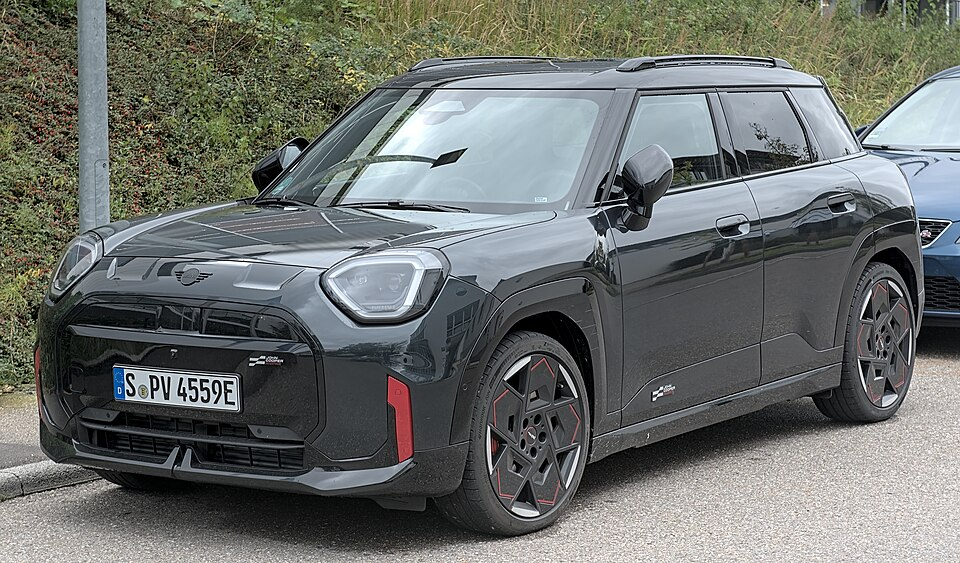

# Mini Aceman

*Bild: [Mini Aceman John Cooper Works DSC 2680.jpg](https://commons.wikimedia.org/wiki/File:Mini_Aceman_John_Cooper_Works_DSC_2680.jpg) · Urheber: Alexander Migl · Lizenz: CC BY-SA 4.0 · via Wikimedia Commons.*

> Elektrischer Crossover von Mini, rein batterieelektrisch und in China gebaut; positioniert zwischen Mini Cooper und Countryman.

## Steckbrief

| Feld | Wert | Beleg |
|---|---|---|
| Hersteller | [[mini\|Mini]] | [[tn-batterycheck-alle-daten]] |
| Segment | Kleinwagen-SUV | Fachwissen¹ |
| Karosserie | Crossover (Fünftürer) | Fachwissen¹ |
| Bauzeit | seit 2024 | Fachwissen¹ |
| Plattform | Elektro-Plattform des Joint Ventures Spotlight Automotive (BMW und Great Wall Motor) | Fachwissen¹ |
| Varianten im Bestand | 3 | [[tn-batterycheck-alle-daten]] |
| [[bruttokapazitaet\|Bruttokapazität]] | 42,5–54,2 kWh | [[tn-batterycheck-alle-daten]] |
| [[nettokapazitaet\|Nettokapazität]] | 38,5–49,2 kWh | [[tn-batterycheck-alle-daten]] |
| [[batteriepuffer\|Puffer]] | 9,2–9,4 % | berechnet |

## Beschreibung

Der Mini Aceman ist ein reines [[bev|Elektroauto]] und wird wie der elektrische [[mini-cooper-electric|Mini Cooper E/SE]] im Rahmen des Gemeinschaftsunternehmens Spotlight Automotive von BMW und Great Wall Motor in China produziert. Beide Modelle sind [[plattform-geschwister|Plattform-Geschwister]].

Der [[elektromotor|Elektromotor]] treibt die Vorderräder an ([[frontantrieb|Frontantrieb]]). Es gibt zwei [[traktionsbatterie|Traktionsbatterien]]; die größere wird für die stärkeren Versionen genutzt.

## Varianten und Batterien

"E" ist die Einstiegsversion mit 42,5/38,5 kWh, "SE" und "JCW" (John Cooper Works, Sportversion) nutzen die größere Batterie mit 54,2/49,2 kWh.

| Variante | Brutto | Netto | Puffer | Zeile |
|---|---|---|---|---|
| Aceman E | 42,5 kWh | 38,5 kWh | 4 kWh (9,4 %) | 216 |
| Aceman JCW | 54,2 kWh | 49,2 kWh | 5 kWh (9,2 %) | 217 |
| Aceman SE | 54,2 kWh | 49,2 kWh | 5 kWh (9,2 %) | 218 |

Quelle: [[tn-batterycheck-alle-daten]], Blatt „Fahrzeuge“, Zeilen 216–218. Puffer = Brutto − Netto (berechnet).

## Fachbegriffe

- [[frontantrieb|Frontantrieb (FWD)]] — Der Elektromotor treibt die Vorderräder an – typisch für Kleinwagen und Konversionsfahrzeuge.
- [[plattform-geschwister|Plattform-Geschwister (Badge-Engineering)]] — Fahrzeuge verschiedener Marken, die technisch weitgehend baugleich sind und dieselbe Batterie nutzen.
- [[typbezeichnungen|Typbezeichnungen]] — Wie Hersteller Leistungsstufe, Batterie und Antrieb in Modellnamen codieren – ein Lesehilfe-Artikel.
- [[bruttokapazitaet|Bruttokapazität]] — Die gesamte, physikalisch in der Batterie verbaute Energiemenge – inklusive der Reserven, die der Fahrer nie nutzen kann.
- [[nettokapazitaet|Nettokapazität]] — Der Teil der Batteriekapazität, den der Fahrer tatsächlich nutzen kann – Grundlage für Reichweite und Batterietests.

## Verwandte Fahrzeuge

- [[mini-cooper-electric|Mini Cooper E / SE]] — technisch verwandt / gleiche Plattform oder Batterie
- Weitere Modelle von Mini: [[mini-countryman-electric|Mini Countryman E / SE]]

## Offene Punkte

- Kleine Batterie hier mit 42,5/38,5 kWh, beim Cooper E dagegen 40,7/36,8 kWh – möglicherweise dieselbe Batterie mit unterschiedlichen Quellenangaben.

Siehe auch [[datenqualitaet]].

## Quellen

- [[tn-batterycheck-alle-daten]] — Brutto-/Nettokapazität aller Varianten (Zeilen 216–218)
- Weiterlesen: [Wikipedia – Mini Aceman](https://en.wikipedia.org/wiki/Mini_Aceman)

¹ *Beschreibung und Steckbrief-Felder ohne Quellseite beruhen auf allgemeinem Fachwissen des LLM (Stand 2026-09-23) und sind nicht durch eine Rohquelle im Bestand belegt. Zahlenwerte zur Batterie stammen ausschließlich aus der Rohquelle.*
