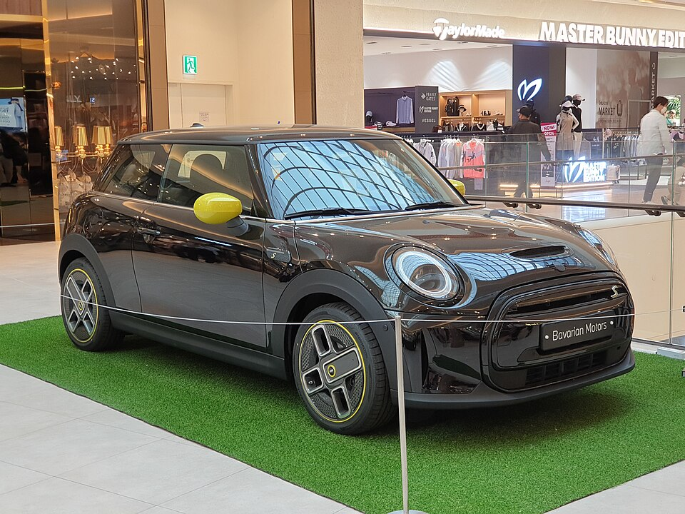

# Mini Cooper E / SE

*Bild: [Mini F56 Hatch Cooper SE Electric MINI Yours Enigmatic Black Metallic (1).jpg](https://commons.wikimedia.org/wiki/File:Mini_F56_Hatch_Cooper_SE_Electric_MINI_Yours_Enigmatic_Black_Metallic_(1).jpg) · Urheber: Damian B Oh · Lizenz: CC BY-SA 4.0 · via Wikimedia Commons. Abgebildet ist der Cooper SE der Generation F56 (bis 2023).*

> Elektrische Version des Mini Cooper (Dreitürer); die erste Generation war eine Konversion des Verbrenner-Mini, die aktuelle Generation ist eine eigenständige Elektro-Konstruktion aus China.

## Steckbrief

| Feld | Wert | Beleg |
|---|---|---|
| Hersteller | [[mini\|Mini]] | [[tn-batterycheck-alle-daten]] |
| Segment | Kleinwagen | Fachwissen¹ |
| Karosserie | Dreitüriges Fließheck | Fachwissen¹ |
| Bauzeit | seit 2020 | Fachwissen¹ |
| Plattform | Erste Generation: Verbrenner-Plattform des Mini F56; aktuelle Generation: Plattform von Spotlight Automotive (BMW und Great Wall Motor) | Fachwissen¹ |
| Varianten im Bestand | 3 | [[tn-batterycheck-alle-daten]] |
| [[bruttokapazitaet\|Bruttokapazität]] | 32,6–54,2 kWh | [[tn-batterycheck-alle-daten]] |
| [[nettokapazitaet\|Nettokapazität]] | 28,9–49,2 kWh | [[tn-batterycheck-alle-daten]] |
| [[batteriepuffer\|Puffer]] | 9,2–11,3 % | berechnet |

## Beschreibung

Der elektrische Mini Cooper existiert in zwei grundverschiedenen Generationen. Der erste Cooper SE (F56) war ein [[konversionsfahrzeug|Konversionsfahrzeug]]: Die vergleichsweise kleine [[traktionsbatterie|Traktionsbatterie]] wurde T-förmig im Mitteltunnel und unter den Rücksitzen untergebracht.

Die aktuelle Generation (J01) ist eine eigenständige Elektro-Konstruktion, die im Rahmen des Joint Ventures Spotlight Automotive in China gebaut wird und die Technik mit dem [[mini-aceman|Mini Aceman]] teilt. Beide Generationen haben [[frontantrieb|Frontantrieb]].

## Varianten und Batterien

Cooper SE mit 32,6/28,9 kWh ist die erste Generation (F56). Cooper E (40,7/36,6 kWh) und Cooper SE (54,2/49,2 kWh; Nettowerte korrigiert) gehören zur aktuellen Generation. Der Name "Cooper SE" steht also für zwei verschiedene Fahrzeuge – die [[typbezeichnungen|Typbezeichnung]] allein reicht zur Zuordnung nicht aus.

| Variante | Brutto | Netto | Puffer | Zeile | Status |
|---|---|---|---|---|---|
| Cooper E | 40,7 kWh | 36,6 kWh | 4,1 kWh (10,1 %) | 219 | korrigiert ([#8](https://github.com/Thitronik01/Frank-Repo/issues/8)) |
| Cooper SE | 32,6 kWh | 28,9 kWh | 3,7 kWh (11,3 %) | 220 |  |
| Cooper SE | 54,2 kWh | 49,2 kWh | 5 kWh (9,2 %) | 221 | korrigiert ([#8](https://github.com/Thitronik01/Frank-Repo/issues/8)) |

Quelle: [[tn-batterycheck-alle-daten]], Blatt „Fahrzeuge“, Zeilen 219–221 – bereinigte Fassung (Stand 2026-09-24, Änderungen in [[datenqualitaet]]). Puffer = Brutto − Netto (berechnet).

## Korrekturen

- **Zeile 219 korrigiert:** „Cooper E“ 40,7 kWh / 36,8 kWh → 40,7 kWh / 36,6 kWh. Laut ev-database und Auto Bild hat der Cooper E 40,7 / 36,6 kWh. Beleg: [Quelle 1](https://ev-database.org/uk/car/1997/Mini-Cooper-E). Issue [#8](https://github.com/Thitronik01/Frank-Repo/issues/8).
- **Zeile 221 korrigiert:** „Cooper SE“ 54,2 kWh / 49,8 kWh → 54,2 kWh / 49,2 kWh. Der neue Cooper SE (J01) hat dieselbe Batterie wie der Aceman SE: 54,2 / 49,2 kWh. Beleg: [Quelle 1](https://ev-database.org/uk/car/1998/Mini-Cooper-SE). Issue [#8](https://github.com/Thitronik01/Frank-Repo/issues/8).

Gegenüber der Rohquelle geändert am 2026-09-24; vollständiges Protokoll in [[datenqualitaet]].

## Fachbegriffe

- [[konversionsfahrzeug|Konversionsfahrzeug]] — Elektroauto, das von einem Modell mit Verbrennungsmotor abgeleitet ist, statt auf einer reinen Elektroplattform zu basieren.
- [[frontantrieb|Frontantrieb (FWD)]] — Der Elektromotor treibt die Vorderräder an – typisch für Kleinwagen und Konversionsfahrzeuge.
- [[typbezeichnungen|Typbezeichnungen]] — Wie Hersteller Leistungsstufe, Batterie und Antrieb in Modellnamen codieren – ein Lesehilfe-Artikel.
- [[modellpflege|Modellpflege (Facelift)]] — Überarbeitung eines Modells während der Bauzeit – bei Elektroautos oft mit neuer Batterie.
- [[plattform-geschwister|Plattform-Geschwister (Badge-Engineering)]] — Fahrzeuge verschiedener Marken, die technisch weitgehend baugleich sind und dieselbe Batterie nutzen.
- [[bruttokapazitaet|Bruttokapazität]] — Die gesamte, physikalisch in der Batterie verbaute Energiemenge – inklusive der Reserven, die der Fahrer nie nutzen kann.

## Verwandte Fahrzeuge

- [[mini-aceman|Mini Aceman]] — technisch verwandt / gleiche Plattform oder Batterie
- Weitere Modelle von Mini: [[mini-countryman-electric|Mini Countryman E / SE]]

## Offene Punkte

- Cooper SE erscheint zweimal mit völlig unterschiedlichen Batterien (Zeilen 220 und 221) – zwei Fahrzeuggenerationen unter gleichem Namen.

Siehe auch [[datenqualitaet]].

## Quellen

- [[tn-batterycheck-alle-daten]] — Brutto-/Nettokapazität aller Varianten (Zeilen 219–221)

¹ *Beschreibung und Steckbrief-Felder ohne Quellseite beruhen auf allgemeinem Fachwissen des LLM (Stand 2026-09-24) und sind nicht durch eine Rohquelle im Bestand belegt. Zahlenwerte zur Batterie stammen aus der Rohquelle, bereinigt nach dem Protokoll in [[datenqualitaet]].*
