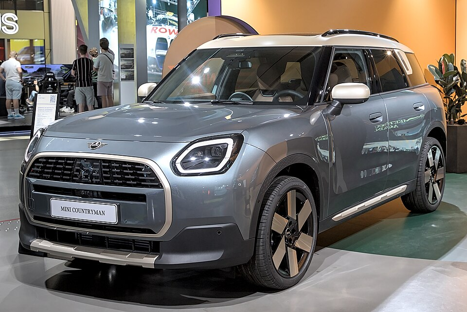

# Mini Countryman E / SE

*Bild: [Mini Countryman (U25) SE IAA 2023 1X7A0735.jpg](https://commons.wikimedia.org/wiki/File:Mini_Countryman_(U25)_SE_IAA_2023_1X7A0735.jpg) · Urheber: Alexander-93 · Lizenz: CC BY-SA 4.0 · via Wikimedia Commons.*

> Elektrische Version des Mini Countryman (U25), des größten Mini-Modells; technisch eng verwandt mit BMW iX1 und iX2.

## Steckbrief

| Feld | Wert | Beleg |
|---|---|---|
| Hersteller | [[mini\|Mini]] | [[tn-batterycheck-alle-daten]] |
| Segment | Kompakt-SUV | Fachwissen¹ |
| Karosserie | SUV | Fachwissen¹ |
| Bauzeit | seit 2024 | Fachwissen¹ |
| Plattform | FAAR (Frontantriebs-Architektur für Verbrenner und Elektro) | Fachwissen¹ |
| Varianten im Bestand | 2 | [[tn-batterycheck-alle-daten]] |
| [[bruttokapazitaet\|Bruttokapazität]] | 66,5 kWh | [[tn-batterycheck-alle-daten]] |
| [[nettokapazitaet\|Nettokapazität]] | 64,6 kWh | [[tn-batterycheck-alle-daten]] |
| [[batteriepuffer\|Puffer]] | 2,9 % | berechnet |

## Beschreibung

Der Mini Countryman E/SE basiert auf der BMW-Plattform FAAR und ist ein [[plattform-geschwister|Plattform-Geschwister]] von [[bmw-ix1|BMW iX1]] und [[bmw-ix2|BMW iX2]]. Anders als Cooper und Aceman wird er in Deutschland gebaut.

Der Countryman E hat [[frontantrieb|Frontantrieb]], der Countryman SE zwei [[elektromotor|Elektromotoren]] und [[allradantrieb|Allradantrieb]] (ALL4). Beide nutzen dieselbe [[traktionsbatterie|Traktionsbatterie]] wie die BMW-Schwestermodelle.

## Varianten und Batterien

Beide Varianten haben 66,5/64,6 kWh; "E" = Frontantrieb, "SE" = Allradantrieb mit höherer Leistung.

| Variante | Brutto | Netto | Puffer | Zeile |
|---|---|---|---|---|
| Countryman E | 66,5 kWh | 64,6 kWh | 1,9 kWh (2,9 %) | 222 |
| Countryman SE | 66,5 kWh | 64,6 kWh | 1,9 kWh (2,9 %) | 223 |

Quelle: [[tn-batterycheck-alle-daten]], Blatt „Fahrzeuge“, Zeilen 222–223. Puffer = Brutto − Netto (berechnet).

## Fachbegriffe

- [[plattform-geschwister|Plattform-Geschwister (Badge-Engineering)]] — Fahrzeuge verschiedener Marken, die technisch weitgehend baugleich sind und dieselbe Batterie nutzen.
- [[frontantrieb|Frontantrieb (FWD)]] — Der Elektromotor treibt die Vorderräder an – typisch für Kleinwagen und Konversionsfahrzeuge.
- [[allradantrieb|Allradantrieb (AWD)]] — Beide Achsen werden angetrieben, bei Elektroautos meist durch je einen eigenen Motor pro Achse.
- [[typbezeichnungen|Typbezeichnungen]] — Wie Hersteller Leistungsstufe, Batterie und Antrieb in Modellnamen codieren – ein Lesehilfe-Artikel.
- [[batteriepuffer|Batteriepuffer]] — Differenz zwischen Brutto- und Nettokapazität – eine Reserve, die die Batterie schont und Alterung ausgleicht.

## Verwandte Fahrzeuge

- [[bmw-ix1|BMW iX1]] — technisch verwandt / gleiche Plattform oder Batterie
- [[bmw-ix2|BMW iX2]] — technisch verwandt / gleiche Plattform oder Batterie
- Weitere Modelle von Mini: [[mini-aceman|Mini Aceman]], [[mini-cooper-electric|Mini Cooper E / SE]]

## Offene Punkte

- Nettowert 64,6 kWh gegenüber 64,7 kWh bei iX1/iX2 mit identischer Batterie – Rundungsdifferenz.

Siehe auch [[datenqualitaet]].

## Quellen

- [[tn-batterycheck-alle-daten]] — Brutto-/Nettokapazität aller Varianten (Zeilen 222–223)

¹ *Beschreibung und Steckbrief-Felder ohne Quellseite beruhen auf allgemeinem Fachwissen des LLM (Stand 2026-09-23) und sind nicht durch eine Rohquelle im Bestand belegt. Zahlenwerte zur Batterie stammen ausschließlich aus der Rohquelle.*
