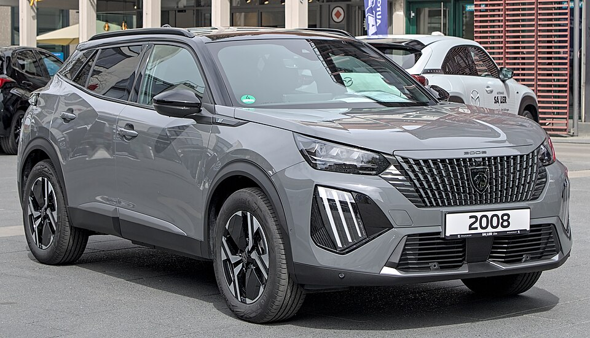

# Peugeot e-2008

*Bild: [Peugeot e-2008 Facelift Autofrühling Ulm IMG 9302.jpg](https://commons.wikimedia.org/wiki/File:Peugeot_e-2008_Facelift_Autofr%C3%BChling_Ulm_IMG_9302.jpg) · Urheber: Alexander-93 · Lizenz: CC BY-SA 4.0 · via Wikimedia Commons.*

> Elektrische Version des kompakten SUV Peugeot 2008 auf der e-CMP-Plattform von Stellantis.

## Steckbrief

| Feld | Wert | Beleg |
|---|---|---|
| Hersteller | [[peugeot\|Peugeot]] | [[tn-batterycheck-alle-daten]] |
| Segment | Kleinwagen-SUV | Fachwissen¹ |
| Karosserie | SUV | Fachwissen¹ |
| Bauzeit | seit 2019 | Fachwissen¹ |
| Plattform | e-CMP (Stellantis, ehemals PSA) | Fachwissen¹ |
| Varianten im Bestand | 3 | [[tn-batterycheck-alle-daten]] |
| [[bruttokapazitaet\|Bruttokapazität]] | 50–54 kWh | [[tn-batterycheck-alle-daten]] |
| [[nettokapazitaet\|Nettokapazität]] | 46,3–50,8 kWh | [[tn-batterycheck-alle-daten]] |
| [[batteriepuffer\|Puffer]] | 5,9–7,4 % | berechnet |

## Beschreibung

Der Peugeot e-2008 ist die batterieelektrische Variante der zweiten Generation des 2008. Er nutzt die e-CMP-Plattform und teilt Antrieb und Batterie mit dem [[peugeot-e-208|e-208]], dem [[citroen-e-c4|Citroën ë-C4]] und weiteren [[plattform-geschwister|Plattform-Geschwistern]] innerhalb der [[plattform-stellantis|Stellantis-Plattformen]].

Der [[elektromotor|Elektromotor]] treibt die Vorderräder an ([[frontantrieb|Frontantrieb]]), die [[traktionsbatterie|Traktionsbatterie]] mit [[nmc-zellchemie|NMC-Zellen]] liegt im Unterboden. Mit einer [[modellpflege|Modellpflege]] wurde die ursprüngliche Batterie durch eine etwas größere ersetzt, zugleich stieg die Motorleistung.

Da dieselbe Batterie in vielen Konzernmodellen verbaut ist, lassen sich Erkenntnisse zu [[batteriealterung|Batteriealterung]] und Ladeverhalten gut übertragen.

## Varianten und Batterien

„e-2008“ und „e-2008 SUV“ bezeichnen dasselbe Fahrzeug; die Zeile „e-2008 SUV“ mit 50 kWh entspricht der ersten Zeile. 50 kWh brutto / 46,3 kWh netto ist die ursprüngliche e-CMP-Batterie, 54 kWh brutto / 50,8 kWh netto die überarbeitete Batterie nach der [[modellpflege|Modellpflege]].

| Variante | Brutto | Netto | Puffer | Zeile | Status |
|---|---|---|---|---|---|
| e-2008 | 50 kWh | 46,3 kWh | 3,7 kWh (7,4 %) | 224 |  |
| e-2008 | 54 kWh | 50,8 kWh | 3,2 kWh (5,9 %) | 225 |  |
| e-2008 SUV | 50 kWh | 46,3 kWh | 3,7 kWh (7,4 %) | 226 | Alias von Z. 224 |

Quelle: [[tn-batterycheck-alle-daten]], Blatt „Fahrzeuge“, Zeilen 224–226 – bereinigte Fassung (Stand 2026-09-24, Änderungen in [[datenqualitaet]]). Puffer = Brutto − Netto (berechnet).

## Fachbegriffe

- [[plattform-stellantis|Stellantis-Plattformen (e-CMP, EMP2, STLA)]] — Die Elektro-Baukästen des Stellantis-Konzerns (Peugeot, Citroën, Opel u. a.).
- [[plattform-geschwister|Plattform-Geschwister (Badge-Engineering)]] — Fahrzeuge verschiedener Marken, die technisch weitgehend baugleich sind und dieselbe Batterie nutzen.
- [[nmc-zellchemie|NMC-Zellchemie]] — Lithium-Ionen-Zellen mit Kathode aus Nickel, Mangan und Kobalt – hohe Energiedichte, Standard in den meisten Fahrzeugen des Bestands.
- [[modellpflege|Modellpflege (Facelift)]] — Überarbeitung eines Modells während der Bauzeit – bei Elektroautos oft mit neuer Batterie.
- [[frontantrieb|Frontantrieb (FWD)]] — Der Elektromotor treibt die Vorderräder an – typisch für Kleinwagen und Konversionsfahrzeuge.
- [[batteriealterung|Batteriealterung (Degradation)]] — Allmählicher Kapazitäts- und Leistungsverlust einer Lithium-Ionen-Batterie über Zeit und Nutzung.

## Verwandte Fahrzeuge

- [[peugeot-e-208|Peugeot e-208]] — technisch verwandt / gleiche Plattform oder Batterie
- [[citroen-e-c4|Citroën ë-C4]] — technisch verwandt / gleiche Plattform oder Batterie
- [[citroen-e-c4-x|Citroën ë-C4 X]] — technisch verwandt / gleiche Plattform oder Batterie
- Weitere Modelle von Peugeot: [[peugeot-e-3008|Peugeot e-3008]], [[peugeot-e-308|Peugeot e-308]], [[peugeot-e-408|Peugeot e-408]], [[peugeot-e-expert|Peugeot e-Expert Combi]], [[peugeot-e-partner|Peugeot e-Partner]], [[peugeot-e-rifter|Peugeot e-Rifter]], [[peugeot-e-traveller|Peugeot e-Traveller]], [[peugeot-ion|Peugeot iOn]], [[peugeot-partner-tepee-electric|Peugeot Partner Tepee Electric]]

## Quellen

- [[tn-batterycheck-alle-daten]] — Brutto-/Nettokapazität aller Varianten (Zeilen 224–226)
- Weiterlesen: [Wikipedia – Peugeot 2008](https://en.wikipedia.org/wiki/Peugeot_2008)

¹ *Beschreibung und Steckbrief-Felder ohne Quellseite beruhen auf allgemeinem Fachwissen des LLM (Stand 2026-09-24) und sind nicht durch eine Rohquelle im Bestand belegt. Zahlenwerte zur Batterie stammen aus der Rohquelle, bereinigt nach dem Protokoll in [[datenqualitaet]].*
