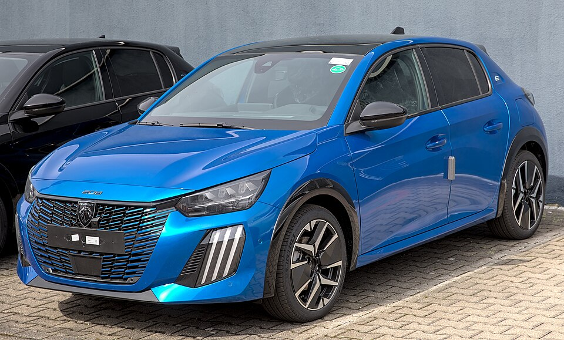

# Peugeot e-208

*Bild: [Peugeot e-208 facelift 1X7A2502.jpg](https://commons.wikimedia.org/wiki/File:Peugeot_e-208_facelift_1X7A2502.jpg) · Urheber: Alexander-93 · Lizenz: CC BY-SA 4.0 · via Wikimedia Commons.*

> Elektrischer Kleinwagen von Peugeot und eines der ersten Modelle auf der e-CMP-Plattform von Stellantis (ehemals PSA).

## Steckbrief

| Feld | Wert | Beleg |
|---|---|---|
| Hersteller | [[peugeot\|Peugeot]] | [[tn-batterycheck-alle-daten]] |
| Segment | Kleinwagen | Fachwissen¹ |
| Karosserie | Schrägheck, fünftürig | Fachwissen¹ |
| Bauzeit | seit 2019 | Fachwissen¹ |
| Plattform | e-CMP (Stellantis, ehemals PSA) | Fachwissen¹ |
| Varianten im Bestand | 3 | [[tn-batterycheck-alle-daten]] |
| [[bruttokapazitaet\|Bruttokapazität]] | 50–54 kWh | [[tn-batterycheck-alle-daten]] |
| [[nettokapazitaet\|Nettokapazität]] | 46,3–50,8 kWh | [[tn-batterycheck-alle-daten]] |
| [[batteriepuffer\|Puffer]] | 5,7–7,4 % | berechnet |

## Beschreibung

Der Peugeot e-208 ist die batterieelektrische Version der zweiten Generation des 208. Er war eines der ersten Fahrzeuge auf der e-CMP-Plattform, die in der Folge für zahlreiche Klein- und Kompaktwagen des Konzerns genutzt wurde, darunter [[peugeot-e-2008|e-2008]] und [[citroen-e-c4|Citroën ë-C4]]. Der e-208 ist damit ein zentrales Modell der [[plattform-stellantis|Stellantis-Plattformen]].

Der [[elektromotor|Elektromotor]] sitzt vorn und treibt die Vorderräder an ([[frontantrieb|Frontantrieb]]). Die [[traktionsbatterie|Traktionsbatterie]] mit [[nmc-zellchemie|NMC-Zellen]] ist im Unterboden und unter den Sitzen verteilt. Im Rahmen einer [[modellpflege|Modellpflege]] wurden Batterie und Motor überarbeitet.

Wegen der weiten Verbreitung ist der e-208 ein häufiger Kandidat für einen [[batteriecheck|Batteriecheck]] im Gebrauchtwagenhandel.

## Varianten und Batterien

Alle drei Zeilen heißen „e-208“ und unterscheiden sich nur in der Batterie: 50 kWh brutto / 46,3 kWh netto ist die ursprüngliche Batterie, 54 kWh brutto / 50,8 kWh netto die überarbeitete Version nach der [[modellpflege|Modellpflege]]. Die Zeile mit 51 kWh brutto / 48,1 kWh netto lässt sich keiner der beiden Generationen eindeutig zuordnen (siehe Hinweise).

| Variante | Brutto | Netto | Puffer | Zeile | Status |
|---|---|---|---|---|---|
| e-208 | 50 kWh | 46,3 kWh | 3,7 kWh (7,4 %) | 227 | bestätigt |
| e-208 | 51 kWh | 48,1 kWh | 2,9 kWh (5,7 %) | 228 | bestätigt |
| e-208 | 54 kWh | 50,8 kWh | 3,2 kWh (5,9 %) | 229 | bestätigt |

Quelle: [[tn-batterycheck-alle-daten]], Blatt „Fahrzeuge“, Zeilen 227–229 – bereinigte Fassung (Stand 2026-09-24, Änderungen in [[datenqualitaet]]). Puffer = Brutto − Netto (berechnet).

## Fachbegriffe

- [[plattform-stellantis|Stellantis-Plattformen (e-CMP, EMP2, STLA)]] — Die Elektro-Baukästen des Stellantis-Konzerns (Peugeot, Citroën, Opel u. a.).
- [[plattform-geschwister|Plattform-Geschwister (Badge-Engineering)]] — Fahrzeuge verschiedener Marken, die technisch weitgehend baugleich sind und dieselbe Batterie nutzen.
- [[nmc-zellchemie|NMC-Zellchemie]] — Lithium-Ionen-Zellen mit Kathode aus Nickel, Mangan und Kobalt – hohe Energiedichte, Standard in den meisten Fahrzeugen des Bestands.
- [[modellpflege|Modellpflege (Facelift)]] — Überarbeitung eines Modells während der Bauzeit – bei Elektroautos oft mit neuer Batterie.
- [[frontantrieb|Frontantrieb (FWD)]] — Der Elektromotor treibt die Vorderräder an – typisch für Kleinwagen und Konversionsfahrzeuge.
- [[batteriecheck|Batteriecheck (Batteriezertifikat)]] — Standardisierte Prüfung des Gesundheitszustands der Traktionsbatterie, meist für den Gebrauchtwagenhandel.
- [[bruttokapazitaet|Bruttokapazität]] — Die gesamte, physikalisch in der Batterie verbaute Energiemenge – inklusive der Reserven, die der Fahrer nie nutzen kann.

## Verwandte Fahrzeuge

- [[peugeot-e-2008|Peugeot e-2008]] — technisch verwandt / gleiche Plattform oder Batterie
- [[citroen-e-c4|Citroën ë-C4]] — technisch verwandt / gleiche Plattform oder Batterie
- [[citroen-e-c4-x|Citroën ë-C4 X]] — technisch verwandt / gleiche Plattform oder Batterie
- Weitere Modelle von Peugeot: [[peugeot-e-3008|Peugeot e-3008]], [[peugeot-e-308|Peugeot e-308]], [[peugeot-e-408|Peugeot e-408]], [[peugeot-e-expert|Peugeot e-Expert Combi]], [[peugeot-e-partner|Peugeot e-Partner]], [[peugeot-e-rifter|Peugeot e-Rifter]], [[peugeot-e-traveller|Peugeot e-Traveller]], [[peugeot-ion|Peugeot iOn]], [[peugeot-partner-tepee-electric|Peugeot Partner Tepee Electric]]

## Quellen

- [[tn-batterycheck-alle-daten]] — Brutto-/Nettokapazität aller Varianten (Zeilen 227–229)
- Weiterlesen: [Wikipedia – Peugeot 208](https://en.wikipedia.org/wiki/Peugeot_208)

¹ *Beschreibung und Steckbrief-Felder ohne Quellseite beruhen auf allgemeinem Fachwissen des LLM (Stand 2026-09-24) und sind nicht durch eine Rohquelle im Bestand belegt. Zahlenwerte zur Batterie stammen aus der Rohquelle, bereinigt nach dem Protokoll in [[datenqualitaet]].*
