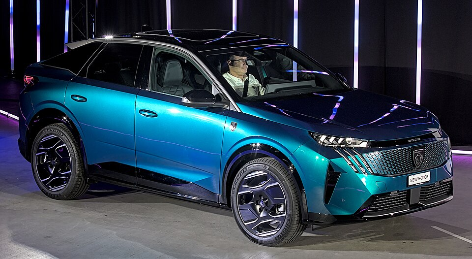

# Peugeot e-3008

*Bild: [Peugeot e-3008 Auto Zuerich 2023 1X7A1012.jpg](https://commons.wikimedia.org/wiki/File:Peugeot_e-3008_Auto_Zuerich_2023_1X7A1012.jpg) · Urheber: Alexander-93 · Lizenz: CC BY-SA 4.0 · via Wikimedia Commons.*

> Elektrisches Mittelklasse-SUV von Peugeot im Coupé-Stil und eines der ersten Modelle auf der STLA-Medium-Plattform von Stellantis.

## Steckbrief

| Feld | Wert | Beleg |
|---|---|---|
| Hersteller | [[peugeot\|Peugeot]] | [[tn-batterycheck-alle-daten]] |
| Segment | Kompakt-SUV / Mittelklasse-SUV | Fachwissen¹ |
| Karosserie | SUV mit coupéartiger Dachlinie | Fachwissen¹ |
| Bauzeit | seit 2024 | Fachwissen¹ |
| Plattform | STLA Medium (Stellantis) | Fachwissen¹ |
| Varianten im Bestand | 2 | [[tn-batterycheck-alle-daten]] |
| [[bruttokapazitaet\|Bruttokapazität]] | 77–101 kWh | [[tn-batterycheck-alle-daten]] |
| [[nettokapazitaet\|Nettokapazität]] | 73–96,9 kWh | [[tn-batterycheck-alle-daten]] |
| [[batteriepuffer\|Puffer]] | 4,1–5,2 % | berechnet |

## Beschreibung

Der Peugeot e-3008 der dritten 3008-Generation ist eines der ersten Serienmodelle auf der STLA-Medium-Plattform, einer neuen, vorrangig für Elektroantriebe ausgelegten Architektur der [[plattform-stellantis|Stellantis-Plattformen]]. Die Karosserie ist als SUV mit abfallender Dachlinie gestaltet.

Gegenüber den älteren e-CMP-Modellen bietet die Plattform Platz für deutlich größere [[traktionsbatterie|Traktionsbatterien]]. Die Basisversion hat einen [[elektromotor|Elektromotor]] an der Vorderachse ([[frontantrieb|Frontantrieb]]); daneben gibt es eine Version mit zwei Motoren und [[allradantrieb|Allradantrieb]].

Die Long-Range-Version gehört mit ihrer großen Batterie zu den reichweitenstärksten Modellen ihres Segments; in Kombination mit der [[wltp|WLTP]]-Reichweite ist sie auch für Langstrecken ausgelegt.

## Varianten und Batterien

„e-3008“ steht für die Standardbatterie mit 77 kWh brutto / 73,0 kWh netto, „e-3008 Long Range“ für die große Batterie mit 101 kWh brutto / 96,9 kWh netto. Beide werden parallel angeboten; die Unterscheidung ist also keine Generationenfrage, sondern eine Ausstattungsoption.

| Variante | Brutto | Netto | Puffer | Zeile |
|---|---|---|---|---|
| e-3008 | 77 kWh | 73 kWh | 4 kWh (5,2 %) | 230 |
| e-3008 Long Range | 101 kWh | 96,9 kWh | 4,1 kWh (4,1 %) | 231 |

Quelle: [[tn-batterycheck-alle-daten]], Blatt „Fahrzeuge“, Zeilen 230–231 – bereinigte Fassung (Stand 2026-09-24, Änderungen in [[datenqualitaet]]). Puffer = Brutto − Netto (berechnet).

## Fachbegriffe

- [[plattform-stellantis|Stellantis-Plattformen (e-CMP, EMP2, STLA)]] — Die Elektro-Baukästen des Stellantis-Konzerns (Peugeot, Citroën, Opel u. a.).
- [[traktionsbatterie|Traktionsbatterie]] — Der Hochvolt-Energiespeicher, der den Elektromotor eines Elektroautos versorgt.
- [[frontantrieb|Frontantrieb (FWD)]] — Der Elektromotor treibt die Vorderräder an – typisch für Kleinwagen und Konversionsfahrzeuge.
- [[allradantrieb|Allradantrieb (AWD)]] — Beide Achsen werden angetrieben, bei Elektroautos meist durch je einen eigenen Motor pro Achse.
- [[wltp|WLTP]] — Worldwide Harmonized Light Vehicles Test Procedure – seit 2017/2018 der EU-Normzyklus für Verbrauch und Reichweite.
- [[bruttokapazitaet|Bruttokapazität]] — Die gesamte, physikalisch in der Batterie verbaute Energiemenge – inklusive der Reserven, die der Fahrer nie nutzen kann.
- [[nettokapazitaet|Nettokapazität]] — Der Teil der Batteriekapazität, den der Fahrer tatsächlich nutzen kann – Grundlage für Reichweite und Batterietests.

## Verwandte Fahrzeuge

- Weitere Modelle von Peugeot: [[peugeot-e-2008|Peugeot e-2008]], [[peugeot-e-208|Peugeot e-208]], [[peugeot-e-308|Peugeot e-308]], [[peugeot-e-408|Peugeot e-408]], [[peugeot-e-expert|Peugeot e-Expert Combi]], [[peugeot-e-partner|Peugeot e-Partner]], [[peugeot-e-rifter|Peugeot e-Rifter]], [[peugeot-e-traveller|Peugeot e-Traveller]], [[peugeot-ion|Peugeot iOn]], [[peugeot-partner-tepee-electric|Peugeot Partner Tepee Electric]]

## Offene Punkte

- Weitere STLA-Medium-Modelle (z. B. Peugeot e-5008, Opel Grandland Electric) sind in families.json nicht enthalten.

Siehe auch [[datenqualitaet]].

## Quellen

- [[tn-batterycheck-alle-daten]] — Brutto-/Nettokapazität aller Varianten (Zeilen 230–231)
- Weiterlesen: [Wikipedia – Peugeot 3008](https://en.wikipedia.org/wiki/Peugeot_3008)

¹ *Beschreibung und Steckbrief-Felder ohne Quellseite beruhen auf allgemeinem Fachwissen des LLM (Stand 2026-09-24) und sind nicht durch eine Rohquelle im Bestand belegt. Zahlenwerte zur Batterie stammen aus der Rohquelle, bereinigt nach dem Protokoll in [[datenqualitaet]].*
