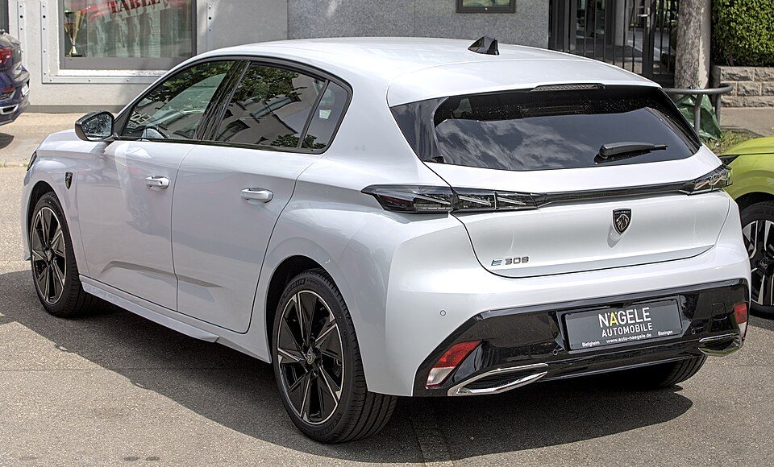

# Peugeot e-308

*Bild: [Peugeot e-308 IMG 9970.jpg](https://commons.wikimedia.org/wiki/File:Peugeot_e-308_IMG_9970.jpg) · Urheber: Alexander-93 · Lizenz: CC BY-SA 4.0 · via Wikimedia Commons.*

> Elektrische Version des Peugeot 308 in der dritten Generation, als Schrägheck und als Kombi (SW) erhältlich.

## Steckbrief

| Feld | Wert | Beleg |
|---|---|---|
| Hersteller | [[peugeot\|Peugeot]] | [[tn-batterycheck-alle-daten]] |
| Segment | Kompaktklasse | Fachwissen¹ |
| Karosserie | Schrägheck, Kombi (SW) | Fachwissen¹ |
| Bauzeit | seit 2023 | Fachwissen¹ |
| Plattform | EMP2 (Stellantis, Weiterentwicklung für Elektroantrieb) | Fachwissen¹ |
| Varianten im Bestand | 2 | [[tn-batterycheck-alle-daten]] |
| [[bruttokapazitaet\|Bruttokapazität]] | 54 kWh | [[tn-batterycheck-alle-daten]] |
| [[nettokapazitaet\|Nettokapazität]] | 50,8 kWh | [[tn-batterycheck-alle-daten]] |
| [[batteriepuffer\|Puffer]] | 5,9 % | berechnet |

## Beschreibung

Der Peugeot e-308 ergänzt die dritte Generation des 308 um einen reinen Elektroantrieb. Anders als die kleineren Modelle basiert er nicht auf e-CMP, sondern auf einer weiterentwickelten Version der EMP2-Plattform, die ursprünglich für Verbrenner und Plug-in-Hybride entstand; sie zählt zu den [[plattform-stellantis|Stellantis-Plattformen]].

Der [[elektromotor|Elektromotor]] treibt die Vorderräder an ([[frontantrieb|Frontantrieb]]). Batterie und Motor entsprechen weitgehend der überarbeiteten Antriebsgeneration, die auch im [[peugeot-e-208|e-208]] und [[peugeot-e-2008|e-2008]] nach der [[modellpflege|Modellpflege]] zum Einsatz kommt.

Neben dem Schrägheck gibt es den Kombi SW, der sich nur in der [[karosserieformen|Karosserieform]] unterscheidet.

## Varianten und Batterien

„e-308“ (Schrägheck) und „e-308 SW“ (Kombi) haben dieselbe Batterie mit 54 kWh brutto / 50,8 kWh netto. Die Bezeichnung SW steht bei Peugeot traditionell für die Kombiversion.

| Variante | Brutto | Netto | Puffer | Zeile |
|---|---|---|---|---|
| e-308 | 54 kWh | 50,8 kWh | 3,2 kWh (5,9 %) | 232 |
| e-308 SW | 54 kWh | 50,8 kWh | 3,2 kWh (5,9 %) | 233 |

Quelle: [[tn-batterycheck-alle-daten]], Blatt „Fahrzeuge“, Zeilen 232–233 – bereinigte Fassung (Stand 2026-09-24, Änderungen in [[datenqualitaet]]). Puffer = Brutto − Netto (berechnet).

## Fachbegriffe

- [[plattform-stellantis|Stellantis-Plattformen (e-CMP, EMP2, STLA)]] — Die Elektro-Baukästen des Stellantis-Konzerns (Peugeot, Citroën, Opel u. a.).
- [[karosserieformen|Karosserieformen]] — Varianten der Aufbauform eines Modells – beeinflussen Aussehen und Luftwiderstand, meist nicht die Batterie.
- [[frontantrieb|Frontantrieb (FWD)]] — Der Elektromotor treibt die Vorderräder an – typisch für Kleinwagen und Konversionsfahrzeuge.
- [[plattform-geschwister|Plattform-Geschwister (Badge-Engineering)]] — Fahrzeuge verschiedener Marken, die technisch weitgehend baugleich sind und dieselbe Batterie nutzen.
- [[nmc-zellchemie|NMC-Zellchemie]] — Lithium-Ionen-Zellen mit Kathode aus Nickel, Mangan und Kobalt – hohe Energiedichte, Standard in den meisten Fahrzeugen des Bestands.
- [[modellpflege|Modellpflege (Facelift)]] — Überarbeitung eines Modells während der Bauzeit – bei Elektroautos oft mit neuer Batterie.

## Verwandte Fahrzeuge

- [[peugeot-e-408|Peugeot e-408]] — technisch verwandt / gleiche Plattform oder Batterie
- [[peugeot-e-208|Peugeot e-208]] — technisch verwandt / gleiche Plattform oder Batterie
- [[peugeot-e-2008|Peugeot e-2008]] — technisch verwandt / gleiche Plattform oder Batterie
- Weitere Modelle von Peugeot: [[peugeot-e-3008|Peugeot e-3008]], [[peugeot-e-expert|Peugeot e-Expert Combi]], [[peugeot-e-partner|Peugeot e-Partner]], [[peugeot-e-rifter|Peugeot e-Rifter]], [[peugeot-e-traveller|Peugeot e-Traveller]], [[peugeot-ion|Peugeot iOn]], [[peugeot-partner-tepee-electric|Peugeot Partner Tepee Electric]]

## Offene Punkte

- Die Batterie hat nach den Rohdaten dieselben Werte (54/50,8 kWh) wie die überarbeitete e-CMP-Batterie. Ob es sich um exakt dasselbe Batteriepaket handelt, ist nicht gesichert.

Siehe auch [[datenqualitaet]].

## Quellen

- [[tn-batterycheck-alle-daten]] — Brutto-/Nettokapazität aller Varianten (Zeilen 232–233)

¹ *Beschreibung und Steckbrief-Felder ohne Quellseite beruhen auf allgemeinem Fachwissen des LLM (Stand 2026-09-24) und sind nicht durch eine Rohquelle im Bestand belegt. Zahlenwerte zur Batterie stammen aus der Rohquelle, bereinigt nach dem Protokoll in [[datenqualitaet]].*
