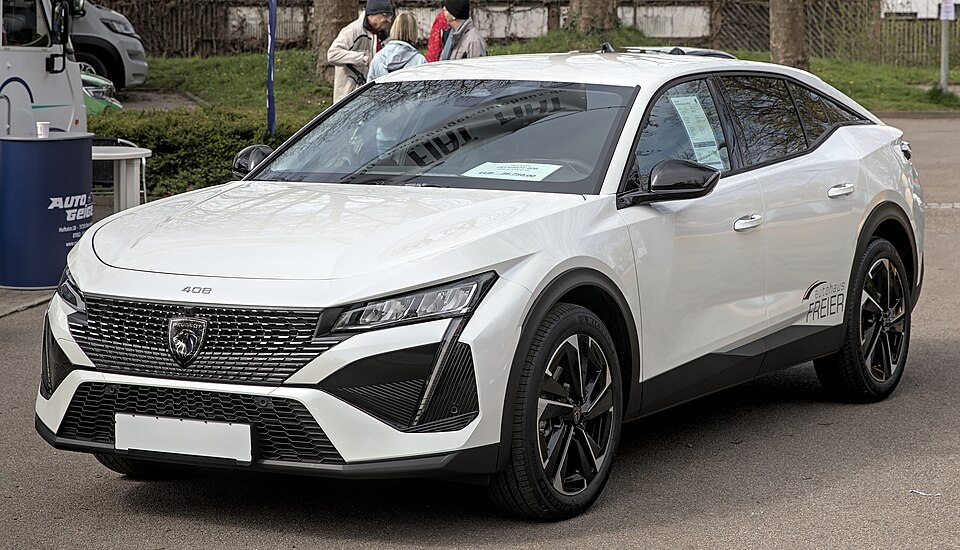

# Peugeot e-408

*Bild: [Peugeot 408 (crossover) 1X7A7195.jpg](https://commons.wikimedia.org/wiki/File:Peugeot_408_(crossover)_1X7A7195.jpg) · Urheber: Alexander-93 · Lizenz: CC BY-SA 4.0 · via Wikimedia Commons.*

> Elektrische Version des Peugeot 408, eines Fastback-Crossovers zwischen Limousine und SUV.

## Steckbrief

| Feld | Wert | Beleg |
|---|---|---|
| Hersteller | [[peugeot\|Peugeot]] | [[tn-batterycheck-alle-daten]] |
| Segment | Kompaktklasse / Mittelklasse | Fachwissen¹ |
| Karosserie | Fastback-Crossover | Fachwissen¹ |
| Bauzeit | seit 2024 | Fachwissen¹ |
| Plattform | EMP2 (Stellantis, Weiterentwicklung für Elektroantrieb) | Fachwissen¹ |
| Varianten im Bestand | 1 | [[tn-batterycheck-alle-daten]] |
| [[bruttokapazitaet\|Bruttokapazität]] | 61 kWh | [[tn-batterycheck-alle-daten]] |
| [[nettokapazitaet\|Nettokapazität]] | 58,3 kWh | [[tn-batterycheck-alle-daten]] |
| [[batteriepuffer\|Puffer]] | 4,4 % | berechnet |

## Beschreibung

Der Peugeot e-408 ist die batterieelektrische Variante des 408, der optisch zwischen Limousine, Coupé und SUV angesiedelt ist. Technisch ist er eng mit dem [[peugeot-e-308|e-308]] verwandt und nutzt ebenfalls die weiterentwickelte EMP2-Plattform der [[plattform-stellantis|Stellantis-Plattformen]].

Der [[elektromotor|Elektromotor]] treibt die Vorderräder an ([[frontantrieb|Frontantrieb]]). Die [[traktionsbatterie|Traktionsbatterie]] ist nach den Rohdaten etwas größer als die des e-308.

Zur Einordnung der verschiedenen Aufbauformen siehe [[karosserieformen|Karosserieformen]].

## Varianten und Batterien

Es gibt nur eine Zeile (e-408) mit 61 kWh brutto / 58,3 kWh netto.

| Variante | Brutto | Netto | Puffer | Zeile |
|---|---|---|---|---|
| e-408 | 61 kWh | 58,3 kWh | 2,7 kWh (4,4 %) | 234 |

Quelle: [[tn-batterycheck-alle-daten]], Blatt „Fahrzeuge“, Zeilen 234 – bereinigte Fassung (Stand 2026-09-24, Änderungen in [[datenqualitaet]]). Puffer = Brutto − Netto (berechnet).

## Fachbegriffe

- [[plattform-stellantis|Stellantis-Plattformen (e-CMP, EMP2, STLA)]] — Die Elektro-Baukästen des Stellantis-Konzerns (Peugeot, Citroën, Opel u. a.).
- [[karosserieformen|Karosserieformen]] — Varianten der Aufbauform eines Modells – beeinflussen Aussehen und Luftwiderstand, meist nicht die Batterie.
- [[frontantrieb|Frontantrieb (FWD)]] — Der Elektromotor treibt die Vorderräder an – typisch für Kleinwagen und Konversionsfahrzeuge.
- [[traktionsbatterie|Traktionsbatterie]] — Der Hochvolt-Energiespeicher, der den Elektromotor eines Elektroautos versorgt.
- [[plattform-geschwister|Plattform-Geschwister (Badge-Engineering)]] — Fahrzeuge verschiedener Marken, die technisch weitgehend baugleich sind und dieselbe Batterie nutzen.

## Verwandte Fahrzeuge

- [[peugeot-e-308|Peugeot e-308]] — technisch verwandt / gleiche Plattform oder Batterie
- Weitere Modelle von Peugeot: [[peugeot-e-2008|Peugeot e-2008]], [[peugeot-e-208|Peugeot e-208]], [[peugeot-e-3008|Peugeot e-3008]], [[peugeot-e-expert|Peugeot e-Expert Combi]], [[peugeot-e-partner|Peugeot e-Partner]], [[peugeot-e-rifter|Peugeot e-Rifter]], [[peugeot-e-traveller|Peugeot e-Traveller]], [[peugeot-ion|Peugeot iOn]], [[peugeot-partner-tepee-electric|Peugeot Partner Tepee Electric]]

## Offene Punkte

- Die Batteriekapazität weicht vom technisch eng verwandten e-308 (54/50,8 kWh) ab; möglicherweise handelt es sich um eine neuere Batterieversion, die inzwischen auch im e-308 angeboten wird. Nicht gesichert.

Siehe auch [[datenqualitaet]].

## Quellen

- [[tn-batterycheck-alle-daten]] — Brutto-/Nettokapazität aller Varianten (Zeilen 234)

¹ *Beschreibung und Steckbrief-Felder ohne Quellseite beruhen auf allgemeinem Fachwissen des LLM (Stand 2026-09-24) und sind nicht durch eine Rohquelle im Bestand belegt. Zahlenwerte zur Batterie stammen aus der Rohquelle, bereinigt nach dem Protokoll in [[datenqualitaet]].*
