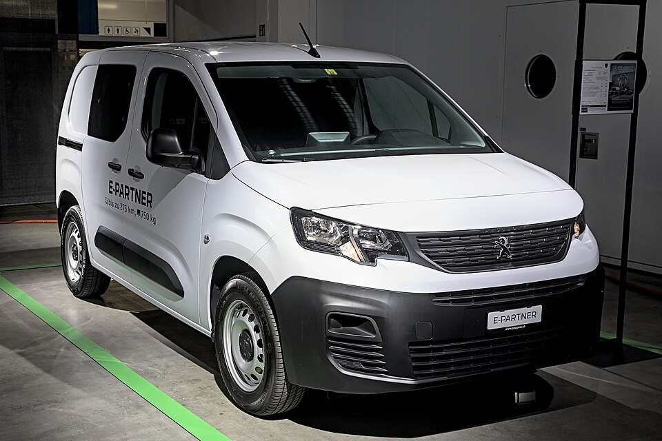

# Peugeot e-Partner

*Bild: [Peugeot e-Partner Auto Zuerich 2023 1X7A1427.jpg](https://commons.wikimedia.org/wiki/File:Peugeot_e-Partner_Auto_Zuerich_2023_1X7A1427.jpg) · Urheber: Alexander-93 · Lizenz: CC BY-SA 4.0 · via Wikimedia Commons.*

> Elektrischer Hochdach-Kleintransporter von Peugeot, technisch eng verwandt mit Peugeot e-Rifter und Citroën ë-Berlingo.

## Steckbrief

| Feld | Wert | Beleg |
|---|---|---|
| Hersteller | [[peugeot\|Peugeot]] | [[tn-batterycheck-alle-daten]] |
| Segment | Kleintransporter / Hochdachkombi | Fachwissen¹ |
| Karosserie | Hochdachkombi bzw. Kastenwagen | Fachwissen¹ |
| Plattform | EMP2 (K9-Baureihe, Stellantis) | Fachwissen¹ |
| Varianten im Bestand | 1 | [[tn-batterycheck-alle-daten]] |
| [[bruttokapazitaet\|Bruttokapazität]] | 50 kWh | [[tn-batterycheck-alle-daten]] |
| [[nettokapazitaet\|Nettokapazität]] | 46,3 kWh | [[tn-batterycheck-alle-daten]] |
| [[batteriepuffer\|Puffer]] | 7,4 % | berechnet |

## Beschreibung

Der Peugeot e-Partner ist die elektrische Version des Kleintransporters Partner der aktuellen Generation (K9). Er teilt Karosserie und Antrieb mit dem Pkw-orientierten [[peugeot-e-rifter|e-Rifter]] und dem [[citroen-e-berlingo|Citroën ë-Berlingo]] und gehört damit zu den [[plattform-geschwister|Plattform-Geschwistern]] der [[plattform-stellantis|Stellantis-Plattformen]].

Der [[elektromotor|Elektromotor]] treibt die Vorderräder an ([[frontantrieb|Frontantrieb]]), die [[traktionsbatterie|Traktionsbatterie]] liegt im Unterboden. Die Batterie entspricht der ursprünglichen 50-kWh-Batterie der e-CMP-Modelle.

Als gewerblich genutzter [[elektro-transporter|Elektro-Transporter]] ist er häufig hohen Laufleistungen ausgesetzt; ein [[batteriecheck|Batteriecheck]] ist beim Gebrauchtkauf daher besonders sinnvoll.

## Varianten und Batterien

Es gibt nur eine Zeile (e-Partner) mit 50 kWh brutto / 46,3 kWh netto; Längenvarianten sind nicht erfasst.

| Variante | Brutto | Netto | Puffer | Zeile |
|---|---|---|---|---|
| e-Partner | 50 kWh | 46,3 kWh | 3,7 kWh (7,4 %) | 240 |

Quelle: [[tn-batterycheck-alle-daten]], Blatt „Fahrzeuge“, Zeilen 240. Puffer = Brutto − Netto (berechnet).

## Fachbegriffe

- [[elektro-transporter|Elektro-Transporter und Vans]] — Leichte Nutzfahrzeuge und Großraum-Pkw mit Elektroantrieb – im Bestand vor allem von Stellantis, Mercedes, Renault und VW.
- [[plattform-stellantis|Stellantis-Plattformen (e-CMP, EMP2, STLA)]] — Die Elektro-Baukästen des Stellantis-Konzerns (Peugeot, Citroën, Opel u. a.).
- [[plattform-geschwister|Plattform-Geschwister (Badge-Engineering)]] — Fahrzeuge verschiedener Marken, die technisch weitgehend baugleich sind und dieselbe Batterie nutzen.
- [[frontantrieb|Frontantrieb (FWD)]] — Der Elektromotor treibt die Vorderräder an – typisch für Kleinwagen und Konversionsfahrzeuge.
- [[batteriecheck|Batteriecheck (Batteriezertifikat)]] — Standardisierte Prüfung des Gesundheitszustands der Traktionsbatterie, meist für den Gebrauchtwagenhandel.

## Verwandte Fahrzeuge

- [[peugeot-e-rifter|Peugeot e-Rifter]] — technisch verwandt / gleiche Plattform oder Batterie
- [[citroen-e-berlingo|Citroën ë-Berlingo]] — technisch verwandt / gleiche Plattform oder Batterie
- Weitere Modelle von Peugeot: [[peugeot-e-2008|Peugeot e-2008]], [[peugeot-e-208|Peugeot e-208]], [[peugeot-e-3008|Peugeot e-3008]], [[peugeot-e-308|Peugeot e-308]], [[peugeot-e-408|Peugeot e-408]], [[peugeot-e-expert|Peugeot e-Expert Combi]], [[peugeot-e-traveller|Peugeot e-Traveller]], [[peugeot-ion|Peugeot iOn]], [[peugeot-partner-tepee-electric|Peugeot Partner Tepee Electric]]

## Offene Punkte

- Die bei den Geschwistermodellen (ë-Berlingo) erfasste neuere 52-kWh-Batterie fehlt hier.
- Nicht erkennbar, ob die Zeile die Personen- oder die Nutzfahrzeugversion betrifft.

Siehe auch [[datenqualitaet]].

## Quellen

- [[tn-batterycheck-alle-daten]] — Brutto-/Nettokapazität aller Varianten (Zeilen 240)

¹ *Beschreibung und Steckbrief-Felder ohne Quellseite beruhen auf allgemeinem Fachwissen des LLM (Stand 2026-09-23) und sind nicht durch eine Rohquelle im Bestand belegt. Zahlenwerte zur Batterie stammen ausschließlich aus der Rohquelle.*
