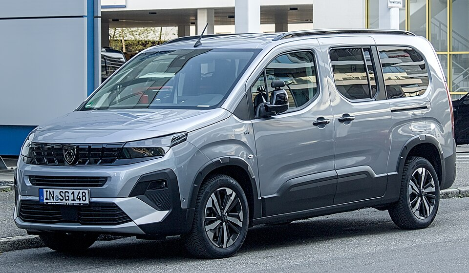

# Peugeot e-Rifter

*Bild: [2024 Peugeot Rifter L2 IMG 7575.jpg](https://commons.wikimedia.org/wiki/File:2024_Peugeot_Rifter_L2_IMG_7575.jpg) · Urheber: Alexander Migl · Lizenz: CC BY-SA 4.0 · via Wikimedia Commons.*

> Elektrischer Hochdachkombi von Peugeot für die Personenbeförderung, baugleich mit Citroën ë-Berlingo.

## Steckbrief

| Feld | Wert | Beleg |
|---|---|---|
| Hersteller | [[peugeot\|Peugeot]] | [[tn-batterycheck-alle-daten]] |
| Segment | Hochdachkombi | Fachwissen¹ |
| Karosserie | Hochdachkombi (Van), kurze und lange Version | Fachwissen¹ |
| Plattform | EMP2 (K9-Baureihe, Stellantis) | Fachwissen¹ |
| Varianten im Bestand | 4 | [[tn-batterycheck-alle-daten]] |
| [[bruttokapazitaet\|Bruttokapazität]] | 50 kWh | [[tn-batterycheck-alle-daten]] |
| [[nettokapazitaet\|Nettokapazität]] | 46,3 kWh | [[tn-batterycheck-alle-daten]] |
| [[batteriepuffer\|Puffer]] | 7,4 % | berechnet |

## Beschreibung

Der Peugeot e-Rifter ist die Pkw-Version des Hochdachkombis der Baureihe K9 mit Elektroantrieb. Er ist baugleich mit dem [[citroen-e-berlingo|Citroën ë-Berlingo]] und technisch identisch mit dem Nutzfahrzeug [[peugeot-e-partner|e-Partner]]; alle zählen zu den [[plattform-geschwister|Plattform-Geschwistern]] der [[plattform-stellantis|Stellantis-Plattformen]].

Der [[elektromotor|Elektromotor]] treibt die Vorderräder an ([[frontantrieb|Frontantrieb]]). Die [[traktionsbatterie|Traktionsbatterie]] im Unterboden entspricht der ursprünglichen 50-kWh-Batterie der e-CMP-Modelle.

Der e-Rifter wird mit zwei Karosserielängen angeboten, die sich in Innenraum und Sitzplatzanzahl unterscheiden, nicht jedoch in der Batterie.

## Varianten und Batterien

Standard/M und Long/XL bezeichnen jeweils die kurze bzw. lange Karosserie; offenbar wurden in den Rohdaten zwei Namensschemata gemischt. Alle vier Zeilen haben dieselbe Batterie mit 50 kWh brutto / 46,3 kWh netto.

| Variante | Brutto | Netto | Puffer | Zeile |
|---|---|---|---|---|
| e-Rifter Long | 50 kWh | 46,3 kWh | 3,7 kWh (7,4 %) | 241 |
| e-Rifter M | 50 kWh | 46,3 kWh | 3,7 kWh (7,4 %) | 242 |
| e-Rifter Standard | 50 kWh | 46,3 kWh | 3,7 kWh (7,4 %) | 243 |
| e-Rifter XL | 50 kWh | 46,3 kWh | 3,7 kWh (7,4 %) | 244 |

Quelle: [[tn-batterycheck-alle-daten]], Blatt „Fahrzeuge“, Zeilen 241–244. Puffer = Brutto − Netto (berechnet).

## Fachbegriffe

- [[plattform-stellantis|Stellantis-Plattformen (e-CMP, EMP2, STLA)]] — Die Elektro-Baukästen des Stellantis-Konzerns (Peugeot, Citroën, Opel u. a.).
- [[plattform-geschwister|Plattform-Geschwister (Badge-Engineering)]] — Fahrzeuge verschiedener Marken, die technisch weitgehend baugleich sind und dieselbe Batterie nutzen.
- [[elektro-transporter|Elektro-Transporter und Vans]] — Leichte Nutzfahrzeuge und Großraum-Pkw mit Elektroantrieb – im Bestand vor allem von Stellantis, Mercedes, Renault und VW.
- [[frontantrieb|Frontantrieb (FWD)]] — Der Elektromotor treibt die Vorderräder an – typisch für Kleinwagen und Konversionsfahrzeuge.
- [[typbezeichnungen|Typbezeichnungen]] — Wie Hersteller Leistungsstufe, Batterie und Antrieb in Modellnamen codieren – ein Lesehilfe-Artikel.

## Verwandte Fahrzeuge

- [[citroen-e-berlingo|Citroën ë-Berlingo]] — technisch verwandt / gleiche Plattform oder Batterie
- [[peugeot-e-partner|Peugeot e-Partner]] — technisch verwandt / gleiche Plattform oder Batterie
- Weitere Modelle von Peugeot: [[peugeot-e-2008|Peugeot e-2008]], [[peugeot-e-208|Peugeot e-208]], [[peugeot-e-3008|Peugeot e-3008]], [[peugeot-e-308|Peugeot e-308]], [[peugeot-e-408|Peugeot e-408]], [[peugeot-e-expert|Peugeot e-Expert Combi]], [[peugeot-e-traveller|Peugeot e-Traveller]], [[peugeot-ion|Peugeot iOn]], [[peugeot-partner-tepee-electric|Peugeot Partner Tepee Electric]]

## Offene Punkte

- Vier Zeilen mit identischen Werten; „Standard“ und „M“ sowie „Long“ und „XL“ sind vermutlich jeweils dieselbe Version unter verschiedenen Bezeichnungen (Duplikate).
- Die beim ë-Berlingo erfasste neuere 52-kWh-Batterie fehlt hier.

Siehe auch [[datenqualitaet]].

## Quellen

- [[tn-batterycheck-alle-daten]] — Brutto-/Nettokapazität aller Varianten (Zeilen 241–244)
- Weiterlesen: [Wikipedia – Peugeot Rifter](https://en.wikipedia.org/wiki/Peugeot_Rifter)

¹ *Beschreibung und Steckbrief-Felder ohne Quellseite beruhen auf allgemeinem Fachwissen des LLM (Stand 2026-09-23) und sind nicht durch eine Rohquelle im Bestand belegt. Zahlenwerte zur Batterie stammen ausschließlich aus der Rohquelle.*
