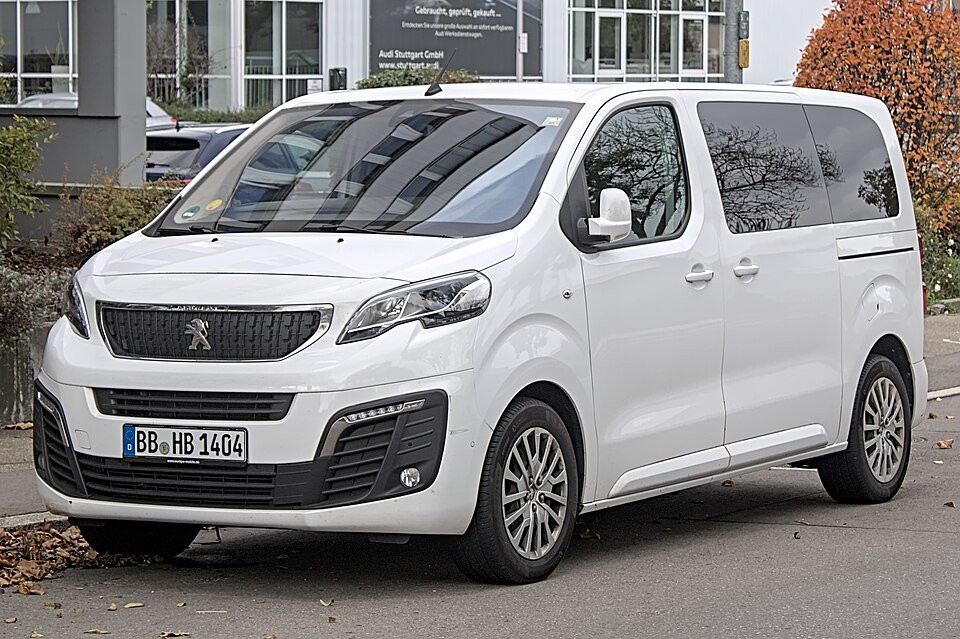

# Peugeot e-Traveller

*Bild: [Peugeot Traveller IMG 2360.jpg](https://commons.wikimedia.org/wiki/File:Peugeot_Traveller_IMG_2360.jpg) · Urheber: Alexander-93 · Lizenz: CC BY-SA 4.0 · via Wikimedia Commons.*

> Elektrischer Großraum-Van von Peugeot für die Personenbeförderung, baugleich mit Citroën ë-SpaceTourer.

## Steckbrief

| Feld | Wert | Beleg |
|---|---|---|
| Hersteller | [[peugeot\|Peugeot]] | [[tn-batterycheck-alle-daten]] |
| Segment | Großraum-Van / Kleinbus | Fachwissen¹ |
| Karosserie | Van (Kleinbus), mehrere Längen | Fachwissen¹ |
| Bauzeit | seit 2020 | Fachwissen¹ |
| Plattform | EMP2 (Transporter-Baureihe K0, Stellantis) | Fachwissen¹ |
| Varianten im Bestand | 9 | [[tn-batterycheck-alle-daten]] |
| [[bruttokapazitaet\|Bruttokapazität]] | 50–75 kWh | [[tn-batterycheck-alle-daten]] |
| [[nettokapazitaet\|Nettokapazität]] | 46,3–68 kWh | [[tn-batterycheck-alle-daten]] |
| [[batteriepuffer\|Puffer]] | 7,4–9,3 % | berechnet |

## Beschreibung

Der Peugeot e-Traveller ist die Personenversion des Transporters Expert mit Elektroantrieb und richtet sich an Familien sowie gewerbliche Personenbeförderer. Er ist baugleich mit dem [[citroen-e-spacetourer|Citroën ë-SpaceTourer]] und eng verwandt mit [[peugeot-e-expert|e-Expert]] und [[citroen-e-jumpy|Citroën ë-Jumpy]]; siehe auch [[elektro-transporter|Elektro-Transporter]] und [[plattform-stellantis|Stellantis-Plattformen]].

Technisch basiert das Fahrzeug auf der EMP2-Plattform in der Ausprägung für Transporter (Baureihe K0), die Stellantis für mehrere Marken nutzt. Der [[elektromotor|Elektromotor]] treibt die Vorderräder an ([[frontantrieb|Frontantrieb]]); die [[traktionsbatterie|Traktionsbatterie]] ist im Unterboden untergebracht, sodass der Innenraum gegenüber den Verbrennerversionen weitgehend unverändert bleibt.

Wie bei den Schwestermodellen standen zwei Batteriegrößen parallel zur Wahl.

## Varianten und Batterien

Compact, Standard und Long bezeichnen die drei Längen; zusätzlich tauchen die Bezeichnungen L2 und L3 auf, die vermutlich Standard und Long entsprechen (anderes Namensschema, eventuell nach einer [[modellpflege|Modellpflege]]). Standard/L2 und Long/L3 sind jeweils mit 50 kWh brutto / 46,3 kWh netto und 75 kWh brutto / 68,0 kWh netto erfasst, Compact nur mit 50 kWh.

| Variante | Brutto | Netto | Puffer | Zeile |
|---|---|---|---|---|
| e-Traveller Compact | 50 kWh | 46,3 kWh | 3,7 kWh (7,4 %) | 245 |
| e-Traveller L2 | 50 kWh | 46,3 kWh | 3,7 kWh (7,4 %) | 246 |
| e-Traveller L2 | 75 kWh | 68,0 kWh | 7 kWh (9,3 %) | 247 |
| e-Traveller L3 | 50 kWh | 46,3 kWh | 3,7 kWh (7,4 %) | 248 |
| e-Traveller L3 | 75 kWh | 68,0 kWh | 7 kWh (9,3 %) | 249 |
| e-Traveller Long | 50 kWh | 46,3 kWh | 3,7 kWh (7,4 %) | 250 |
| e-Traveller Long | 75 kWh | 68,0 kWh | 7 kWh (9,3 %) | 251 |
| e-Traveller Standard | 50 kWh | 46,3 kWh | 3,7 kWh (7,4 %) | 252 |
| e-Traveller Standard | 75 kWh | 68,0 kWh | 7 kWh (9,3 %) | 253 |

Quelle: [[tn-batterycheck-alle-daten]], Blatt „Fahrzeuge“, Zeilen 245–253. Puffer = Brutto − Netto (berechnet).

## Fachbegriffe

- [[elektro-transporter|Elektro-Transporter und Vans]] — Leichte Nutzfahrzeuge und Großraum-Pkw mit Elektroantrieb – im Bestand vor allem von Stellantis, Mercedes, Renault und VW.
- [[plattform-stellantis|Stellantis-Plattformen (e-CMP, EMP2, STLA)]] — Die Elektro-Baukästen des Stellantis-Konzerns (Peugeot, Citroën, Opel u. a.).
- [[plattform-geschwister|Plattform-Geschwister (Badge-Engineering)]] — Fahrzeuge verschiedener Marken, die technisch weitgehend baugleich sind und dieselbe Batterie nutzen.
- [[typbezeichnungen|Typbezeichnungen]] — Wie Hersteller Leistungsstufe, Batterie und Antrieb in Modellnamen codieren – ein Lesehilfe-Artikel.
- [[frontantrieb|Frontantrieb (FWD)]] — Der Elektromotor treibt die Vorderräder an – typisch für Kleinwagen und Konversionsfahrzeuge.
- [[modellpflege|Modellpflege (Facelift)]] — Überarbeitung eines Modells während der Bauzeit – bei Elektroautos oft mit neuer Batterie.

## Verwandte Fahrzeuge

- [[citroen-e-spacetourer|Citroën ë-SpaceTourer]] — technisch verwandt / gleiche Plattform oder Batterie
- [[peugeot-e-expert|Peugeot e-Expert Combi]] — technisch verwandt / gleiche Plattform oder Batterie
- [[citroen-e-jumpy|Citroën ë-Jumpy Combi]] — technisch verwandt / gleiche Plattform oder Batterie
- Weitere Modelle von Peugeot: [[peugeot-e-2008|Peugeot e-2008]], [[peugeot-e-208|Peugeot e-208]], [[peugeot-e-3008|Peugeot e-3008]], [[peugeot-e-308|Peugeot e-308]], [[peugeot-e-408|Peugeot e-408]], [[peugeot-e-partner|Peugeot e-Partner]], [[peugeot-e-rifter|Peugeot e-Rifter]], [[peugeot-ion|Peugeot iOn]], [[peugeot-partner-tepee-electric|Peugeot Partner Tepee Electric]]

## Offene Punkte

- L2/L3 und Standard/Long liefern identische Werte – vermutlich Duplikate unter zwei Namensschemata.
- Ob die Längenbezeichnungen L2/L3 mit einer Modellpflege eingeführt wurden, ist nicht gesichert.

Siehe auch [[datenqualitaet]].

## Quellen

- [[tn-batterycheck-alle-daten]] — Brutto-/Nettokapazität aller Varianten (Zeilen 245–253)
- Weiterlesen: [Wikipedia – Peugeot Traveller](https://en.wikipedia.org/wiki/Peugeot_Traveller)

¹ *Beschreibung und Steckbrief-Felder ohne Quellseite beruhen auf allgemeinem Fachwissen des LLM (Stand 2026-09-23) und sind nicht durch eine Rohquelle im Bestand belegt. Zahlenwerte zur Batterie stammen ausschließlich aus der Rohquelle.*
