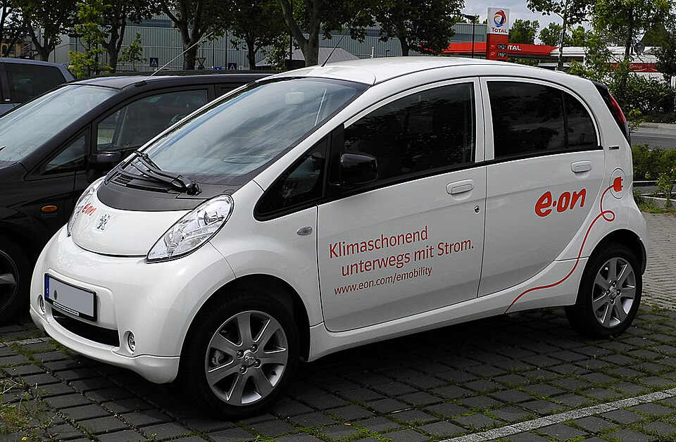

# Peugeot iOn

*Bild: [Peugeot iOn – Frontansicht, 17. Juli 2011, Düsseldorf.jpg](https://commons.wikimedia.org/wiki/File:Peugeot_iOn_%E2%80%93_Frontansicht,_17._Juli_2011,_D%C3%BCsseldorf.jpg) · Urheber: M 93 · Lizenz: CC BY-SA 3.0 de · via Wikimedia Commons.*

> Elektrischer Kleinstwagen von Peugeot, baugleich mit Mitsubishi i-MiEV und Citroën C-Zero und bei Mitsubishi in Japan gebaut.

## Steckbrief

| Feld | Wert | Beleg |
|---|---|---|
| Hersteller | [[peugeot\|Peugeot]] | [[tn-batterycheck-alle-daten]] |
| Segment | Kleinstwagen | Fachwissen¹ |
| Karosserie | Schrägheck, fünftürig | Fachwissen¹ |
| Bauzeit | 2010–2020 | Fachwissen¹ |
| Plattform | Mitsubishi i-MiEV (abgeleitet vom Kei-Car Mitsubishi i) | Fachwissen¹ |
| Varianten im Bestand | 1 | [[tn-batterycheck-alle-daten]] |
| [[bruttokapazitaet\|Bruttokapazität]] | 16 kWh | [[tn-batterycheck-alle-daten]] |
| [[nettokapazitaet\|Nettokapazität]] | 14,5 kWh | [[tn-batterycheck-alle-daten]] |
| [[batteriepuffer\|Puffer]] | 9,4 % | berechnet |

## Beschreibung

Der Peugeot iOn ist das Peugeot-Pendant des Mitsubishi i-MiEV und damit baugleich mit dem [[citroen-c-zero|Citroën C-Zero]]. Die drei Modelle gelten als typisches Beispiel für Badge-Engineering bzw. [[plattform-geschwister|Plattform-Geschwister]]: Technik und Fertigung stammen von Mitsubishi.

Der [[elektromotor|Elektromotor]] sitzt im Heck und treibt die Hinterräder an ([[hinterradantrieb|Hinterradantrieb]]). Die [[traktionsbatterie|Traktionsbatterie]] aus [[lithium-ionen-akku|Lithium-Ionen-Zellen]] ist flach im Unterboden eingebaut.

Aufgrund des Alters der Fahrzeuge ist die [[batteriealterung|Batteriealterung]] ein zentrales Thema; vor einem Kauf empfiehlt sich ein [[batteriecheck|Batteriecheck]].

## Varianten und Batterien

Es gibt nur eine Zeile (iOn) mit 16 kWh brutto / 14,5 kWh netto, identisch mit dem [[citroen-c-zero|Citroën C-Zero]].

| Variante | Brutto | Netto | Puffer | Zeile |
|---|---|---|---|---|
| iOn | 16 kWh | 14,5 kWh | 1,5 kWh (9,4 %) | 254 |

Quelle: [[tn-batterycheck-alle-daten]], Blatt „Fahrzeuge“, Zeilen 254 – bereinigte Fassung (Stand 2026-09-24, Änderungen in [[datenqualitaet]]). Puffer = Brutto − Netto (berechnet).

## Fachbegriffe

- [[plattform-geschwister|Plattform-Geschwister (Badge-Engineering)]] — Fahrzeuge verschiedener Marken, die technisch weitgehend baugleich sind und dieselbe Batterie nutzen.
- [[traktionsbatterie|Traktionsbatterie]] — Der Hochvolt-Energiespeicher, der den Elektromotor eines Elektroautos versorgt.
- [[lithium-ionen-akku|Lithium-Ionen-Akku]] — Wiederaufladbare Batterietechnik, bei der Lithium-Ionen zwischen Anode und Kathode wandern – Standard in allen Fahrzeugen dieses Wikis.
- [[hinterradantrieb|Hinterradantrieb (RWD)]] — Der Elektromotor treibt die Hinterräder an – Standard auf vielen reinen Elektroplattformen.
- [[batteriealterung|Batteriealterung (Degradation)]] — Allmählicher Kapazitäts- und Leistungsverlust einer Lithium-Ionen-Batterie über Zeit und Nutzung.
- [[batteriecheck|Batteriecheck (Batteriezertifikat)]] — Standardisierte Prüfung des Gesundheitszustands der Traktionsbatterie, meist für den Gebrauchtwagenhandel.

## Verwandte Fahrzeuge

- [[citroen-c-zero|Citroën C-Zero]] — technisch verwandt / gleiche Plattform oder Batterie
- Weitere Modelle von Peugeot: [[peugeot-e-2008|Peugeot e-2008]], [[peugeot-e-208|Peugeot e-208]], [[peugeot-e-3008|Peugeot e-3008]], [[peugeot-e-308|Peugeot e-308]], [[peugeot-e-408|Peugeot e-408]], [[peugeot-e-expert|Peugeot e-Expert Combi]], [[peugeot-e-partner|Peugeot e-Partner]], [[peugeot-e-rifter|Peugeot e-Rifter]], [[peugeot-e-traveller|Peugeot e-Traveller]], [[peugeot-partner-tepee-electric|Peugeot Partner Tepee Electric]]

## Offene Punkte

- Je nach Baujahr werden für i-MiEV/C-Zero/iOn sowohl 16 kWh als auch 14,5 kWh als Gesamtkapazität genannt; möglicherweise ist 14,5 kWh eine spätere Bruttokapazität statt eines Nettowerts.

Siehe auch [[datenqualitaet]].

## Quellen

- [[tn-batterycheck-alle-daten]] — Brutto-/Nettokapazität aller Varianten (Zeilen 254)
- Weiterlesen: [Wikipedia – Peugeot iOn](https://en.wikipedia.org/wiki/Peugeot_iOn)

¹ *Beschreibung und Steckbrief-Felder ohne Quellseite beruhen auf allgemeinem Fachwissen des LLM (Stand 2026-09-24) und sind nicht durch eine Rohquelle im Bestand belegt. Zahlenwerte zur Batterie stammen aus der Rohquelle, bereinigt nach dem Protokoll in [[datenqualitaet]].*
