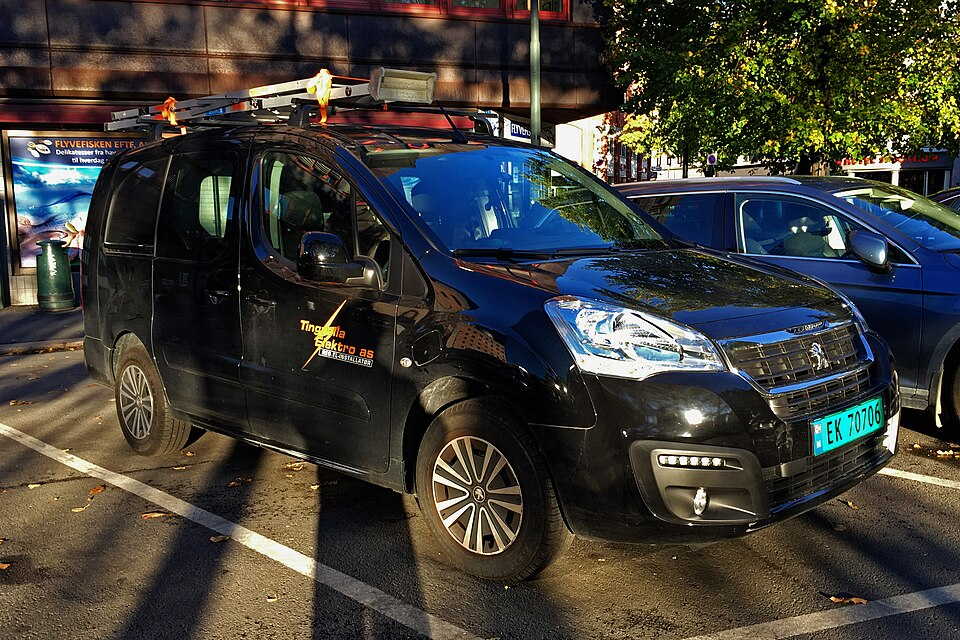

# Peugeot Partner Tepee Electric

*Bild: [Peugeot Partner Tepee Electric 10 2018 1111.jpg](https://commons.wikimedia.org/wiki/File:Peugeot_Partner_Tepee_Electric_10_2018_1111.jpg) · Urheber: Mariordo (Mario Roberto Durán Ortiz) · Lizenz: CC BY-SA 4.0 · via Wikimedia Commons.*

> Früher elektrischer Hochdachkombi von Peugeot auf Basis der zweiten Partner-Generation, baugleich mit dem damaligen elektrischen Citroën Berlingo.

## Steckbrief

| Feld | Wert | Beleg |
|---|---|---|
| Hersteller | [[peugeot\|Peugeot]] | [[tn-batterycheck-alle-daten]] |
| Segment | Hochdachkombi | Fachwissen¹ |
| Karosserie | Hochdachkombi (Van) | Fachwissen¹ |
| Plattform | Partner/Berlingo der zweiten Generation (Konversion eines Verbrennermodells) | Fachwissen¹ |
| Varianten im Bestand | 1 | [[tn-batterycheck-alle-daten]] |
| [[bruttokapazitaet\|Bruttokapazität]] | 22,5 kWh | [[tn-batterycheck-alle-daten]] |
| [[nettokapazitaet\|Nettokapazität]] | 20,5 kWh | [[tn-batterycheck-alle-daten]] |
| [[batteriepuffer\|Puffer]] | 8,9 % | berechnet |

## Beschreibung

Der Peugeot Partner Tepee Electric war die elektrische Pkw-Version des Hochdachkombis Partner der zweiten Generation. Er entstand als [[konversionsfahrzeug|Konversionsfahrzeug]]: Ein ursprünglich für Verbrennungsmotoren konstruiertes Fahrzeug wurde auf Elektroantrieb umgerüstet. Sein Gegenstück bei Citroën ist der ältere elektrische Berlingo, der in diesem Wiki unter dem [[citroen-e-berlingo|ë-Berlingo]] geführt wird.

Die [[traktionsbatterie|Traktionsbatterie]] ist im Vergleich zu heutigen Modellen klein; das Fahrzeug war vor allem für innerstädtische Einsätze gedacht. Angetrieben werden die Vorderräder ([[frontantrieb|Frontantrieb]]).

Der Nachfolger ist der [[peugeot-e-rifter|Peugeot e-Rifter]] auf der aktuellen K9-Plattform mit deutlich größerer Batterie.

## Varianten und Batterien

Es gibt nur eine Zeile (Partner Tepee Electric) mit 22,5 kWh brutto / 20,5 kWh netto. Dieselben Werte stehen beim [[citroen-e-berlingo|ë-Berlingo]] in der Zeile „E-Berlingo Multispace“.

| Variante | Brutto | Netto | Puffer | Zeile |
|---|---|---|---|---|
| Partner Tepee Electric | 22,5 kWh | 20,5 kWh | 2 kWh (8,9 %) | 255 |

Quelle: [[tn-batterycheck-alle-daten]], Blatt „Fahrzeuge“, Zeilen 255 – bereinigte Fassung (Stand 2026-09-24, Änderungen in [[datenqualitaet]]). Puffer = Brutto − Netto (berechnet).

## Fachbegriffe

- [[konversionsfahrzeug|Konversionsfahrzeug]] — Elektroauto, das von einem Modell mit Verbrennungsmotor abgeleitet ist, statt auf einer reinen Elektroplattform zu basieren.
- [[plattform-geschwister|Plattform-Geschwister (Badge-Engineering)]] — Fahrzeuge verschiedener Marken, die technisch weitgehend baugleich sind und dieselbe Batterie nutzen.
- [[traktionsbatterie|Traktionsbatterie]] — Der Hochvolt-Energiespeicher, der den Elektromotor eines Elektroautos versorgt.
- [[elektro-transporter|Elektro-Transporter und Vans]] — Leichte Nutzfahrzeuge und Großraum-Pkw mit Elektroantrieb – im Bestand vor allem von Stellantis, Mercedes, Renault und VW.
- [[frontantrieb|Frontantrieb (FWD)]] — Der Elektromotor treibt die Vorderräder an – typisch für Kleinwagen und Konversionsfahrzeuge.

## Verwandte Fahrzeuge

- [[citroen-e-berlingo|Citroën ë-Berlingo]] — technisch verwandt / gleiche Plattform oder Batterie
- Weitere Modelle von Peugeot: [[peugeot-e-2008|Peugeot e-2008]], [[peugeot-e-208|Peugeot e-208]], [[peugeot-e-3008|Peugeot e-3008]], [[peugeot-e-308|Peugeot e-308]], [[peugeot-e-408|Peugeot e-408]], [[peugeot-e-expert|Peugeot e-Expert Combi]], [[peugeot-e-partner|Peugeot e-Partner]], [[peugeot-e-rifter|Peugeot e-Rifter]], [[peugeot-e-traveller|Peugeot e-Traveller]], [[peugeot-ion|Peugeot iOn]]

## Offene Punkte

- Bauzeit nicht sicher bekannt, daher null.
- Die Konversion erfolgte nach verbreiteten Angaben in Zusammenarbeit mit einem externen Partner; Details nicht gesichert.

Siehe auch [[datenqualitaet]].

## Quellen

- [[tn-batterycheck-alle-daten]] — Brutto-/Nettokapazität aller Varianten (Zeilen 255)

¹ *Beschreibung und Steckbrief-Felder ohne Quellseite beruhen auf allgemeinem Fachwissen des LLM (Stand 2026-09-24) und sind nicht durch eine Rohquelle im Bestand belegt. Zahlenwerte zur Batterie stammen aus der Rohquelle, bereinigt nach dem Protokoll in [[datenqualitaet]].*
