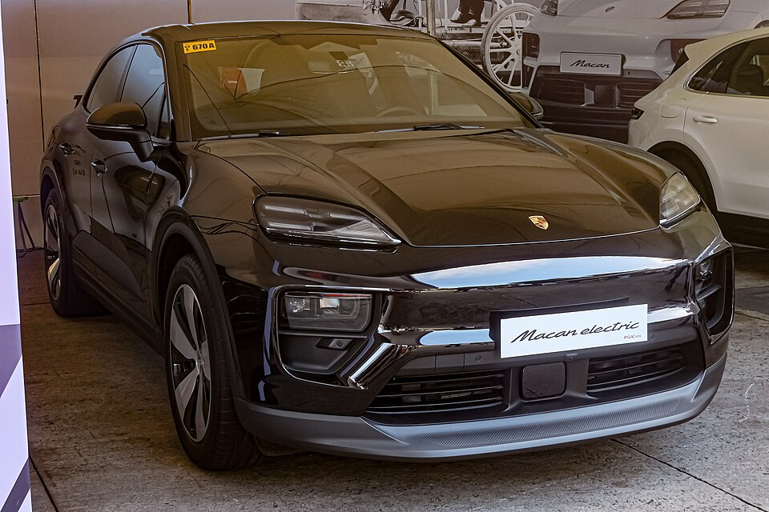

# Porsche Macan (Elektro)

*Bild: [Porsche Macan Electric XAB Jet Black Metallic 01.jpg](https://commons.wikimedia.org/wiki/File:Porsche_Macan_Electric_XAB_Jet_Black_Metallic_01.jpg) · Urheber: Ethan Llamas · Lizenz: CC BY-SA 4.0 · via Wikimedia Commons.*

> Rein elektrische Neuauflage des Porsche Macan, ein Mittelklasse-SUV auf der mit Audi entwickelten PPE-Plattform mit 800-Volt-Technik.

## Steckbrief

| Feld | Wert | Beleg |
|---|---|---|
| Hersteller | [[porsche\|Porsche]] | [[tn-batterycheck-alle-daten]] |
| Segment | Mittelklasse-SUV | Fachwissen¹ |
| Karosserie | SUV | Fachwissen¹ |
| Bauzeit | seit 2024 | Fachwissen¹ |
| Plattform | PPE (Premium Platform Electric) | Fachwissen¹ |
| Varianten im Bestand | 4 | [[tn-batterycheck-alle-daten]] |
| [[bruttokapazitaet\|Bruttokapazität]] | 100 kWh | [[tn-batterycheck-alle-daten]] |
| [[nettokapazitaet\|Nettokapazität]] | 95 kWh | [[tn-batterycheck-alle-daten]] |
| [[batteriepuffer\|Puffer]] | 5,0 % | berechnet |

## Beschreibung

Der elektrische Porsche Macan ist eine eigenständige Neuentwicklung und kein Umbau des Verbrenner-Macan. Er nutzt die [[plattform-ppe|Premium Platform Electric (PPE)]] und ist damit ein [[plattform-geschwister|Plattform-Geschwister]] des [[audi-q6-e-tron|Audi Q6 e-tron]].

Die [[800-volt-architektur|800-Volt-Architektur]] erlaubt hohe Ladeleistungen beim [[dc-schnellladen|DC-Schnellladen]]. Der Basis-Macan hat [[hinterradantrieb|Hinterradantrieb]], die Versionen 4, 4S und Turbo zwei [[elektromotor|Elektromotoren]] und [[allradantrieb|Allradantrieb]]. Alle Varianten nutzen dieselbe [[traktionsbatterie|Traktionsbatterie]] mit prismatischen [[nmc-zellchemie|NMC-Zellen]].

## Varianten und Batterien

Alle vier Zeilen haben dieselbe Batterie mit 100/95 kWh. "Macan" ohne Zusatz = Hinterradantrieb; "4", "4S" und "Turbo" sind Allrad-Leistungsstufen (bei Porsche bezeichnet "Turbo" beim Elektroauto die Topversion, nicht einen Turbolader).

| Variante | Brutto | Netto | Puffer | Zeile |
|---|---|---|---|---|
| Macan | 100 kWh | 95 kWh | 5 kWh (5,0 %) | 256 |
| Macan 4 | 100 kWh | 95 kWh | 5 kWh (5,0 %) | 257 |
| Macan 4S | 100 kWh | 95 kWh | 5 kWh (5,0 %) | 258 |
| Macan Turbo | 100 kWh | 95 kWh | 5 kWh (5,0 %) | 259 |

Quelle: [[tn-batterycheck-alle-daten]], Blatt „Fahrzeuge“, Zeilen 256–259 – bereinigte Fassung (Stand 2026-09-24, Änderungen in [[datenqualitaet]]). Puffer = Brutto − Netto (berechnet).

## Fachbegriffe

- [[plattform-ppe|PPE (Premium Platform Electric)]] — Gemeinsame Elektroplattform von Audi und Porsche für Oberklasse-Fahrzeuge mit 800-Volt-Technik.
- [[800-volt-architektur|800-Volt-Architektur]] — Hochvoltsystem mit etwa doppelter Spannung gegenüber üblichen 400 Volt – ermöglicht schnelleres Laden und leichtere Kabel.
- [[dc-schnellladen|DC-Schnellladen]] — Laden mit Gleichstrom direkt in die Batterie, ohne Umweg über den Bordlader – mit 50 bis über 300 kW.
- [[hinterradantrieb|Hinterradantrieb (RWD)]] — Der Elektromotor treibt die Hinterräder an – Standard auf vielen reinen Elektroplattformen.
- [[allradantrieb|Allradantrieb (AWD)]] — Beide Achsen werden angetrieben, bei Elektroautos meist durch je einen eigenen Motor pro Achse.
- [[typbezeichnungen|Typbezeichnungen]] — Wie Hersteller Leistungsstufe, Batterie und Antrieb in Modellnamen codieren – ein Lesehilfe-Artikel.
- [[plattform-geschwister|Plattform-Geschwister (Badge-Engineering)]] — Fahrzeuge verschiedener Marken, die technisch weitgehend baugleich sind und dieselbe Batterie nutzen.

## Verwandte Fahrzeuge

- [[audi-q6-e-tron|Audi Q6 e-tron]] — technisch verwandt / gleiche Plattform oder Batterie
- Weitere Modelle von Porsche: [[porsche-taycan|Porsche Taycan]]

## Offene Punkte

- Die Audi-Schwester Q6 e-tron ist mit 100/94,9 kWh gelistet, der Macan mit 100/95 kWh – Rundungsdifferenz bei vermutlich gleicher Batterie.

Siehe auch [[datenqualitaet]].

## Quellen

- [[tn-batterycheck-alle-daten]] — Brutto-/Nettokapazität aller Varianten (Zeilen 256–259)

¹ *Beschreibung und Steckbrief-Felder ohne Quellseite beruhen auf allgemeinem Fachwissen des LLM (Stand 2026-09-24) und sind nicht durch eine Rohquelle im Bestand belegt. Zahlenwerte zur Batterie stammen aus der Rohquelle, bereinigt nach dem Protokoll in [[datenqualitaet]].*
