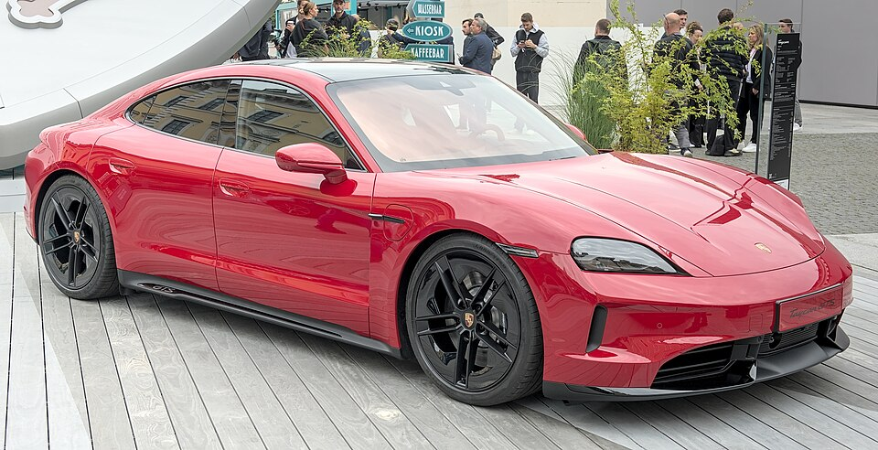

# Porsche Taycan

*Bild: [2024 Porsche Taycan GTS IAA 2025 DSC 1988.jpg](https://commons.wikimedia.org/wiki/File:2024_Porsche_Taycan_GTS_IAA_2025_DSC_1988.jpg) · Urheber: Alexander-93 · Lizenz: CC BY-SA 4.0 · via Wikimedia Commons.*

> Erstes Serien-Elektroauto von Porsche: eine Sportlimousine auf der J1-Plattform mit 800-Volt-Technik, ergänzt um die Kombiversionen Sport Turismo und Cross Turismo.

## Steckbrief

| Feld | Wert | Beleg |
|---|---|---|
| Hersteller | [[porsche\|Porsche]] | [[tn-batterycheck-alle-daten]] |
| Segment | Oberklasse-Sportlimousine | Fachwissen¹ |
| Karosserie | Limousine, Kombi (Sport Turismo), Offroad-Kombi (Cross Turismo) | Fachwissen¹ |
| Bauzeit | seit 2019 | Fachwissen¹ |
| Plattform | J1 | Fachwissen¹ |
| Varianten im Bestand | 36 | [[tn-batterycheck-alle-daten]] |
| [[bruttokapazitaet\|Bruttokapazität]] | 79,2–105 kWh | [[tn-batterycheck-alle-daten]] |
| [[nettokapazitaet\|Nettokapazität]] | 71–97 kWh | [[tn-batterycheck-alle-daten]] |
| [[batteriepuffer\|Puffer]] | 7,5–10,4 % | berechnet |

## Beschreibung

Der Porsche Taycan wurde als reines [[bev|Elektroauto]] entwickelt und begründete die [[plattform-j1|J1-Plattform]], die auch der [[audi-e-tron-gt|Audi e-tron GT]] nutzt. Er war eines der ersten Serienfahrzeuge mit [[800-volt-architektur|800-Volt-Architektur]], die kurze Ladezeiten beim [[dc-schnellladen|DC-Schnellladen]] ermöglicht.

Die Basisversionen haben [[hinterradantrieb|Hinterradantrieb]], die Modelle 4, 4S, GTS, Turbo und Turbo S zwei [[elektromotor|Elektromotoren]] und [[allradantrieb|Allradantrieb]]. Hinten kommt ein Zweigang-Getriebe zum Einsatz. Die [[traktionsbatterie|Traktionsbatterie]] besteht aus Pouch-Zellen mit [[nmc-zellchemie|NMC-Chemie]].

Mit der [[modellpflege|Modellpflege]] 2024 wurden beide Batterien durch Nachfolger mit höherer Kapazität ersetzt. Deshalb erscheinen viele Varianten in den Rohdaten mehrfach.

## Varianten und Batterien

Vier Batterien in zwei Generationen: Vor der Modellpflege die Performancebatterie (79,2/71 kWh) und die Performancebatterie Plus (93,4/83,7 kWh); nach der Modellpflege die Performancebatterie (89/82,3 kWh) und die Performancebatterie Plus (105/97 kWh). "Sport Turismo" ist der Kombi, "Cross Turismo" der höhergelegte Kombi; "4", "4S", "GTS", "Turbo", "Turbo S" und "Turbo GT" sind Leistungsstufen – "Turbo" bezeichnet keine Aufladung, sondern die Leistungsklasse.

| Variante | Brutto | Netto | Puffer | Zeile |
|---|---|---|---|---|
| Taycan | 79,2 kWh | 71 kWh | 8,2 kWh (10,4 %) | 260 |
| Taycan | 89 kWh | 82,3 kWh | 6,7 kWh (7,5 %) | 261 |
| Taycan | 93,4 kWh | 83,7 kWh | 9,7 kWh (10,4 %) | 262 |
| Taycan | 105 kWh | 97 kWh | 8 kWh (7,6 %) | 263 |
| Taycan 4 Cross Turismo | 93,4 kWh | 83,7 kWh | 9,7 kWh (10,4 %) | 264 |
| Taycan 4 Cross Turismo | 105 kWh | 97 kWh | 8 kWh (7,6 %) | 265 |
| Taycan 4S | 79,2 kWh | 71 kWh | 8,2 kWh (10,4 %) | 266 |
| Taycan 4S | 89 kWh | 82,3 kWh | 6,7 kWh (7,5 %) | 267 |
| Taycan 4S | 93,4 kWh | 83,7 kWh | 9,7 kWh (10,4 %) | 268 |
| Taycan 4S | 105 kWh | 97 kWh | 8 kWh (7,6 %) | 269 |
| Taycan 4S Cross Turismo | 93,4 kWh | 83,7 kWh | 9,7 kWh (10,4 %) | 270 |
| Taycan 4S Cross Turismo | 105 kWh | 97 kWh | 8 kWh (7,6 %) | 271 |
| Taycan 4S Sport Turismo | 79,2 kWh | 71 kWh | 8,2 kWh (10,4 %) | 272 |
| Taycan 4S Sport Turismo | 89 kWh | 82,3 kWh | 6,7 kWh (7,5 %) | 273 |
| Taycan 4S Sport Turismo | 93,4 kWh | 83,7 kWh | 9,7 kWh (10,4 %) | 274 |
| Taycan 4S Sport Turismo | 105 kWh | 97 kWh | 8 kWh (7,6 %) | 275 |
| Taycan GTS | 93,4 kWh | 83,7 kWh | 9,7 kWh (10,4 %) | 276 |
| Taycan GTS | 105 kWh | 97 kWh | 8 kWh (7,6 %) | 277 |
| Taycan GTS Sport Turismo | 93,4 kWh | 83,7 kWh | 9,7 kWh (10,4 %) | 278 |
| Taycan GTS Sport Turismo | 105 kWh | 97 kWh | 8 kWh (7,6 %) | 279 |
| Taycan Sport Turismo | 79,2 kWh | 71 kWh | 8,2 kWh (10,4 %) | 280 |
| Taycan Sport Turismo | 93,4 kWh | 83,7 kWh | 9,7 kWh (10,4 %) | 281 |
| Taycan Sport Turismo | 105 kWh | 97 kWh | 8 kWh (7,6 %) | 283 |
| Taycan Turbo | 93,4 kWh | 83,7 kWh | 9,7 kWh (10,4 %) | 284 |
| Taycan Turbo | 105 kWh | 97 kWh | 8 kWh (7,6 %) | 285 |
| Taycan Turbo Cross Turismo | 93,4 kWh | 83,7 kWh | 9,7 kWh (10,4 %) | 286 |
| Taycan Turbo Cross Turismo | 105 kWh | 97 kWh | 8 kWh (7,6 %) | 287 |
| Taycan Turbo GT | 105 kWh | 97 kWh | 8 kWh (7,6 %) | 288 |
| Taycan Turbo S | 93,4 kWh | 83,7 kWh | 9,7 kWh (10,4 %) | 289 |
| Taycan Turbo S | 105 kWh | 97 kWh | 8 kWh (7,6 %) | 290 |
| Taycan Turbo S Cross Turismo | 93,4 kWh | 83,7 kWh | 9,7 kWh (10,4 %) | 291 |
| Taycan Turbo S Cross Turismo | 105 kWh | 97 kWh | 8 kWh (7,6 %) | 292 |
| Taycan Turbo S Sport Turismo | 93,4 kWh | 83,7 kWh | 9,7 kWh (10,4 %) | 293 |
| Taycan Turbo S Sport Turismo | 105 kWh | 97 kWh | 8 kWh (7,6 %) | 294 |
| Taycan Turbo Sport Turismo | 93,4 kWh | 83,7 kWh | 9,7 kWh (10,4 %) | 295 |
| Taycan Turbo Sport Turismo | 105 kWh | 97 kWh | 8 kWh (7,6 %) | 296 |

Quelle: [[tn-batterycheck-alle-daten]], Blatt „Fahrzeuge“, Zeilen 260–296 – bereinigte Fassung (Stand 2026-09-24, Änderungen in [[datenqualitaet]]). Puffer = Brutto − Netto (berechnet).

## Korrekturen

- **Zeile 282 entfernt:** Exaktes Duplikat von Zeile 281 (Taycan Sport Turismo, 93,4 / 83,7 kWh).

Gegenüber der Rohquelle geändert am 2026-09-24; vollständiges Protokoll in [[datenqualitaet]].

## Fachbegriffe

- [[plattform-j1|J1-Plattform]] — Porsches Elektro-Sportwagenplattform für Taycan und Audi e-tron GT.
- [[800-volt-architektur|800-Volt-Architektur]] — Hochvoltsystem mit etwa doppelter Spannung gegenüber üblichen 400 Volt – ermöglicht schnelleres Laden und leichtere Kabel.
- [[dc-schnellladen|DC-Schnellladen]] — Laden mit Gleichstrom direkt in die Batterie, ohne Umweg über den Bordlader – mit 50 bis über 300 kW.
- [[modellpflege|Modellpflege (Facelift)]] — Überarbeitung eines Modells während der Bauzeit – bei Elektroautos oft mit neuer Batterie.
- [[hinterradantrieb|Hinterradantrieb (RWD)]] — Der Elektromotor treibt die Hinterräder an – Standard auf vielen reinen Elektroplattformen.
- [[allradantrieb|Allradantrieb (AWD)]] — Beide Achsen werden angetrieben, bei Elektroautos meist durch je einen eigenen Motor pro Achse.
- [[typbezeichnungen|Typbezeichnungen]] — Wie Hersteller Leistungsstufe, Batterie und Antrieb in Modellnamen codieren – ein Lesehilfe-Artikel.
- [[karosserieformen|Karosserieformen]] — Varianten der Aufbauform eines Modells – beeinflussen Aussehen und Luftwiderstand, meist nicht die Batterie.

## Verwandte Fahrzeuge

- [[audi-e-tron-gt|Audi e-tron GT]] — technisch verwandt / gleiche Plattform oder Batterie
- Weitere Modelle von Porsche: [[porsche-macan-electric|Porsche Macan (Elektro)]]

## Offene Punkte

- Die Batteriebezeichnungen (Performancebatterie/Performancebatterie Plus) stehen nicht in den Rohdaten; die Zuordnung erfolgt über die Kapazität.

Siehe auch [[datenqualitaet]].

## Quellen

- [[tn-batterycheck-alle-daten]] — Brutto-/Nettokapazität aller Varianten (Zeilen 260–296)
- Weiterlesen: [Wikipedia – Porsche Taycan](https://en.wikipedia.org/wiki/Porsche_Taycan)

¹ *Beschreibung und Steckbrief-Felder ohne Quellseite beruhen auf allgemeinem Fachwissen des LLM (Stand 2026-09-24) und sind nicht durch eine Rohquelle im Bestand belegt. Zahlenwerte zur Batterie stammen aus der Rohquelle, bereinigt nach dem Protokoll in [[datenqualitaet]].*
