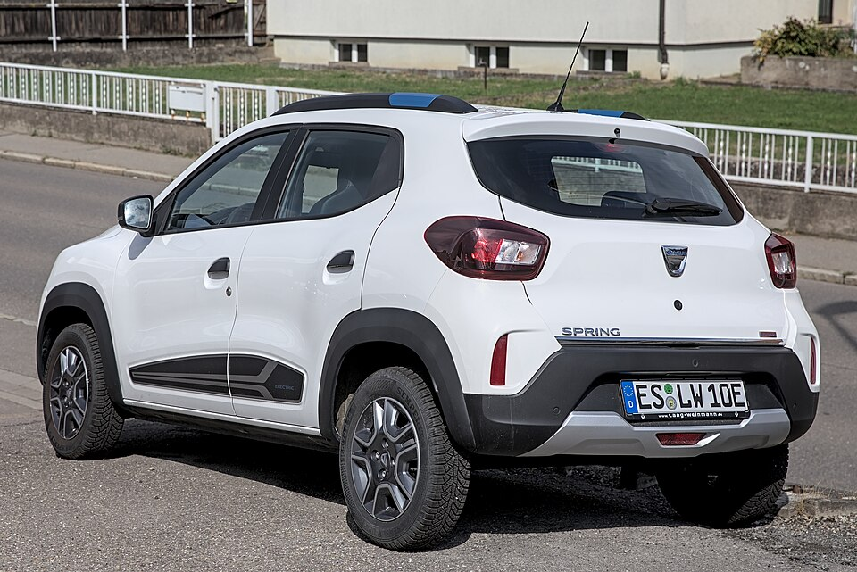

# Renault City K-ZE

*Bild: [Dacia Spring 1X7A0346.jpg](https://commons.wikimedia.org/wiki/File:Dacia_Spring_1X7A0346.jpg) · Urheber: Alexander Migl · Lizenz: CC BY-SA 4.0 · via Wikimedia Commons. Abgebildet ist der baugleiche Dacia Spring (Europa-Version des City K-ZE).*

> Elektrischer Kleinstwagen im SUV-Stil, den Renault für den chinesischen Markt anbot und der die Basis des Dacia Spring bildet.

## Steckbrief

| Feld | Wert | Beleg |
|---|---|---|
| Hersteller | [[renault\|Renault]] | [[tn-batterycheck-alle-daten]] |
| Segment | Kleinstwagen | Fachwissen¹ |
| Karosserie | Schrägheck im Mini-SUV-Stil, fünftürig | Fachwissen¹ |
| Plattform | CMF-A (Renault-Nissan-Kleinwagenplattform, Basis Renault Kwid) | Fachwissen¹ |
| Varianten im Bestand | 1 | [[tn-batterycheck-alle-daten]] |
| [[bruttokapazitaet\|Bruttokapazität]] | 27,4 kWh | [[tn-batterycheck-alle-daten]] |
| [[nettokapazitaet\|Nettokapazität]] | 26,8 kWh | [[tn-batterycheck-alle-daten]] |
| [[batteriepuffer\|Puffer]] | 2,2 % | berechnet |

## Beschreibung

Der Renault City K-ZE ist eine elektrische Ableitung des Kleinwagens Renault Kwid und wurde in China über ein Gemeinschaftsunternehmen produziert und vermarktet. Für Europa wurde das Fahrzeug als [[dacia-spring|Dacia Spring]] adaptiert; beide Modelle sind damit [[plattform-geschwister|Plattform-Geschwister]].

Konzipiert ist der City K-ZE als preiswertes Stadtauto mit kleiner [[traktionsbatterie|Traktionsbatterie]] und [[elektromotor|Elektromotor]] an der Vorderachse ([[frontantrieb|Frontantrieb]]).

In Europa wurde das Modell unter dem Renault-Namen nicht regulär angeboten; Relevanz hat es hier vor allem als technische Basis des Dacia Spring.

## Varianten und Batterien

Es gibt nur eine Zeile (City K-ZE) mit 27,4 kWh brutto / 26,8 kWh netto – korrigiert, die Rohquelle nannte 30 kWh brutto ohne Beleg. Renault selbst nennt 26,8 kWh, ohne brutto und netto zu unterscheiden.

| Variante | Brutto | Netto | Puffer | Zeile | Status |
|---|---|---|---|---|---|
| City K-ZE | 27,4 kWh | 26,8 kWh | 0,6 kWh (2,2 %) | 297 | korrigiert ([#4](https://github.com/Thitronik01/Frank-Repo/issues/4)) |

Quelle: [[tn-batterycheck-alle-daten]], Blatt „Fahrzeuge“, Zeilen 297 – bereinigte Fassung (Stand 2026-09-24, Änderungen in [[datenqualitaet]]). Puffer = Brutto − Netto (berechnet).

## Korrekturen

- **Zeile 297 korrigiert:** „City K-ZE“ 30 kWh / 26,8 kWh → 27,4 kWh / 26,8 kWh. 30 kWh brutto sind nicht belegt (nur auto-data.net). Renault nennt 26,8 kWh; der baugleiche Dacia Spring hat laut ADAC (Herstellerdaten) 27,4 / 26,8 kWh. Beleg: [Quelle 1](https://paultan.org/2019/09/10/renault-k-ze-launched-in-china/), [Quelle 2](https://www.batterydesign.net/dacia-spring-battery/). Issue [#4](https://github.com/Thitronik01/Frank-Repo/issues/4).

Gegenüber der Rohquelle geändert am 2026-09-24; vollständiges Protokoll in [[datenqualitaet]].

## Fachbegriffe

- [[plattform-geschwister|Plattform-Geschwister (Badge-Engineering)]] — Fahrzeuge verschiedener Marken, die technisch weitgehend baugleich sind und dieselbe Batterie nutzen.
- [[traktionsbatterie|Traktionsbatterie]] — Der Hochvolt-Energiespeicher, der den Elektromotor eines Elektroautos versorgt.
- [[frontantrieb|Frontantrieb (FWD)]] — Der Elektromotor treibt die Vorderräder an – typisch für Kleinwagen und Konversionsfahrzeuge.
- [[bruttokapazitaet|Bruttokapazität]] — Die gesamte, physikalisch in der Batterie verbaute Energiemenge – inklusive der Reserven, die der Fahrer nie nutzen kann.
- [[nettokapazitaet|Nettokapazität]] — Der Teil der Batteriekapazität, den der Fahrer tatsächlich nutzen kann – Grundlage für Reichweite und Batterietests.

## Verwandte Fahrzeuge

- [[dacia-spring|Dacia Spring Electric]] — technisch verwandt / gleiche Plattform oder Batterie
- Weitere Modelle von Renault: [[renault-kangoo-electric|Renault Kangoo Z.E. / E-Tech]], [[renault-master-electric|Renault Master Z.E. / E-Tech]], [[renault-scenic-e-tech|Renault Scenic E-Tech]], [[renault-twingo-electric|Renault Twingo Electric]], [[renault-zoe|Renault Zoe]]

## Offene Punkte

- Bauzeit nicht sicher bekannt, daher null.

Siehe auch [[datenqualitaet]].

## Quellen

- [[tn-batterycheck-alle-daten]] — Brutto-/Nettokapazität aller Varianten (Zeilen 297)

¹ *Beschreibung und Steckbrief-Felder ohne Quellseite beruhen auf allgemeinem Fachwissen des LLM (Stand 2026-09-24) und sind nicht durch eine Rohquelle im Bestand belegt. Zahlenwerte zur Batterie stammen aus der Rohquelle, bereinigt nach dem Protokoll in [[datenqualitaet]].*
