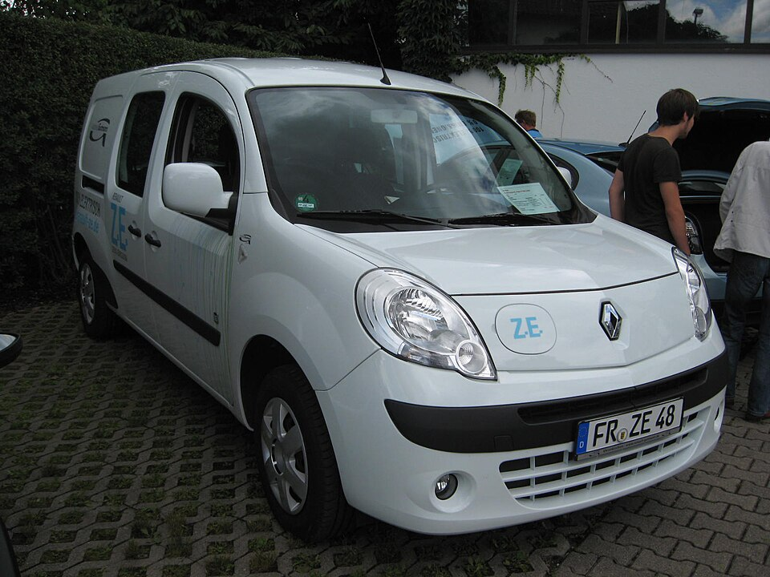

# Renault Kangoo Z.E. / E-Tech

*Bild: [Renault Kangoo Z.E..JPG](https://commons.wikimedia.org/wiki/File:Renault_Kangoo_Z.E..JPG) · Urheber: Ctebert · Lizenz: CC BY-SA 3.0 · via Wikimedia Commons.*

> Elektrischer Hochdachkombi bzw. Kleintransporter von Renault, der als Kangoo Z.E. (zweite Generation) und als Kangoo E-Tech Electric (dritte Generation) angeboten wurde.

## Steckbrief

| Feld | Wert | Beleg |
|---|---|---|
| Hersteller | [[renault\|Renault]] | [[tn-batterycheck-alle-daten]] |
| Segment | Hochdachkombi / Kleintransporter | Fachwissen¹ |
| Karosserie | Hochdachkombi bzw. Kastenwagen, normale und lange Version | Fachwissen¹ |
| Plattform | Kangoo II (Z.E.); Kangoo III auf Renault-Nissan-Plattform CMF-C/D (E-Tech) | Fachwissen¹ |
| Varianten im Bestand | 5 | [[tn-batterycheck-alle-daten]] |
| [[bruttokapazitaet\|Bruttokapazität]] | 22–48 kWh | [[tn-batterycheck-alle-daten]] |
| [[nettokapazitaet\|Nettokapazität]] | 20–45 kWh | [[tn-batterycheck-alle-daten]] |
| [[batteriepuffer\|Puffer]] | 6,1–9,1 % | berechnet |

## Beschreibung

Der Renault Kangoo mit Elektroantrieb ist einer der am längsten angebotenen [[elektro-transporter|Elektro-Transporter]] in Europa. Der Kangoo Z.E. der zweiten Generation basierte auf dem Verbrennermodell und erhielt im Laufe der Bauzeit eine größere Batterie. Die dritte Generation wird als Kangoo E-Tech Electric vermarktet und ist baugleich mit Modellen anderer Hersteller, darunter der [[mercedes-eqt|Mercedes EQT]].

In beiden Generationen treibt ein [[elektromotor|Elektromotor]] die Vorderräder an ([[frontantrieb|Frontantrieb]]); die [[traktionsbatterie|Traktionsbatterie]] liegt im Unterboden. Beim Kangoo Z.E. war – wie bei der Renault Zoe – anfangs auch eine Batteriemiete üblich.

Die Bezeichnung „Z.E.“ (Zero Emission) wurde bei Renault später durch „E-Tech Electric“ abgelöst; siehe auch [[typbezeichnungen|Typbezeichnungen]].

## Varianten und Batterien

„Kangoo Z.E.“ gibt es mit zwei Batteriegenerationen: 22 kWh brutto / 20,0 kWh netto (Erstausstattung) und 33 kWh brutto / 31,0 kWh netto (spätere, größere Batterie). „Kangoo Maxi Z.E.“ ist die Langversion mit der 33-kWh-Batterie. „Kangoo E-Tech“ und „Kangoo Grand E-Tech“ (Langversion) gehören zur dritten Generation mit 48 kWh brutto / 45,0 kWh netto.

| Variante | Brutto | Netto | Puffer | Zeile |
|---|---|---|---|---|
| Kangoo E-Tech | 48 kWh | 45,0 kWh | 3 kWh (6,2 %) | 298 |
| Kangoo Grand E-Tech | 48 kWh | 45,0 kWh | 3 kWh (6,2 %) | 299 |
| Kangoo Maxi Z.E. | 33 kWh | 31,0 kWh | 2 kWh (6,1 %) | 300 |
| Kangoo Z.E. | 22 kWh | 20,0 kWh | 2 kWh (9,1 %) | 301 |
| Kangoo Z.E. | 33 kWh | 31,0 kWh | 2 kWh (6,1 %) | 302 |

Quelle: [[tn-batterycheck-alle-daten]], Blatt „Fahrzeuge“, Zeilen 298–302. Puffer = Brutto − Netto (berechnet).

## Fachbegriffe

- [[elektro-transporter|Elektro-Transporter und Vans]] — Leichte Nutzfahrzeuge und Großraum-Pkw mit Elektroantrieb – im Bestand vor allem von Stellantis, Mercedes, Renault und VW.
- [[plattform-geschwister|Plattform-Geschwister (Badge-Engineering)]] — Fahrzeuge verschiedener Marken, die technisch weitgehend baugleich sind und dieselbe Batterie nutzen.
- [[typbezeichnungen|Typbezeichnungen]] — Wie Hersteller Leistungsstufe, Batterie und Antrieb in Modellnamen codieren – ein Lesehilfe-Artikel.
- [[modellpflege|Modellpflege (Facelift)]] — Überarbeitung eines Modells während der Bauzeit – bei Elektroautos oft mit neuer Batterie.
- [[frontantrieb|Frontantrieb (FWD)]] — Der Elektromotor treibt die Vorderräder an – typisch für Kleinwagen und Konversionsfahrzeuge.
- [[traktionsbatterie|Traktionsbatterie]] — Der Hochvolt-Energiespeicher, der den Elektromotor eines Elektroautos versorgt.

## Verwandte Fahrzeuge

- [[mercedes-eqt|Mercedes-Benz EQT]] — technisch verwandt / gleiche Plattform oder Batterie
- [[renault-master-electric|Renault Master Z.E. / E-Tech]] — technisch verwandt / gleiche Plattform oder Batterie
- Weitere Modelle von Renault: [[renault-city-k-ze|Renault City K-ZE]], [[renault-scenic-e-tech|Renault Scenic E-Tech]], [[renault-twingo-electric|Renault Twingo Electric]], [[renault-zoe|Renault Zoe]]

## Offene Punkte

- Unter einem Slug sind zwei Fahrzeuggenerationen (Kangoo Z.E. und Kangoo E-Tech) zusammengefasst.
- Für den Kangoo Z.E. mit kleiner Batterie findet man 22 kWh teils als Brutto-, teils als Nettoangabe.
- Mercedes EQT ist in families.json mit 50/45 kWh erfasst, der Kangoo E-Tech mit 48/45 kWh – gleicher Nettowert, abweichender Bruttowert.

Siehe auch [[datenqualitaet]].

## Quellen

- [[tn-batterycheck-alle-daten]] — Brutto-/Nettokapazität aller Varianten (Zeilen 298–302)

¹ *Beschreibung und Steckbrief-Felder ohne Quellseite beruhen auf allgemeinem Fachwissen des LLM (Stand 2026-09-23) und sind nicht durch eine Rohquelle im Bestand belegt. Zahlenwerte zur Batterie stammen ausschließlich aus der Rohquelle.*
