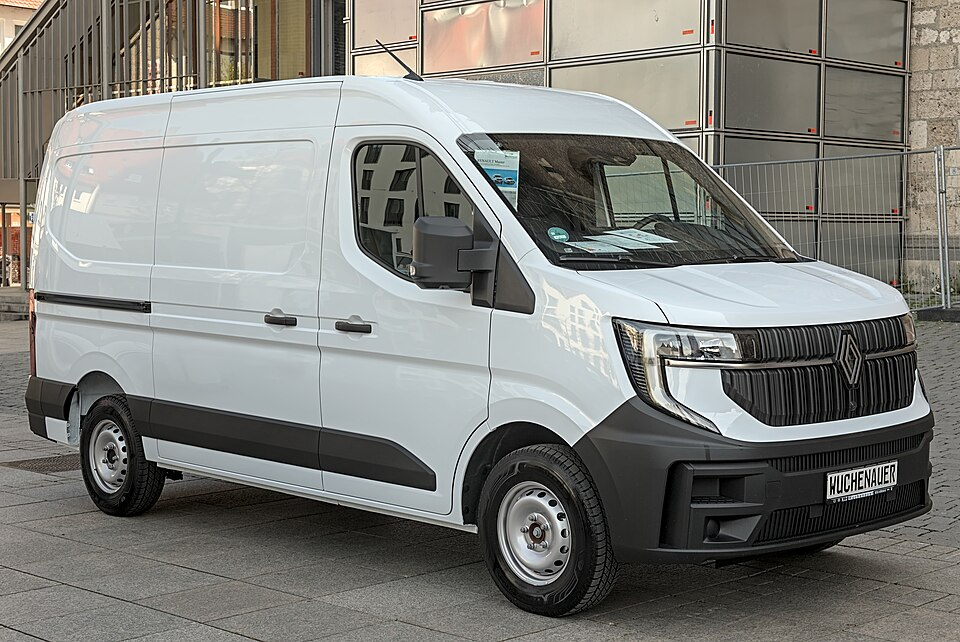

# Renault Master Z.E. / E-Tech

*Bild: [Renault Master IV Autofrühling Ulm 2025 DSC 8730.jpg](https://commons.wikimedia.org/wiki/File:Renault_Master_IV_Autofr%C3%BChling_Ulm_2025_DSC_8730.jpg) · Urheber: Alexander Migl · Lizenz: CC BY-SA 4.0 · via Wikimedia Commons.*

> Elektrischer großer Transporter von Renault, erst als Master Z.E. und in der neuen Generation als Master E-Tech Electric angeboten.

## Steckbrief

| Feld | Wert | Beleg |
|---|---|---|
| Hersteller | [[renault\|Renault]] | [[tn-batterycheck-alle-daten]] |
| Segment | Transporter (großer Kastenwagen) | Fachwissen¹ |
| Karosserie | Kastenwagen, Fahrgestell | Fachwissen¹ |
| Plattform | Master III (Z.E.); Master IV (E-Tech) | Fachwissen¹ |
| Varianten im Bestand | 3 | [[tn-batterycheck-alle-daten]] |
| [[bruttokapazitaet\|Bruttokapazität]] | 33–92 kWh | [[tn-batterycheck-alle-daten]] |
| [[nettokapazitaet\|Nettokapazität]] | 31–87 kWh | [[tn-batterycheck-alle-daten]] |
| [[batteriepuffer\|Puffer]] | 5,4–6,1 % | berechnet |

## Beschreibung

Der Renault Master mit Elektroantrieb ist der große [[elektro-transporter|Elektro-Transporter]] der Marke. Der Master Z.E. basierte auf der dritten Master-Generation und war mit einer vergleichsweise kleinen [[traktionsbatterie|Traktionsbatterie]] vor allem für den städtischen Lieferverkehr ausgelegt.

Mit der neuen Master-Generation (E-Tech Electric) wurde das Konzept grundlegend überarbeitet: Die Karosserie ist aerodynamischer, und es stehen deutlich größere Batterien zur Wahl, womit der Transporter auch für Überlandfahrten geeignet ist. Angetrieben werden die Vorderräder ([[frontantrieb|Frontantrieb]]).

Die Bezeichnungswechsel von „Z.E.“ zu „E-Tech“ folgen der allgemeinen Namenssystematik von Renault; siehe [[typbezeichnungen|Typbezeichnungen]].

## Varianten und Batterien

„Master Z.E.“ ist die ältere Generation mit 33 kWh brutto / 31,0 kWh netto. „Master E-Tech“ gehört zur neuen Generation und ist mit zwei parallel angebotenen Batterien erfasst: 55 kWh brutto / 52,0 kWh netto und 92 kWh brutto / 87,0 kWh netto.

| Variante | Brutto | Netto | Puffer | Zeile |
|---|---|---|---|---|
| Master E-Tech | 55 kWh | 52,0 kWh | 3 kWh (5,5 %) | 303 |
| Master E-Tech | 92 kWh | 87,0 kWh | 5 kWh (5,4 %) | 304 |
| Master Z.E. | 33 kWh | 31,0 kWh | 2 kWh (6,1 %) | 305 |

Quelle: [[tn-batterycheck-alle-daten]], Blatt „Fahrzeuge“, Zeilen 303–305. Puffer = Brutto − Netto (berechnet).

## Fachbegriffe

- [[elektro-transporter|Elektro-Transporter und Vans]] — Leichte Nutzfahrzeuge und Großraum-Pkw mit Elektroantrieb – im Bestand vor allem von Stellantis, Mercedes, Renault und VW.
- [[typbezeichnungen|Typbezeichnungen]] — Wie Hersteller Leistungsstufe, Batterie und Antrieb in Modellnamen codieren – ein Lesehilfe-Artikel.
- [[frontantrieb|Frontantrieb (FWD)]] — Der Elektromotor treibt die Vorderräder an – typisch für Kleinwagen und Konversionsfahrzeuge.
- [[traktionsbatterie|Traktionsbatterie]] — Der Hochvolt-Energiespeicher, der den Elektromotor eines Elektroautos versorgt.
- [[batteriepuffer|Batteriepuffer]] — Differenz zwischen Brutto- und Nettokapazität – eine Reserve, die die Batterie schont und Alterung ausgleicht.

## Verwandte Fahrzeuge

- [[renault-kangoo-electric|Renault Kangoo Z.E. / E-Tech]] — technisch verwandt / gleiche Plattform oder Batterie
- Weitere Modelle von Renault: [[renault-city-k-ze|Renault City K-ZE]], [[renault-scenic-e-tech|Renault Scenic E-Tech]], [[renault-twingo-electric|Renault Twingo Electric]], [[renault-zoe|Renault Zoe]]

## Offene Punkte

- Zwei Generationen unter einem Slug zusammengefasst.
- Für den Master E-Tech werden in Herstellerangaben häufig 40 kWh und 87 kWh (nutzbar) genannt. Die Zeile 55/52 kWh passt dazu nicht – bitte prüfen.
- Die Batterie des Master Z.E. (33/31 kWh) hat dieselben Werte wie der Kangoo Z.E. mit großer Batterie; eine technische Identität wird hier nicht behauptet.
- Die Werte 92/87 kWh stimmen mit der großen Batterie des Renault Scenic E-Tech überein; ob es sich um dasselbe Batteriepaket handelt, ist nicht gesichert.

Siehe auch [[datenqualitaet]].

## Quellen

- [[tn-batterycheck-alle-daten]] — Brutto-/Nettokapazität aller Varianten (Zeilen 303–305)
- Weiterlesen: [Wikipedia – Renault Master](https://en.wikipedia.org/wiki/Renault_Master)

¹ *Beschreibung und Steckbrief-Felder ohne Quellseite beruhen auf allgemeinem Fachwissen des LLM (Stand 2026-09-23) und sind nicht durch eine Rohquelle im Bestand belegt. Zahlenwerte zur Batterie stammen ausschließlich aus der Rohquelle.*
