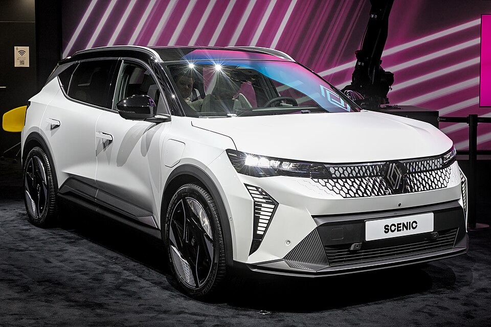

# Renault Scenic E-Tech

*Bild: [Renault Scénic E-Tech IAA 2023 1X7A0344.jpg](https://commons.wikimedia.org/wiki/File:Renault_Sc%C3%A9nic_E-Tech_IAA_2023_1X7A0344.jpg) · Urheber: Alexander-93 · Lizenz: CC BY-SA 4.0 · via Wikimedia Commons.*

> Rein elektrischer Familien-SUV-Van von Renault auf der Elektroplattform AmpR Medium (ehemals CMF-EV).

## Steckbrief

| Feld | Wert | Beleg |
|---|---|---|
| Hersteller | [[renault\|Renault]] | [[tn-batterycheck-alle-daten]] |
| Segment | Kompakt-SUV | Fachwissen¹ |
| Karosserie | SUV / Crossover-Van | Fachwissen¹ |
| Bauzeit | seit 2024 | Fachwissen¹ |
| Plattform | AmpR Medium (ehemals CMF-EV, Renault-Nissan) | Fachwissen¹ |
| Varianten im Bestand | 2 | [[tn-batterycheck-alle-daten]] |
| [[bruttokapazitaet\|Bruttokapazität]] | 65–92 kWh | [[tn-batterycheck-alle-daten]] |
| [[nettokapazitaet\|Nettokapazität]] | 60–87 kWh | [[tn-batterycheck-alle-daten]] |
| [[batteriepuffer\|Puffer]] | 5,4–7,7 % | berechnet |

## Beschreibung

Der Renault Scenic E-Tech Electric ist die fünfte Generation des Scenic und erstmals ein reines Elektroauto. Aus dem früheren Kompaktvan wurde ein familienorientierter Crossover mit SUV-Anmutung. Er basiert auf der dedizierten Elektroplattform AmpR Medium, die Renault gemeinsam mit Nissan entwickelt hat und die auch der Renault Megane E-Tech und der Nissan Ariya nutzen.

Der [[elektromotor|Elektromotor]] treibt die Vorderräder an ([[frontantrieb|Frontantrieb]]). Zwei Batteriegrößen mit [[nmc-zellchemie|NMC-Zellen]] werden parallel angeboten; die größere ermöglicht nach [[wltp|WLTP]] eine hohe Reichweite für die Klasse.

Da die Plattform von vornherein für den [[bev|batterieelektrischen Antrieb]] entwickelt wurde, liegt die [[traktionsbatterie|Traktionsbatterie]] flach im Fahrzeugboden.

## Varianten und Batterien

Die Zahlen in den Bezeichnungen geben die gerundete [[nettokapazitaet|Nettokapazität]] an: „EV60“ steht für 65 kWh brutto / 60,0 kWh netto, „EV87“ für 92 kWh brutto / 87,0 kWh netto. Beide Batterien werden parallel angeboten.

| Variante | Brutto | Netto | Puffer | Zeile |
|---|---|---|---|---|
| Scenic E-Tech EV60 | 65 kWh | 60 kWh | 5 kWh (7,7 %) | 306 |
| Scenic E-Tech EV87 | 92 kWh | 87 kWh | 5 kWh (5,4 %) | 307 |

Quelle: [[tn-batterycheck-alle-daten]], Blatt „Fahrzeuge“, Zeilen 306–307 – bereinigte Fassung (Stand 2026-09-24, Änderungen in [[datenqualitaet]]). Puffer = Brutto − Netto (berechnet).

## Fachbegriffe

- [[bev|BEV (batterieelektrisches Fahrzeug)]] — Battery Electric Vehicle – Fahrzeug, das ausschließlich mit Strom aus einer Traktionsbatterie fährt.
- [[nmc-zellchemie|NMC-Zellchemie]] — Lithium-Ionen-Zellen mit Kathode aus Nickel, Mangan und Kobalt – hohe Energiedichte, Standard in den meisten Fahrzeugen des Bestands.
- [[frontantrieb|Frontantrieb (FWD)]] — Der Elektromotor treibt die Vorderräder an – typisch für Kleinwagen und Konversionsfahrzeuge.
- [[wltp|WLTP]] — Worldwide Harmonized Light Vehicles Test Procedure – seit 2017/2018 der EU-Normzyklus für Verbrauch und Reichweite.
- [[nettokapazitaet|Nettokapazität]] — Der Teil der Batteriekapazität, den der Fahrer tatsächlich nutzen kann – Grundlage für Reichweite und Batterietests.
- [[typbezeichnungen|Typbezeichnungen]] — Wie Hersteller Leistungsstufe, Batterie und Antrieb in Modellnamen codieren – ein Lesehilfe-Artikel.

## Verwandte Fahrzeuge

- Weitere Modelle von Renault: [[renault-city-k-ze|Renault City K-ZE]], [[renault-kangoo-electric|Renault Kangoo Z.E. / E-Tech]], [[renault-master-electric|Renault Master Z.E. / E-Tech]], [[renault-twingo-electric|Renault Twingo Electric]], [[renault-zoe|Renault Zoe]]

## Offene Punkte

- Weitere AmpR-Medium-Modelle (Renault Megane E-Tech, Nissan Ariya) sind in families.json nicht enthalten.
- Die Werte der großen Batterie (92/87 kWh) stimmen mit dem Renault Master E-Tech überein.

Siehe auch [[datenqualitaet]].

## Quellen

- [[tn-batterycheck-alle-daten]] — Brutto-/Nettokapazität aller Varianten (Zeilen 306–307)

¹ *Beschreibung und Steckbrief-Felder ohne Quellseite beruhen auf allgemeinem Fachwissen des LLM (Stand 2026-09-24) und sind nicht durch eine Rohquelle im Bestand belegt. Zahlenwerte zur Batterie stammen aus der Rohquelle, bereinigt nach dem Protokoll in [[datenqualitaet]].*
