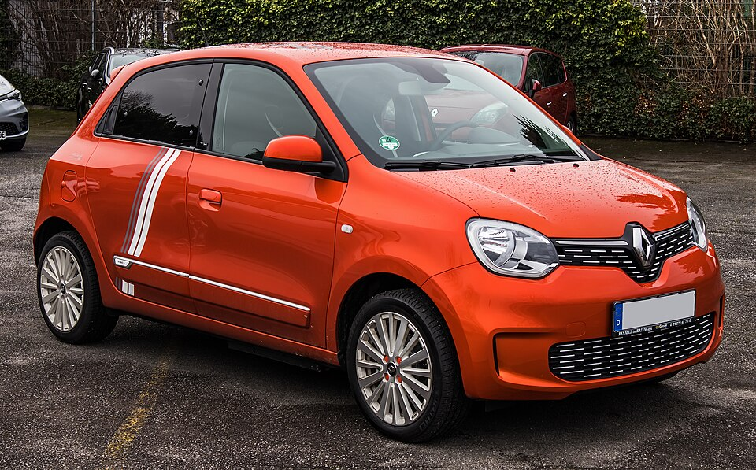

# Renault Twingo Electric

*Bild: [Renault Twingo Electric Vibes (III, Facelift) – f 30012021.jpg](https://commons.wikimedia.org/wiki/File:Renault_Twingo_Electric_Vibes_(III,_Facelift)_%E2%80%93_f_30012021.jpg) · Urheber: © M 93 · Lizenz: CC BY-SA 3.0 de · via Wikimedia Commons.*

> Elektrische Version des Kleinstwagens Renault Twingo der dritten Generation mit Heckmotor, technisch verwandt mit dem Smart ForFour EQ.

## Steckbrief

| Feld | Wert | Beleg |
|---|---|---|
| Hersteller | [[renault\|Renault]] | [[tn-batterycheck-alle-daten]] |
| Segment | Kleinstwagen | Fachwissen¹ |
| Karosserie | Schrägheck, fünftürig | Fachwissen¹ |
| Bauzeit | 2020–2024 | Fachwissen¹ |
| Plattform | Renault-Daimler-Kleinwagenplattform (Twingo III / Smart ForFour) | Fachwissen¹ |
| Varianten im Bestand | 1 | [[tn-batterycheck-alle-daten]] |
| [[bruttokapazitaet\|Bruttokapazität]] | 22 kWh | [[tn-batterycheck-alle-daten]] |
| [[nettokapazitaet\|Nettokapazität]] | 21,3 kWh | [[tn-batterycheck-alle-daten]] |
| [[batteriepuffer\|Puffer]] | 3,2 % | berechnet |

## Beschreibung

Der Renault Twingo Electric ist die batterieelektrische Variante des Twingo der dritten Generation, die Renault gemeinsam mit Daimler entwickelt hat. Schwestermodell ist der Smart ForFour mit Elektroantrieb (EQ), der in families.json nicht enthalten ist.

Besonderheit ist das Heckmotor-Layout: Der [[elektromotor|Elektromotor]] sitzt hinten und treibt die Hinterräder an ([[hinterradantrieb|Hinterradantrieb]]), was einen sehr kleinen Wendekreis ermöglicht. Die [[traktionsbatterie|Traktionsbatterie]] ist im Unterboden untergebracht.

Der Twingo Electric bietet [[ac-laden|AC-Laden]] mit vergleichsweise hoher Leistung, ist aber insgesamt klar als Stadtfahrzeug konzipiert.

## Varianten und Batterien

Es gibt nur eine Zeile (Twingo Electric ZE) mit 22 kWh brutto / 21,3 kWh netto. Der Zusatz „ZE“ verweist auf die frühere Renault-Kennzeichnung „Z.E.“ für Elektrofahrzeuge.

| Variante | Brutto | Netto | Puffer | Zeile |
|---|---|---|---|---|
| Twingo Electric ZE | 22 kWh | 21,3 kWh | 0,7 kWh (3,2 %) | 308 |

Quelle: [[tn-batterycheck-alle-daten]], Blatt „Fahrzeuge“, Zeilen 308. Puffer = Brutto − Netto (berechnet).

## Fachbegriffe

- [[hinterradantrieb|Hinterradantrieb (RWD)]] — Der Elektromotor treibt die Hinterräder an – Standard auf vielen reinen Elektroplattformen.
- [[ac-laden|AC-Laden]] — Laden mit Wechselstrom an Haushaltssteckdose oder Wallbox; der Bordlader im Auto wandelt in Gleichstrom um.
- [[traktionsbatterie|Traktionsbatterie]] — Der Hochvolt-Energiespeicher, der den Elektromotor eines Elektroautos versorgt.
- [[batteriepuffer|Batteriepuffer]] — Differenz zwischen Brutto- und Nettokapazität – eine Reserve, die die Batterie schont und Alterung ausgleicht.
- [[typbezeichnungen|Typbezeichnungen]] — Wie Hersteller Leistungsstufe, Batterie und Antrieb in Modellnamen codieren – ein Lesehilfe-Artikel.

## Verwandte Fahrzeuge

- Weitere Modelle von Renault: [[renault-city-k-ze|Renault City K-ZE]], [[renault-kangoo-electric|Renault Kangoo Z.E. / E-Tech]], [[renault-master-electric|Renault Master Z.E. / E-Tech]], [[renault-scenic-e-tech|Renault Scenic E-Tech]], [[renault-zoe|Renault Zoe]]

## Offene Punkte

- Kleiner Puffer (22 vs. 21,3 kWh); in manchen Quellen wird 22 kWh als nutzbare Kapazität angegeben.
- Das Schwestermodell Smart ForFour EQ ist nicht in families.json enthalten.

Siehe auch [[datenqualitaet]].

## Quellen

- [[tn-batterycheck-alle-daten]] — Brutto-/Nettokapazität aller Varianten (Zeilen 308)

¹ *Beschreibung und Steckbrief-Felder ohne Quellseite beruhen auf allgemeinem Fachwissen des LLM (Stand 2026-09-23) und sind nicht durch eine Rohquelle im Bestand belegt. Zahlenwerte zur Batterie stammen ausschließlich aus der Rohquelle.*
