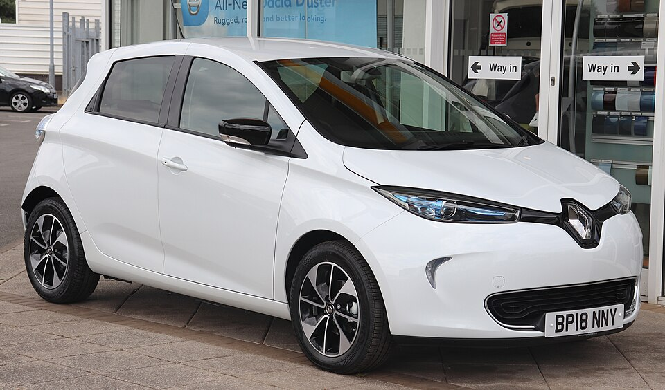

# Renault Zoe

*Bild: [2018 Renault ZOE.jpg](https://commons.wikimedia.org/wiki/File:2018_Renault_ZOE.jpg) · Urheber: Vauxford · Lizenz: CC BY-SA 4.0 · via Wikimedia Commons.*

> Elektrischer Kleinwagen von Renault und über viele Jahre eines der meistverkauften Elektroautos Europas, mit drei Batteriegenerationen.

## Steckbrief

| Feld | Wert | Beleg |
|---|---|---|
| Hersteller | [[renault\|Renault]] | [[tn-batterycheck-alle-daten]] |
| Segment | Kleinwagen | Fachwissen¹ |
| Karosserie | Schrägheck, fünftürig | Fachwissen¹ |
| Bauzeit | 2012–2024 | Fachwissen¹ |
| Plattform | Renault-Kleinwagenplattform (von Beginn an als Elektroauto konzipiert, verwandt mit Clio IV) | Fachwissen¹ |
| Varianten im Bestand | 12 | [[tn-batterycheck-alle-daten]] |
| [[bruttokapazitaet\|Bruttokapazität]] | 25,9–54,7 kWh | [[tn-batterycheck-alle-daten]] |
| [[nettokapazitaet\|Nettokapazität]] | 23,3–52 kWh | [[tn-batterycheck-alle-daten]] |
| [[batteriepuffer\|Puffer]] | 4,9–10,0 % | berechnet |

## Beschreibung

Die Renault Zoe wurde von Beginn an als reines Elektroauto ([[bev|BEV]]) entwickelt und war über mehrere Jahre eines der meistverkauften Elektroautos in Europa. Technisch lehnt sie sich an den Clio der vierten Generation an, hat aber eine eigene Karosserie.

Im Laufe der Bauzeit erhielt die Zoe drei [[traktionsbatterie|Batteriegenerationen]] (22, Z.E. 40 und Z.E. 50) sowie verschiedene [[elektromotor|Elektromotoren]], die über die Typbezeichnung erkennbar sind. Charakteristisch für die frühen Versionen ist das leistungsfähige [[ac-laden|AC-Laden]] über das „Chameleon“-Ladegerät; [[dc-schnellladen|DC-Schnellladen]] (CCS) wurde erst mit der großen [[modellpflege|Modellpflege]] 2019 optional. Angetrieben werden die Vorderräder ([[frontantrieb|Frontantrieb]]).

Viele Zoe wurden mit Batteriemiete verkauft, d. h. die Batterie gehörte nicht dem Fahrzeughalter. Für Gebrauchtkäufer sind deshalb neben dem [[state-of-health|State of Health]] auch die Eigentumsverhältnisse der Batterie relevant; ein [[batteriecheck|Batteriecheck]] ist empfehlenswert.

## Varianten und Batterien

Die [[typbezeichnungen|Typbezeichnungen]] setzen sich aus einem Buchstaben für den Motor (R = Renault-eigener Motor, Q = Motor mit Schnelllade-Option für AC 43 kW) und einer Zahl zusammen, die sich auf Reichweite bzw. Leistung bezieht. Die Rohdaten zeigen drei Batteriegenerationen: 25,9 kWh brutto / 23,3 kWh netto (erste Generation, „22 kWh“; Q210, R210, R240, R90 Entry, R75), 44,1 kWh brutto / 41,0 kWh netto (Z.E. 40; Q90, R90, R110, R75) und 54,7 kWh brutto / 52,0 kWh netto (Z.E. 50; R110, R135). Dieselbe Motorbezeichnung kann daher mit unterschiedlichen Batterien vorkommen.

| Variante | Brutto | Netto | Puffer | Zeile |
|---|---|---|---|---|
| Zoe Q210 | 25,9 kWh | 23,3 kWh | 2,6 kWh (10,0 %) | 309 |
| Zoe Q90 | 44,1 kWh | 41,0 kWh | 3,1 kWh (7,0 %) | 310 |
| Zoe R110 | 44,1 kWh | 41,0 kWh | 3,1 kWh (7,0 %) | 311 |
| Zoe R110 Z.E. 40 | 44,1 kWh | 41,0 kWh | 3,1 kWh (7,0 %) | 312 |
| Zoe R110 Z.E. 50 | 54,7 kWh | 52,0 kWh | 2,7 kWh (4,9 %) | 313 |
| Zoe R135 Z.E. 50 | 54,7 kWh | 52,0 kWh | 2,7 kWh (4,9 %) | 314 |
| Zoe R210 | 25,9 kWh | 23,3 kWh | 2,6 kWh (10,0 %) | 315 |
| Zoe R240 | 25,9 kWh | 23,3 kWh | 2,6 kWh (10,0 %) | 316 |
| Zoe R75 | 25,9 kWh | 23,3 kWh | 2,6 kWh (10,0 %) | 317 |
| Zoe R75 | 44,1 kWh | 41,0 kWh | 3,1 kWh (7,0 %) | 318 |
| Zoe R90 | 44,1 kWh | 41,0 kWh | 3,1 kWh (7,0 %) | 319 |
| Zoe R90 Entry | 25,9 kWh | 23,3 kWh | 2,6 kWh (10,0 %) | 320 |

Quelle: [[tn-batterycheck-alle-daten]], Blatt „Fahrzeuge“, Zeilen 309–320. Puffer = Brutto − Netto (berechnet).

## Fachbegriffe

- [[typbezeichnungen|Typbezeichnungen]] — Wie Hersteller Leistungsstufe, Batterie und Antrieb in Modellnamen codieren – ein Lesehilfe-Artikel.
- [[ac-laden|AC-Laden]] — Laden mit Wechselstrom an Haushaltssteckdose oder Wallbox; der Bordlader im Auto wandelt in Gleichstrom um.
- [[dc-schnellladen|DC-Schnellladen]] — Laden mit Gleichstrom direkt in die Batterie, ohne Umweg über den Bordlader – mit 50 bis über 300 kW.
- [[modellpflege|Modellpflege (Facelift)]] — Überarbeitung eines Modells während der Bauzeit – bei Elektroautos oft mit neuer Batterie.
- [[bev|BEV (batterieelektrisches Fahrzeug)]] — Battery Electric Vehicle – Fahrzeug, das ausschließlich mit Strom aus einer Traktionsbatterie fährt.
- [[state-of-health|State of Health (SoH)]] — Gesundheitszustand der Batterie: verbleibende Kapazität im Verhältnis zur Neu-Kapazität, in Prozent.
- [[batteriecheck|Batteriecheck (Batteriezertifikat)]] — Standardisierte Prüfung des Gesundheitszustands der Traktionsbatterie, meist für den Gebrauchtwagenhandel.
- [[frontantrieb|Frontantrieb (FWD)]] — Der Elektromotor treibt die Vorderräder an – typisch für Kleinwagen und Konversionsfahrzeuge.

## Verwandte Fahrzeuge

- Weitere Modelle von Renault: [[renault-city-k-ze|Renault City K-ZE]], [[renault-kangoo-electric|Renault Kangoo Z.E. / E-Tech]], [[renault-master-electric|Renault Master Z.E. / E-Tech]], [[renault-scenic-e-tech|Renault Scenic E-Tech]], [[renault-twingo-electric|Renault Twingo Electric]]

## Offene Punkte

- „Zoe R110“ und „Zoe R110 Z.E. 40“ haben identische Werte (44,1/41,0 kWh) – vermutlich Duplikat.
- „Zoe R75“ erscheint mit zwei Batterien (25,9 und 44,1 kWh); die Zuordnung der R75-Variante ist nicht gesichert.
- „Zoe R90 Entry“ mit 25,9 kWh ist ungewöhnlich, da R90 sonst mit der Z.E.-40-Batterie verbunden ist – bitte prüfen.
- Die erste Batteriegeneration wird im Handel als „22 kWh“ bezeichnet, in den Rohdaten aber mit 25,9 kWh brutto / 23,3 kWh netto geführt.
- Die Bedeutung der Zahl in den Motorbezeichnungen (Reichweite vs. Leistung) ist je nach Generation unterschiedlich; hier nur grob beschrieben.

Siehe auch [[datenqualitaet]].

## Quellen

- [[tn-batterycheck-alle-daten]] — Brutto-/Nettokapazität aller Varianten (Zeilen 309–320)
- Weiterlesen: [Wikipedia – Renault Zoe](https://en.wikipedia.org/wiki/Renault_Zoe)

¹ *Beschreibung und Steckbrief-Felder ohne Quellseite beruhen auf allgemeinem Fachwissen des LLM (Stand 2026-09-23) und sind nicht durch eine Rohquelle im Bestand belegt. Zahlenwerte zur Batterie stammen ausschließlich aus der Rohquelle.*
