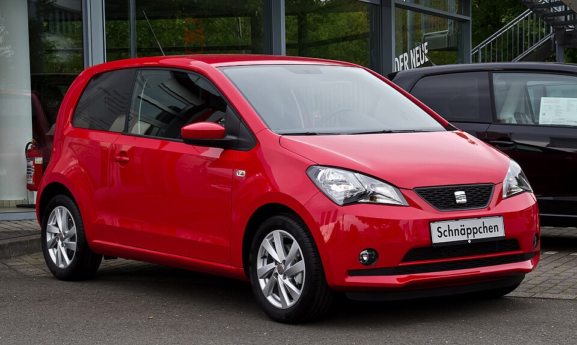

# Seat Mii electric

*Bild: [Seat Mii 1.0 Style – Frontansicht, 23. September 2012, Düsseldorf.jpg](https://commons.wikimedia.org/wiki/File:Seat_Mii_1.0_Style_%E2%80%93_Frontansicht,_23._September_2012,_D%C3%BCsseldorf.jpg) · Urheber: M 93 · Lizenz: CC BY-SA 3.0 de · via Wikimedia Commons.*

> Elektrischer Kleinstwagen von SEAT, baugleich mit VW e-up! und Škoda Citigo e iV.

## Steckbrief

| Feld | Wert | Beleg |
|---|---|---|
| Hersteller | [[seat\|SEAT]] | [[tn-batterycheck-alle-daten]] |
| Segment | Kleinstwagen | Fachwissen¹ |
| Karosserie | Schrägheck (fünftürig) | Fachwissen¹ |
| Plattform | NSF (New Small Family) des Volkswagen-Konzerns, Verbrenner-Plattform | Fachwissen¹ |
| Varianten im Bestand | 1 | [[tn-batterycheck-alle-daten]] |
| [[bruttokapazitaet\|Bruttokapazität]] | 36,8 kWh | [[tn-batterycheck-alle-daten]] |
| [[nettokapazitaet\|Nettokapazität]] | 32,3 kWh | [[tn-batterycheck-alle-daten]] |
| [[batteriepuffer\|Puffer]] | 12,2 % | berechnet |

## Beschreibung

Der SEAT Mii electric ist die elektrische Variante des Kleinstwagens Mii und gehört zur sogenannten New Small Family des Volkswagen-Konzerns, zu der auch [[vw-e-up|VW e-up!]] und [[skoda-citigo-e-iv|Škoda Citigo e iV]] zählen. Alle drei wurden im VW-Werk Bratislava gebaut und unterscheiden sich im Wesentlichen nur durch Design-Details.

Als [[konversionsfahrzeug|Konversionsfahrzeug]] nutzt der Mii electric die Karosserie des Verbrenners; die [[traktionsbatterie|Traktionsbatterie]] ist im Unterboden und unter der Rücksitzbank untergebracht, der [[elektromotor|Elektromotor]] treibt die Vorderräder an ([[frontantrieb|Frontantrieb]]). Der Mii electric war das bislang einzige Elektroauto der Marke SEAT.

## Varianten und Batterien

Es gibt nur eine Zeile (321) mit 36,8 kWh brutto und 32,3 kWh netto. Das ist dieselbe Batterie, die auch im überarbeiteten e-up! und im Citigo e iV steckt.

| Variante | Brutto | Netto | Puffer | Zeile |
|---|---|---|---|---|
| Mii electric | 36,8 kWh | 32,3 kWh | 4,5 kWh (12,2 %) | 321 |

Quelle: [[tn-batterycheck-alle-daten]], Blatt „Fahrzeuge“, Zeilen 321 – bereinigte Fassung (Stand 2026-09-24, Änderungen in [[datenqualitaet]]). Puffer = Brutto − Netto (berechnet).

## Fachbegriffe

- [[konversionsfahrzeug|Konversionsfahrzeug]] — Elektroauto, das von einem Modell mit Verbrennungsmotor abgeleitet ist, statt auf einer reinen Elektroplattform zu basieren.
- [[plattform-geschwister|Plattform-Geschwister (Badge-Engineering)]] — Fahrzeuge verschiedener Marken, die technisch weitgehend baugleich sind und dieselbe Batterie nutzen.
- [[frontantrieb|Frontantrieb (FWD)]] — Der Elektromotor treibt die Vorderräder an – typisch für Kleinwagen und Konversionsfahrzeuge.
- [[bruttokapazitaet|Bruttokapazität]] — Die gesamte, physikalisch in der Batterie verbaute Energiemenge – inklusive der Reserven, die der Fahrer nie nutzen kann.
- [[nettokapazitaet|Nettokapazität]] — Der Teil der Batteriekapazität, den der Fahrer tatsächlich nutzen kann – Grundlage für Reichweite und Batterietests.
- [[traktionsbatterie|Traktionsbatterie]] — Der Hochvolt-Energiespeicher, der den Elektromotor eines Elektroautos versorgt.

## Verwandte Fahrzeuge

- [[vw-e-up|VW e-up!]] — technisch verwandt / gleiche Plattform oder Batterie
- [[skoda-citigo-e-iv|Škoda Citigo e iV]] — technisch verwandt / gleiche Plattform oder Batterie

## Offene Punkte

- Bauzeit offen gelassen: Markteinführung um 2019/2020, genaues Produktionsende nicht sicher belegt.

Siehe auch [[datenqualitaet]].

## Quellen

- [[tn-batterycheck-alle-daten]] — Brutto-/Nettokapazität aller Varianten (Zeilen 321)
- Weiterlesen: [Wikipedia – SEAT Mii](https://en.wikipedia.org/wiki/SEAT_Mii)

¹ *Beschreibung und Steckbrief-Felder ohne Quellseite beruhen auf allgemeinem Fachwissen des LLM (Stand 2026-09-24) und sind nicht durch eine Rohquelle im Bestand belegt. Zahlenwerte zur Batterie stammen aus der Rohquelle, bereinigt nach dem Protokoll in [[datenqualitaet]].*
