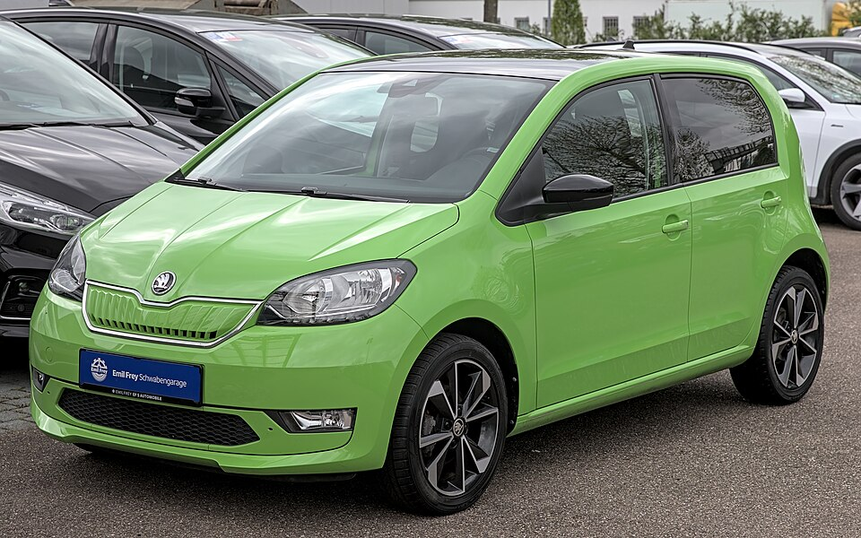

# Škoda Citigo e iV

*Bild: [Škoda Citigo-e iV 1X7A7291.jpg](https://commons.wikimedia.org/wiki/File:%C5%A0koda_Citigo-e_iV_1X7A7291.jpg) · Urheber: Alexander-93 · Lizenz: CC BY-SA 4.0 · via Wikimedia Commons.*

> Elektrischer Kleinstwagen von Škoda, baugleich mit VW e-up! und SEAT Mii electric.

## Steckbrief

| Feld | Wert | Beleg |
|---|---|---|
| Hersteller | [[skoda\|Škoda]] | [[tn-batterycheck-alle-daten]] |
| Segment | Kleinstwagen | Fachwissen¹ |
| Karosserie | Schrägheck (fünftürig) | Fachwissen¹ |
| Plattform | NSF (New Small Family) des Volkswagen-Konzerns, Verbrenner-Plattform | Fachwissen¹ |
| Varianten im Bestand | 1 | [[tn-batterycheck-alle-daten]] |
| [[bruttokapazitaet\|Bruttokapazität]] | 36,8 kWh | [[tn-batterycheck-alle-daten]] |
| [[nettokapazitaet\|Nettokapazität]] | 32,3 kWh | [[tn-batterycheck-alle-daten]] |
| [[batteriepuffer\|Puffer]] | 12,2 % | berechnet |

## Beschreibung

Der Škoda Citigo e iV ist die elektrische Version des Kleinstwagens Citigo und das erste reine Elektroauto von Škoda. Er ist ein Drilling aus der New Small Family des Volkswagen-Konzerns und technisch identisch mit [[vw-e-up|VW e-up!]] und [[seat-mii-electric|SEAT Mii electric]].

Als [[konversionsfahrzeug|Konversionsfahrzeug]] übernimmt er die Karosserie des Verbrennermodells; [[traktionsbatterie|Traktionsbatterie]] und [[elektromotor|Elektromotor]] wurden in die vorhandene Struktur integriert, angetrieben werden die Vorderräder ([[frontantrieb|Frontantrieb]]). Das Kürzel „iV“ verwendete Škoda damals für elektrifizierte Modelle.

## Varianten und Batterien

Nur eine Zeile (322) mit 36,8 kWh brutto und 32,3 kWh netto – dieselbe Batterie wie im SEAT Mii electric und im e-up! ab der Modellpflege.

| Variante | Brutto | Netto | Puffer | Zeile |
|---|---|---|---|---|
| Citigo e iV | 36,8 kWh | 32,3 kWh | 4,5 kWh (12,2 %) | 322 |

Quelle: [[tn-batterycheck-alle-daten]], Blatt „Fahrzeuge“, Zeilen 322 – bereinigte Fassung (Stand 2026-09-24, Änderungen in [[datenqualitaet]]). Puffer = Brutto − Netto (berechnet).

## Fachbegriffe

- [[konversionsfahrzeug|Konversionsfahrzeug]] — Elektroauto, das von einem Modell mit Verbrennungsmotor abgeleitet ist, statt auf einer reinen Elektroplattform zu basieren.
- [[plattform-geschwister|Plattform-Geschwister (Badge-Engineering)]] — Fahrzeuge verschiedener Marken, die technisch weitgehend baugleich sind und dieselbe Batterie nutzen.
- [[frontantrieb|Frontantrieb (FWD)]] — Der Elektromotor treibt die Vorderräder an – typisch für Kleinwagen und Konversionsfahrzeuge.
- [[bruttokapazitaet|Bruttokapazität]] — Die gesamte, physikalisch in der Batterie verbaute Energiemenge – inklusive der Reserven, die der Fahrer nie nutzen kann.
- [[nettokapazitaet|Nettokapazität]] — Der Teil der Batteriekapazität, den der Fahrer tatsächlich nutzen kann – Grundlage für Reichweite und Batterietests.
- [[typbezeichnungen|Typbezeichnungen]] — Wie Hersteller Leistungsstufe, Batterie und Antrieb in Modellnamen codieren – ein Lesehilfe-Artikel.

## Verwandte Fahrzeuge

- [[vw-e-up|VW e-up!]] — technisch verwandt / gleiche Plattform oder Batterie
- [[seat-mii-electric|Seat Mii electric]] — technisch verwandt / gleiche Plattform oder Batterie
- Weitere Modelle von Škoda: [[skoda-elroq|Škoda Elroq]], [[skoda-enyaq|Škoda Enyaq]]

## Offene Punkte

- Bauzeit offen gelassen, da genaue Produktionsdaten nicht sicher sind (Markteinführung um 2019/2020, nur kurze Bauzeit).

Siehe auch [[datenqualitaet]].

## Quellen

- [[tn-batterycheck-alle-daten]] — Brutto-/Nettokapazität aller Varianten (Zeilen 322)
- Weiterlesen: [Wikipedia – Škoda Citigo](https://en.wikipedia.org/wiki/Škoda_Citigo)

¹ *Beschreibung und Steckbrief-Felder ohne Quellseite beruhen auf allgemeinem Fachwissen des LLM (Stand 2026-09-24) und sind nicht durch eine Rohquelle im Bestand belegt. Zahlenwerte zur Batterie stammen aus der Rohquelle, bereinigt nach dem Protokoll in [[datenqualitaet]].*
