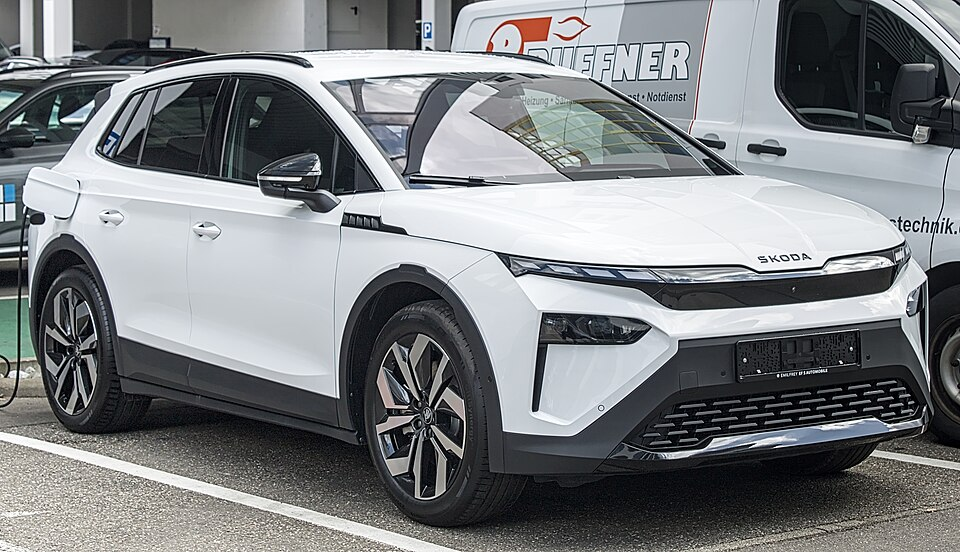

# Škoda Elroq

*Bild: [Škoda Elroq IMG 5643.jpg](https://commons.wikimedia.org/wiki/File:%C5%A0koda_Elroq_IMG_5643.jpg) · Urheber: Alexander Migl · Lizenz: CC BY-SA 4.0 · via Wikimedia Commons.*

> Kompaktes Elektro-SUV von Škoda auf Basis des MEB, unterhalb des Enyaq positioniert.

## Steckbrief

| Feld | Wert | Beleg |
|---|---|---|
| Hersteller | [[skoda\|Škoda]] | [[tn-batterycheck-alle-daten]] |
| Segment | Kompakt-SUV | Fachwissen¹ |
| Karosserie | SUV | Fachwissen¹ |
| Bauzeit | seit 2024 | Fachwissen¹ |
| Plattform | MEB (Modularer E-Antriebs-Baukasten) | Fachwissen¹ |
| Varianten im Bestand | 4 | [[tn-batterycheck-alle-daten]] |
| [[bruttokapazitaet\|Bruttokapazität]] | 55–82 kWh | [[tn-batterycheck-alle-daten]] |
| [[nettokapazitaet\|Nettokapazität]] | 52–77 kWh | [[tn-batterycheck-alle-daten]] |
| [[batteriepuffer\|Puffer]] | 5,5–6,3 % | berechnet |

## Beschreibung

Der Škoda Elroq ist ein kompaktes Elektro-SUV und nach dem [[skoda-enyaq|Enyaq]] das zweite Škoda-Modell auf dem [[plattform-meb|MEB]]. Er ist kürzer als der Enyaq und führt eine neue Designsprache der Marke ein. Technisch ist er eng mit [[vw-id-3|VW ID.3]], [[cupra-born|Cupra Born]] und dem Enyaq verwandt.

Angeboten wird der Elroq mit drei MEB-Batteriegrößen und [[hinterradantrieb|Hinterradantrieb]], die Version mit dem Zusatz „x“ hat einen zweiten Motor an der Vorderachse und damit [[allradantrieb|Allradantrieb]]. Die Zahl im Namen orientiert sich grob an der nutzbaren [[nettokapazitaet|Nettokapazität]] bzw. an der Leistungsstufe, nicht exakt an einem Messwert.

## Varianten und Batterien

Die Zahl in der Bezeichnung steht für die Batterie-/Leistungsstufe: „50“ = kleine Batterie (55 kWh brutto), „60“ = mittlere Batterie (63 kWh brutto), „85“ = große Batterie (82 kWh brutto). „85x“ nutzt dieselbe große Batterie, hat aber Allradantrieb. Die Nummern sind also Typbezeichnungen, keine exakten Kapazitätsangaben.

| Variante | Brutto | Netto | Puffer | Zeile |
|---|---|---|---|---|
| Elroq 50 | 55 kWh | 52,0 kWh | 3 kWh (5,5 %) | 323 |
| Elroq 60 | 63 kWh | 59,0 kWh | 4 kWh (6,3 %) | 324 |
| Elroq 85 | 82 kWh | 77,0 kWh | 5 kWh (6,1 %) | 325 |
| Elroq 85x | 82 kWh | 77,0 kWh | 5 kWh (6,1 %) | 326 |

Quelle: [[tn-batterycheck-alle-daten]], Blatt „Fahrzeuge“, Zeilen 323–326. Puffer = Brutto − Netto (berechnet).

## Fachbegriffe

- [[plattform-meb|MEB (Modularer E-Antriebs-Baukasten)]] — Volkswagens erste reine Elektroauto-Plattform, Basis für ID.-Modelle, Enyaq, Elroq, Born, Tavascan und Q4 e-tron.
- [[typbezeichnungen|Typbezeichnungen]] — Wie Hersteller Leistungsstufe, Batterie und Antrieb in Modellnamen codieren – ein Lesehilfe-Artikel.
- [[hinterradantrieb|Hinterradantrieb (RWD)]] — Der Elektromotor treibt die Hinterräder an – Standard auf vielen reinen Elektroplattformen.
- [[allradantrieb|Allradantrieb (AWD)]] — Beide Achsen werden angetrieben, bei Elektroautos meist durch je einen eigenen Motor pro Achse.
- [[nettokapazitaet|Nettokapazität]] — Der Teil der Batteriekapazität, den der Fahrer tatsächlich nutzen kann – Grundlage für Reichweite und Batterietests.
- [[plattform-geschwister|Plattform-Geschwister (Badge-Engineering)]] — Fahrzeuge verschiedener Marken, die technisch weitgehend baugleich sind und dieselbe Batterie nutzen.

## Verwandte Fahrzeuge

- [[vw-id-3|VW ID.3]] — technisch verwandt / gleiche Plattform oder Batterie
- [[vw-id-4|VW ID.4]] — technisch verwandt / gleiche Plattform oder Batterie
- [[vw-id-5|VW ID.5]] — technisch verwandt / gleiche Plattform oder Batterie
- [[vw-id-7|VW ID.7]] — technisch verwandt / gleiche Plattform oder Batterie
- [[vw-id-buzz|VW ID. Buzz]] — technisch verwandt / gleiche Plattform oder Batterie
- [[skoda-enyaq|Škoda Enyaq]] — technisch verwandt / gleiche Plattform oder Batterie
- [[cupra-born|Cupra Born]] — technisch verwandt / gleiche Plattform oder Batterie
- [[cupra-tavascan|Cupra Tavascan]] — technisch verwandt / gleiche Plattform oder Batterie
- [[audi-q4-e-tron|Audi Q4 e-tron]] — technisch verwandt / gleiche Plattform oder Batterie
- Weitere Modelle von Škoda: [[skoda-citigo-e-iv|Škoda Citigo e iV]]

## Quellen

- [[tn-batterycheck-alle-daten]] — Brutto-/Nettokapazität aller Varianten (Zeilen 323–326)
- Weiterlesen: [Wikipedia – Škoda Elroq](https://en.wikipedia.org/wiki/Škoda_Elroq)

¹ *Beschreibung und Steckbrief-Felder ohne Quellseite beruhen auf allgemeinem Fachwissen des LLM (Stand 2026-09-23) und sind nicht durch eine Rohquelle im Bestand belegt. Zahlenwerte zur Batterie stammen ausschließlich aus der Rohquelle.*
