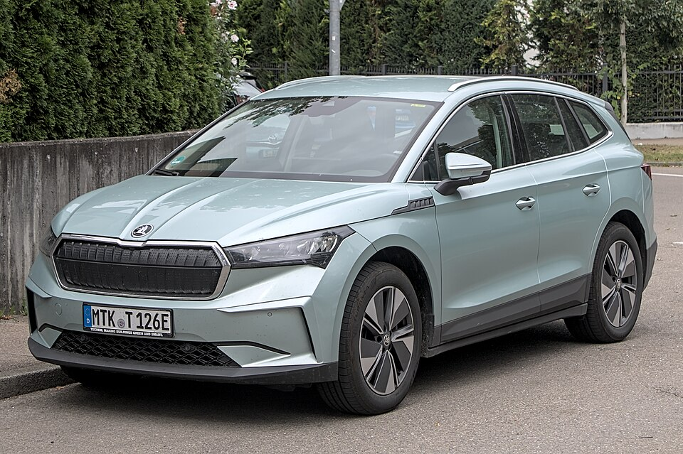

# Škoda Enyaq

*Bild: [Škoda Enyaq IMG 1190.jpg](https://commons.wikimedia.org/wiki/File:%C5%A0koda_Enyaq_IMG_1190.jpg) · Urheber: Alexander-93 · Lizenz: CC BY-SA 4.0 · via Wikimedia Commons.*

> Elektro-SUV von Škoda auf dem MEB, erhältlich als SUV und als SUV-Coupé, mit mehreren Batteriestufen und Modellpflege.

## Steckbrief

| Feld | Wert | Beleg |
|---|---|---|
| Hersteller | [[skoda\|Škoda]] | [[tn-batterycheck-alle-daten]] |
| Segment | Mittelklasse-SUV | Fachwissen¹ |
| Karosserie | SUV, SUV-Coupé | Fachwissen¹ |
| Bauzeit | seit 2020 | Fachwissen¹ |
| Plattform | MEB (Modularer E-Antriebs-Baukasten) | Fachwissen¹ |
| Varianten im Bestand | 18 | [[tn-batterycheck-alle-daten]] |
| [[bruttokapazitaet\|Bruttokapazität]] | 55–82 kWh | [[tn-batterycheck-alle-daten]] |
| [[nettokapazitaet\|Nettokapazität]] | 52–77 kWh | [[tn-batterycheck-alle-daten]] |
| [[batteriepuffer\|Puffer]] | 5,5–6,5 % | berechnet |

## Beschreibung

Der Škoda Enyaq (bis zur Modellpflege „Enyaq iV“) war das erste Škoda-Modell auf dem [[plattform-meb|MEB]] und wird im Stammwerk Mladá Boleslav gebaut. Er ist technisch mit [[vw-id-4|VW ID.4]] und [[audi-q4-e-tron|Audi Q4 e-tron]] verwandt, bietet aber einen etwas längeren Aufbau mit großem Kofferraum. Neben dem klassischen SUV gibt es eine Variante mit abfallender Dachlinie (Coupé).

Die [[traktionsbatterie|Traktionsbatterie]] im Unterboden gibt es in mehreren Stufen. Grundsätzlich haben die Modelle [[hinterradantrieb|Hinterradantrieb]], Versionen mit „x“ im Namen sowie der RS haben einen zweiten Motor und damit [[allradantrieb|Allradantrieb]].

Mit der [[modellpflege|Modellpflege]] hat Škoda das Kürzel „iV“ gestrichen und die Modellnummern neu vergeben (z. B. „85“ statt „80“). Zusätzlich wurde die mittlere Batterie auf eine neuere Zellgeneration umgestellt, was sich in leicht höheren Brutto- und Nettowerten zeigt.

## Varianten und Batterien

Die Zahl steht für die Batterie-/Leistungsstufe: „50“ = 55 kWh brutto, „60“ = 62 bzw. 63 kWh brutto, „80“ und „85“ = 82 kWh brutto; „x“ bedeutet Allradantrieb, „Coupé“ die Coupé-Karosserie, „RS“ die sportliche Top-Version (ebenfalls 82 kWh). Beim „iV 60“ gibt es zwei Batterien (62/58 und 63/59 kWh) – das ist eine Zellgeneration aus der Laufzeit, keine eigene Variante. Die Einträge ohne „iV“ („Enyaq 85“, „Enyaq 85x“ usw.) gehören zur überarbeiteten Baureihe.

| Variante | Brutto | Netto | Puffer | Zeile | Status |
|---|---|---|---|---|---|
| Enyaq 85 | 82 kWh | 77 kWh | 5 kWh (6,1 %) | 327 |  |
| Enyaq 85 Coupé | 82 kWh | 77 kWh | 5 kWh (6,1 %) | 328 |  |
| Enyaq 85x | 82 kWh | 77 kWh | 5 kWh (6,1 %) | 329 |  |
| Enyaq 85x Coupé | 82 kWh | 77 kWh | 5 kWh (6,1 %) | 330 |  |
| Enyaq iV 50 | 55 kWh | 52 kWh | 3 kWh (5,5 %) | 331 |  |
| Enyaq iV 50 Coupé | 55 kWh | 52 kWh | 3 kWh (5,5 %) | 332 |  |
| Enyaq iV 60 | 62 kWh | 58 kWh | 4 kWh (6,5 %) | 333 |  |
| Enyaq iV 60 | 63 kWh | 59 kWh | 4 kWh (6,3 %) | 334 |  |
| Enyaq iV 60 Coupé | 62 kWh | 58 kWh | 4 kWh (6,5 %) | 335 |  |
| Enyaq iV 60 Coupé | 63 kWh | 59 kWh | 4 kWh (6,3 %) | 336 |  |
| Enyaq iV 80 | 82 kWh | 77 kWh | 5 kWh (6,1 %) | 337 |  |
| Enyaq iV 80 Coupé | 82 kWh | 77 kWh | 5 kWh (6,1 %) | 338 |  |
| Enyaq iV 80x | 82 kWh | 77 kWh | 5 kWh (6,1 %) | 339 |  |
| Enyaq iV 85 | 82 kWh | 77 kWh | 5 kWh (6,1 %) | 340 | Alias von Z. 327 |
| Enyaq iV 85 Coupé | 82 kWh | 77 kWh | 5 kWh (6,1 %) | 341 | Alias von Z. 328 |
| Enyaq iV 85x | 82 kWh | 77 kWh | 5 kWh (6,1 %) | 342 | Alias von Z. 329 |
| Enyaq iV 85x Coupé | 82 kWh | 77 kWh | 5 kWh (6,1 %) | 343 | Alias von Z. 330 |
| Enyaq iV RS | 82 kWh | 77 kWh | 5 kWh (6,1 %) | 344 |  |

Quelle: [[tn-batterycheck-alle-daten]], Blatt „Fahrzeuge“, Zeilen 327–344 – bereinigte Fassung (Stand 2026-09-24, Änderungen in [[datenqualitaet]]). Puffer = Brutto − Netto (berechnet).

## Fachbegriffe

- [[plattform-meb|MEB (Modularer E-Antriebs-Baukasten)]] — Volkswagens erste reine Elektroauto-Plattform, Basis für ID.-Modelle, Enyaq, Elroq, Born, Tavascan und Q4 e-tron.
- [[typbezeichnungen|Typbezeichnungen]] — Wie Hersteller Leistungsstufe, Batterie und Antrieb in Modellnamen codieren – ein Lesehilfe-Artikel.
- [[modellpflege|Modellpflege (Facelift)]] — Überarbeitung eines Modells während der Bauzeit – bei Elektroautos oft mit neuer Batterie.
- [[allradantrieb|Allradantrieb (AWD)]] — Beide Achsen werden angetrieben, bei Elektroautos meist durch je einen eigenen Motor pro Achse.
- [[hinterradantrieb|Hinterradantrieb (RWD)]] — Der Elektromotor treibt die Hinterräder an – Standard auf vielen reinen Elektroplattformen.
- [[karosserieformen|Karosserieformen]] — Varianten der Aufbauform eines Modells – beeinflussen Aussehen und Luftwiderstand, meist nicht die Batterie.
- [[plattform-geschwister|Plattform-Geschwister (Badge-Engineering)]] — Fahrzeuge verschiedener Marken, die technisch weitgehend baugleich sind und dieselbe Batterie nutzen.

## Verwandte Fahrzeuge

- [[vw-id-3|VW ID.3]] — technisch verwandt / gleiche Plattform oder Batterie
- [[vw-id-4|VW ID.4]] — technisch verwandt / gleiche Plattform oder Batterie
- [[vw-id-5|VW ID.5]] — technisch verwandt / gleiche Plattform oder Batterie
- [[vw-id-7|VW ID.7]] — technisch verwandt / gleiche Plattform oder Batterie
- [[vw-id-buzz|VW ID. Buzz]] — technisch verwandt / gleiche Plattform oder Batterie
- [[skoda-elroq|Škoda Elroq]] — technisch verwandt / gleiche Plattform oder Batterie
- [[cupra-born|Cupra Born]] — technisch verwandt / gleiche Plattform oder Batterie
- [[cupra-tavascan|Cupra Tavascan]] — technisch verwandt / gleiche Plattform oder Batterie
- [[audi-q4-e-tron|Audi Q4 e-tron]] — technisch verwandt / gleiche Plattform oder Batterie
- Weitere Modelle von Škoda: [[skoda-citigo-e-iv|Škoda Citigo e iV]]

## Offene Punkte

- Zeilen 333/334 und 335/336: gleicher Name, zwei leicht unterschiedliche Batterien (62/58 vs. 63/59 kWh).

Siehe auch [[datenqualitaet]].

## Quellen

- [[tn-batterycheck-alle-daten]] — Brutto-/Nettokapazität aller Varianten (Zeilen 327–344)
- Weiterlesen: [Wikipedia – Škoda Enyaq](https://en.wikipedia.org/wiki/Škoda_Enyaq)

¹ *Beschreibung und Steckbrief-Felder ohne Quellseite beruhen auf allgemeinem Fachwissen des LLM (Stand 2026-09-24) und sind nicht durch eine Rohquelle im Bestand belegt. Zahlenwerte zur Batterie stammen aus der Rohquelle, bereinigt nach dem Protokoll in [[datenqualitaet]].*
