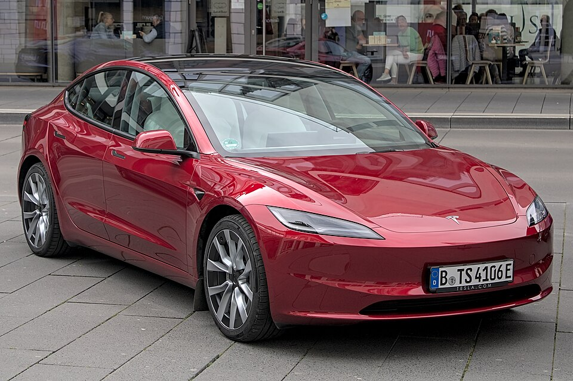

# Tesla Model 3

*Bild: [Tesla Model 3 (2023) Autofrühling Ulm IMG 9282.jpg](https://commons.wikimedia.org/wiki/File:Tesla_Model_3_(2023)_Autofr%C3%BChling_Ulm_IMG_9282.jpg) · Urheber: Alexander-93 · Lizenz: CC BY-SA 4.0 · via Wikimedia Commons.*

> Mittelklasse-Limousine von Tesla und eines der meistverkauften Elektroautos, mit zahlreichen Batterievarianten verschiedener Zellchemien und Lieferanten.

## Steckbrief

| Feld | Wert | Beleg |
|---|---|---|
| Hersteller | [[tesla\|Tesla]] | [[tn-batterycheck-alle-daten]] |
| Segment | Mittelklasse-Limousine | Fachwissen¹ |
| Karosserie | Stufenheck-Limousine | Fachwissen¹ |
| Bauzeit | seit 2017 | Fachwissen¹ |
| Plattform | Tesla-eigene Plattform (gemeinsam mit Model Y) | Fachwissen¹ |
| Varianten im Bestand | 14 | [[tn-batterycheck-alle-daten]] |
| [[bruttokapazitaet\|Bruttokapazität]] | 53,1–82 kWh | [[tn-batterycheck-alle-daten]] |
| [[nettokapazitaet\|Nettokapazität]] | 49–76 kWh | [[tn-batterycheck-alle-daten]] |
| [[batteriepuffer\|Puffer]] | 4,0–7,7 % | berechnet |

## Beschreibung

Das Tesla Model 3 ist die Mittelklasse-Limousine des Herstellers und bildet technisch die Basis für das [[tesla-model-y|Model Y]]. Es wird in den USA und in China gebaut; europäische Fahrzeuge kamen je nach Zeitraum aus beiden Werken. Eine umfassende [[modellpflege|Modellpflege]] (intern „Highland“) brachte ab 2023 überarbeitete Karosserie und Innenraum.

Die Einstiegsversionen (Standard Range Plus, später „RWD“) nutzen je nach Baujahr und Werk [[lfp-zellchemie|LFP-Zellen]] in prismatischer Bauform, die Long-Range- und Performance-Versionen nickelhaltige Zellen (NCA bzw. [[nmc-zellchemie|NMC]]) im zylindrischen [[zellformat|Zellformat]] 2170 verschiedener Lieferanten. Dadurch ergeben sich bei gleicher Modellbezeichnung mehrere unterschiedliche Batterien.

Die Basisversion hat [[hinterradantrieb|Hinterradantrieb]], Long Range und Performance meist zwei Motoren und [[allradantrieb|Allradantrieb]]. Der [[batteriepuffer|Puffer]] zwischen Brutto- und Nettowert fällt bei Tesla vergleichsweise klein aus.

## Varianten und Batterien

„Standard Range plus“ ist die frühe Einstiegsversion, die später in „RWD“ umbenannt wurde; „Long Range“ bezeichnet die große Batterie, „AWD“/„RWD“ die Antriebsart, „Performance“ die Topversion. Die vielen Batteriewerte (z. B. 75, 78,1, 78,8 und 82 kWh brutto bei Long Range; 53,1 bzw. 55 kWh bei SR+; 60 bzw. 64 kWh bei RWD) gehen auf wechselnde Zelllieferanten, Zellchemien und Produktionsstandorte zurück, nicht auf offizielle Ausstattungsvarianten.

| Variante | Brutto | Netto | Puffer | Zeile |
|---|---|---|---|---|
| Model 3 Long Range AWD | 75 kWh | 72,0 kWh | 3 kWh (4,0 %) | 345 |
| Model 3 Long Range AWD | 78,1 kWh | 75,0 kWh | 3,1 kWh (4,0 %) | 346 |
| Model 3 Long Range AWD | 78,8 kWh | 73,5 kWh | 5,3 kWh (6,7 %) | 347 |
| Model 3 Long Range AWD | 82 kWh | 76,0 kWh | 6 kWh (7,3 %) | 348 |
| Model 3 Long Range RWD | 78,1 kWh | 75,0 kWh | 3,1 kWh (4,0 %) | 349 |
| Model 3 Long Range RWD | 78,8 kWh | 73,5 kWh | 5,3 kWh (6,7 %) | 350 |
| Model 3 Performance | 78,1 kWh | 75,0 kWh | 3,1 kWh (4,0 %) | 351 |
| Model 3 Performance | 78,8 kWh | 73,5 kWh | 5,3 kWh (6,7 %) | 352 |
| Model 3 Performance | 82 kWh | 76,0 kWh | 6 kWh (7,3 %) | 353 |
| Model 3 RWD | 60 kWh | 57,5 kWh | 2,5 kWh (4,2 %) | 354 |
| Model 3 RWD | 64 kWh | 60,5 kWh | 3,5 kWh (5,5 %) | 355 |
| Model 3 Standard Range plus | 53,1 kWh | 49,0 kWh | 4,1 kWh (7,7 %) | 356 |
| Model 3 Standard Range plus | 55 kWh | 51,0 kWh | 4 kWh (7,3 %) | 357 |
| Model 3 Standard Range plus | 55 kWh | 52,5 kWh | 2,5 kWh (4,5 %) | 358 |

Quelle: [[tn-batterycheck-alle-daten]], Blatt „Fahrzeuge“, Zeilen 345–358. Puffer = Brutto − Netto (berechnet).

## Fachbegriffe

- [[lfp-zellchemie|LFP-Zellchemie]] — Lithium-Eisenphosphat-Zellen – kobaltfrei, günstig, sehr langlebig, aber mit geringerer Energiedichte.
- [[nmc-zellchemie|NMC-Zellchemie]] — Lithium-Ionen-Zellen mit Kathode aus Nickel, Mangan und Kobalt – hohe Energiedichte, Standard in den meisten Fahrzeugen des Bestands.
- [[zellformat|Zellformat]] — Bauform der einzelnen Batteriezellen: zylindrische Rundzelle, prismatische Zelle oder Pouch-Zelle.
- [[batteriepuffer|Batteriepuffer]] — Differenz zwischen Brutto- und Nettokapazität – eine Reserve, die die Batterie schont und Alterung ausgleicht.
- [[allradantrieb|Allradantrieb (AWD)]] — Beide Achsen werden angetrieben, bei Elektroautos meist durch je einen eigenen Motor pro Achse.
- [[hinterradantrieb|Hinterradantrieb (RWD)]] — Der Elektromotor treibt die Hinterräder an – Standard auf vielen reinen Elektroplattformen.
- [[modellpflege|Modellpflege (Facelift)]] — Überarbeitung eines Modells während der Bauzeit – bei Elektroautos oft mit neuer Batterie.
- [[typbezeichnungen|Typbezeichnungen]] — Wie Hersteller Leistungsstufe, Batterie und Antrieb in Modellnamen codieren – ein Lesehilfe-Artikel.

## Verwandte Fahrzeuge

- [[tesla-model-y|Tesla Model Y]] — technisch verwandt / gleiche Plattform oder Batterie
- Weitere Modelle von Tesla: [[tesla-model-s|Tesla Model S]], [[tesla-model-x|Tesla Model X]]

## Offene Punkte

- Mehrfach vorkommende Bezeichnungen mit unterschiedlichen Werten (z. B. Long Range AWD in vier Varianten, Zeilen 345–348); Zuordnung zu Baujahr, Werk oder Zelllieferant fehlt in den Rohdaten.
- Die Bruttowerte bei Tesla sind oft nicht offiziell veröffentlicht und stammen aus Messungen bzw. Schätzungen Dritter.
- Standard Range plus in drei Varianten (Zeilen 356–358), vermutlich unterschiedliche Zellchemien (NCA vs. LFP).

Siehe auch [[datenqualitaet]].

## Quellen

- [[tn-batterycheck-alle-daten]] — Brutto-/Nettokapazität aller Varianten (Zeilen 345–358)
- Weiterlesen: [Wikipedia – Tesla Model 3](https://en.wikipedia.org/wiki/Tesla_Model_3)

¹ *Beschreibung und Steckbrief-Felder ohne Quellseite beruhen auf allgemeinem Fachwissen des LLM (Stand 2026-09-23) und sind nicht durch eine Rohquelle im Bestand belegt. Zahlenwerte zur Batterie stammen ausschließlich aus der Rohquelle.*
