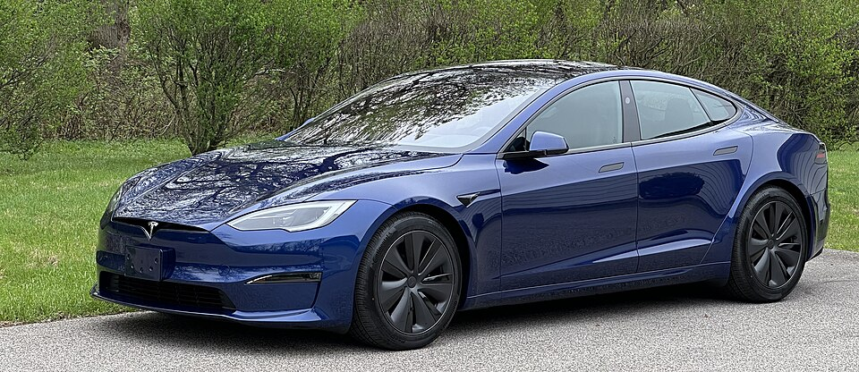

# Tesla Model S

*Bild: [Tesla Model S 2024 Blue.jpg](https://commons.wikimedia.org/wiki/File:Tesla_Model_S_2024_Blue.jpg) · Urheber: Correlated alembic · Lizenz: CC BY-SA 4.0 · via Wikimedia Commons.*

> Oberklasse-Limousine von Tesla, die den Durchbruch der Marke markierte und über viele Jahre mit einer Vielzahl von Batteriegrößen angeboten wurde.

## Steckbrief

| Feld | Wert | Beleg |
|---|---|---|
| Hersteller | [[tesla\|Tesla]] | [[tn-batterycheck-alle-daten]] |
| Segment | Oberklasse-Limousine | Fachwissen¹ |
| Karosserie | Fließheck-Limousine (Liftback) | Fachwissen¹ |
| Plattform | Tesla-eigene Plattform (gemeinsam mit Model X) | Fachwissen¹ |
| Varianten im Bestand | 28 | [[tn-batterycheck-alle-daten]] |
| [[bruttokapazitaet\|Bruttokapazität]] | 70–103 kWh | [[tn-batterycheck-alle-daten]] |
| [[nettokapazitaet\|Nettokapazität]] | 62–98 kWh | [[tn-batterycheck-alle-daten]] |
| [[batteriepuffer\|Puffer]] | 3,3–17,3 % | berechnet |

## Beschreibung

Das Tesla Model S ist eine große [[bev|batterieelektrische]] Fließhecklimousine und war das erste in großer Stückzahl gebaute Modell des Herstellers. Es teilt seine technische Basis mit dem [[tesla-model-x|Model X]]. Über die lange Bauzeit hat Tesla die Batterie und den Antrieb häufig verändert, wodurch eine sehr unübersichtliche Variantenlandschaft entstanden ist.

Die [[traktionsbatterie|Traktionsbatterie]] besteht aus tausenden zylindrischen Rundzellen ([[zellformat|Zellformat]] 18650). In frühen Jahren benannte Tesla die Modelle nach der ungefähren Batteriekapazität (60, 70, 75, 85, 90, 100). Bei einigen Einstiegsversionen war eine größere Batterie verbaut, deren Kapazität per [[software-lock|Software-Sperre]] begrenzt und gegen Aufpreis freischaltbar war.

Ab etwa 2019 wurden die Zahlenbezeichnungen durch Namen wie „Long Range“, „Performance“ und später „Plaid“ ersetzt. Ein „D“ im Namen steht für Dual Motor, also [[allradantrieb|Allradantrieb]].

## Varianten und Batterien

Zahl = ungefähre Batteriegröße in kWh, „D“ = Dual Motor (Allrad), „P“ = Performance, „L“ = Ludicrous-Modus. Auffällig: Die Versionen „60“, „60D“ und „P60“ (Zeilen 360, 361, 376) haben 75 kWh brutto, aber nur 62 kWh netto – das entspricht einer softwareseitig begrenzten 75-kWh-Batterie. Die späteren Namen „Long Range“, „Long Range Plus“, „Performance“, „Plaid“ und „Dual Motor“ nutzen die 100- bzw. 103-kWh-Batterie.

| Variante | Brutto | Netto | Puffer | Zeile |
|---|---|---|---|---|
| Model S 100D | 100 kWh | 95,0 kWh | 5 kWh (5,0 %) | 359 |
| Model S 60 | 75 kWh | 62,0 kWh | 13 kWh (17,3 %) | 360 |
| Model S 60D | 75 kWh | 62,0 kWh | 13 kWh (17,3 %) | 361 |
| Model S 70 | 70 kWh | 66,5 kWh | 3,5 kWh (5,0 %) | 362 |
| Model S 70 | 75 kWh | 69,0 kWh | 6 kWh (8,0 %) | 363 |
| Model S 70D | 70 kWh | 66,5 kWh | 3,5 kWh (5,0 %) | 364 |
| Model S 70D | 75 kWh | 69,0 kWh | 6 kWh (8,0 %) | 365 |
| Model S 75 | 75 kWh | 72,5 kWh | 2,5 kWh (3,3 %) | 366 |
| Model S 75D | 75 kWh | 72,5 kWh | 2,5 kWh (3,3 %) | 367 |
| Model S 85 | 85 kWh | 80,8 kWh | 4,2 kWh (4,9 %) | 368 |
| Model S 85D | 85 kWh | 80,8 kWh | 4,2 kWh (4,9 %) | 369 |
| Model S 90 | 90 kWh | 85,5 kWh | 4,5 kWh (5,0 %) | 370 |
| Model S 90D | 90 kWh | 85,5 kWh | 4,5 kWh (5,0 %) | 371 |
| Model S Dual Motor | 100 kWh | 95,0 kWh | 5 kWh (5,0 %) | 372 |
| Model S Long Range | 100 kWh | 95,0 kWh | 5 kWh (5,0 %) | 373 |
| Model S Long Range Plus | 103 kWh | 98,0 kWh | 5 kWh (4,9 %) | 374 |
| Model S P100D | 100 kWh | 95,0 kWh | 5 kWh (5,0 %) | 375 |
| Model S P60 | 75 kWh | 62,0 kWh | 13 kWh (17,3 %) | 376 |
| Model S P70 | 70 kWh | 66,5 kWh | 3,5 kWh (5,0 %) | 377 |
| Model S P75 | 75 kWh | 72,5 kWh | 2,5 kWh (3,3 %) | 378 |
| Model S P85 | 85 kWh | 80,8 kWh | 4,2 kWh (4,9 %) | 379 |
| Model S P85D | 85 kWh | 80,8 kWh | 4,2 kWh (4,9 %) | 380 |
| Model S P90D | 90 kWh | 85,5 kWh | 4,5 kWh (5,0 %) | 381 |
| Model S P90DL | 90 kWh | 85,5 kWh | 4,5 kWh (5,0 %) | 382 |
| Model S Performance | 100 kWh | 95,0 kWh | 5 kWh (5,0 %) | 383 |
| Model S Performance | 103 kWh | 98,0 kWh | 5 kWh (4,9 %) | 384 |
| Model S Plaid | 100 kWh | 95,0 kWh | 5 kWh (5,0 %) | 385 |
| Model S Standard Range | 75 kWh | 72,5 kWh | 2,5 kWh (3,3 %) | 386 |

Quelle: [[tn-batterycheck-alle-daten]], Blatt „Fahrzeuge“, Zeilen 359–386. Puffer = Brutto − Netto (berechnet).

## Fachbegriffe

- [[software-lock|Software-Lock (softwarebegrenzte Kapazität)]] — Eine physikalisch größere Batterie wird per Software auf eine kleinere nutzbare Kapazität begrenzt.
- [[zellformat|Zellformat]] — Bauform der einzelnen Batteriezellen: zylindrische Rundzelle, prismatische Zelle oder Pouch-Zelle.
- [[typbezeichnungen|Typbezeichnungen]] — Wie Hersteller Leistungsstufe, Batterie und Antrieb in Modellnamen codieren – ein Lesehilfe-Artikel.
- [[allradantrieb|Allradantrieb (AWD)]] — Beide Achsen werden angetrieben, bei Elektroautos meist durch je einen eigenen Motor pro Achse.
- [[batteriepuffer|Batteriepuffer]] — Differenz zwischen Brutto- und Nettokapazität – eine Reserve, die die Batterie schont und Alterung ausgleicht.
- [[bruttokapazitaet|Bruttokapazität]] — Die gesamte, physikalisch in der Batterie verbaute Energiemenge – inklusive der Reserven, die der Fahrer nie nutzen kann.
- [[nettokapazitaet|Nettokapazität]] — Der Teil der Batteriekapazität, den der Fahrer tatsächlich nutzen kann – Grundlage für Reichweite und Batterietests.
- [[modellpflege|Modellpflege (Facelift)]] — Überarbeitung eines Modells während der Bauzeit – bei Elektroautos oft mit neuer Batterie.

## Verwandte Fahrzeuge

- [[tesla-model-x|Tesla Model X]] — technisch verwandt / gleiche Plattform oder Batterie
- Weitere Modelle von Tesla: [[tesla-model-3|Tesla Model 3]], [[tesla-model-y|Tesla Model Y]]

## Offene Punkte

- Viele Nettowerte entsprechen exakt 95 % des Bruttowerts (z. B. 100/95, 90/85,5, 85/80,8, 70/66,5) – wirkt schematisch berechnet statt gemessen.
- Bauzeit offen gelassen: Produktionsstart 2012; ein angekündigtes Produktionsende (2026) ist nicht sicher bestätigt.
- „Model S P60“ und „Model S P70“ sind als offizielle Varianten nicht bekannt; möglicherweise Fehler in den Rohdaten.
- „Model S 70“ und „70D“ erscheinen mit 70 kWh und mit 75 kWh brutto; die 75-kWh-Variante könnte ebenfalls softwarebegrenzt sein – nicht gesichert.
- „Model S Performance“ mit zwei Batteriewerten (100 und 103 kWh brutto, Zeilen 383/384).

Siehe auch [[datenqualitaet]].

## Quellen

- [[tn-batterycheck-alle-daten]] — Brutto-/Nettokapazität aller Varianten (Zeilen 359–386)
- Weiterlesen: [Wikipedia – Tesla Model S](https://en.wikipedia.org/wiki/Tesla_Model_S)

¹ *Beschreibung und Steckbrief-Felder ohne Quellseite beruhen auf allgemeinem Fachwissen des LLM (Stand 2026-09-23) und sind nicht durch eine Rohquelle im Bestand belegt. Zahlenwerte zur Batterie stammen ausschließlich aus der Rohquelle.*
