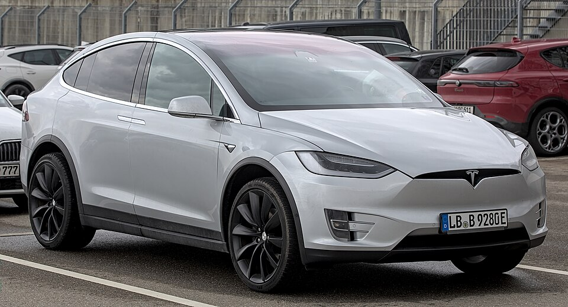

# Tesla Model X

*Bild: [Tesla Model X 100D 1X7A6736.jpg](https://commons.wikimedia.org/wiki/File:Tesla_Model_X_100D_1X7A6736.jpg) · Urheber: Alexander Migl · Lizenz: CC BY-SA 4.0 · via Wikimedia Commons.*

> Großes Oberklasse-SUV von Tesla mit Flügeltüren im Fond, technisch eng verwandt mit dem Model S.

## Steckbrief

| Feld | Wert | Beleg |
|---|---|---|
| Hersteller | [[tesla\|Tesla]] | [[tn-batterycheck-alle-daten]] |
| Segment | Oberklasse-SUV | Fachwissen¹ |
| Karosserie | SUV | Fachwissen¹ |
| Plattform | Tesla-eigene Plattform (gemeinsam mit Model S) | Fachwissen¹ |
| Varianten im Bestand | 15 | [[tn-batterycheck-alle-daten]] |
| [[bruttokapazitaet\|Bruttokapazität]] | 75–103 kWh | [[tn-batterycheck-alle-daten]] |
| [[nettokapazitaet\|Nettokapazität]] | 62–98 kWh | [[tn-batterycheck-alle-daten]] |
| [[batteriepuffer\|Puffer]] | 3,3–17,3 % | berechnet |

## Beschreibung

Das Tesla Model X ist ein großes [[bev|Elektro]]-SUV mit bis zu sieben Sitzen, das sich Plattform, Antrieb und Batterien mit dem [[tesla-model-s|Model S]] teilt. Markantes Merkmal sind die nach oben öffnenden hinteren Türen („Falcon Wing“).

Alle Model X haben zwei oder mehr Motoren und damit [[allradantrieb|Allradantrieb]]. Die [[traktionsbatterie|Traktionsbatterie]] besteht wie beim Model S aus zylindrischen Rundzellen ([[zellformat|Zellformat]] 18650). Die Einstiegsversion 60D nutzte eine per [[software-lock|Software]] begrenzte 75-kWh-Batterie.

Die Benennung folgt dem Model S: zunächst Zahlen für die Batteriegröße, später Namen wie „Long Range“, „Performance“ und „Plaid“.

## Varianten und Batterien

Zahl = ungefähre Batteriegröße, „D“ = Dual Motor, „P“ = Performance, „L“ = Ludicrous. „60D“ (Zeile 388) hat 75 kWh brutto bei nur 62 kWh netto (softwarebegrenzt). Die 100- und 103-kWh-Batterien finden sich bei „100D“, „P100D“, „Long Range“, „Long Range Plus“, „Performance“, „Ludicrous Performance“, „Dual Motor“ und „Plaid“; 103 kWh entspricht einer späteren Ausbaustufe.

| Variante | Brutto | Netto | Puffer | Zeile |
|---|---|---|---|---|
| Model X 100D | 100 kWh | 95 kWh | 5 kWh (5,0 %) | 387 |
| Model X 60D | 75 kWh | 62 kWh | 13 kWh (17,3 %) | 388 |
| Model X 75D | 75 kWh | 72,5 kWh | 2,5 kWh (3,3 %) | 389 |
| Model X 90D | 90 kWh | 85,5 kWh | 4,5 kWh (5,0 %) | 390 |
| Model X Dual Motor | 100 kWh | 95 kWh | 5 kWh (5,0 %) | 391 |
| Model X Long Range | 100 kWh | 95 kWh | 5 kWh (5,0 %) | 392 |
| Model X Long Range Plus | 103 kWh | 98 kWh | 5 kWh (4,9 %) | 393 |
| Model X Ludicrous Performance | 100 kWh | 95 kWh | 5 kWh (5,0 %) | 394 |
| Model X P100D | 100 kWh | 95 kWh | 5 kWh (5,0 %) | 395 |
| Model X P90D | 90 kWh | 85,5 kWh | 4,5 kWh (5,0 %) | 396 |
| Model X P90DL | 90 kWh | 85,5 kWh | 4,5 kWh (5,0 %) | 397 |
| Model X Performance | 100 kWh | 95 kWh | 5 kWh (5,0 %) | 398 |
| Model X Performance | 103 kWh | 98 kWh | 5 kWh (4,9 %) | 399 |
| Model X Plaid | 100 kWh | 95 kWh | 5 kWh (5,0 %) | 400 |
| Model X Standard Range | 75 kWh | 72,5 kWh | 2,5 kWh (3,3 %) | 401 |

Quelle: [[tn-batterycheck-alle-daten]], Blatt „Fahrzeuge“, Zeilen 387–401 – bereinigte Fassung (Stand 2026-09-24, Änderungen in [[datenqualitaet]]). Puffer = Brutto − Netto (berechnet).

## Fachbegriffe

- [[software-lock|Software-Lock (softwarebegrenzte Kapazität)]] — Eine physikalisch größere Batterie wird per Software auf eine kleinere nutzbare Kapazität begrenzt.
- [[zellformat|Zellformat]] — Bauform der einzelnen Batteriezellen: zylindrische Rundzelle, prismatische Zelle oder Pouch-Zelle.
- [[typbezeichnungen|Typbezeichnungen]] — Wie Hersteller Leistungsstufe, Batterie und Antrieb in Modellnamen codieren – ein Lesehilfe-Artikel.
- [[allradantrieb|Allradantrieb (AWD)]] — Beide Achsen werden angetrieben, bei Elektroautos meist durch je einen eigenen Motor pro Achse.
- [[bruttokapazitaet|Bruttokapazität]] — Die gesamte, physikalisch in der Batterie verbaute Energiemenge – inklusive der Reserven, die der Fahrer nie nutzen kann.
- [[nettokapazitaet|Nettokapazität]] — Der Teil der Batteriekapazität, den der Fahrer tatsächlich nutzen kann – Grundlage für Reichweite und Batterietests.

## Verwandte Fahrzeuge

- [[tesla-model-s|Tesla Model S]] — technisch verwandt / gleiche Plattform oder Batterie
- Weitere Modelle von Tesla: [[tesla-model-3|Tesla Model 3]], [[tesla-model-y|Tesla Model Y]]

## Offene Punkte

- Nettowerte vielfach exakt 95 % des Bruttowerts – vermutlich schematisch berechnet.
- Bauzeit offen gelassen: Produktionsstart 2015; ein angekündigtes Produktionsende (2026) ist nicht sicher bestätigt.
- „Model X Performance“ mit zwei Batteriewerten (100 und 103 kWh brutto, Zeilen 398/399).

Siehe auch [[datenqualitaet]].

## Quellen

- [[tn-batterycheck-alle-daten]] — Brutto-/Nettokapazität aller Varianten (Zeilen 387–401)
- Weiterlesen: [Wikipedia – Tesla Model X](https://en.wikipedia.org/wiki/Tesla_Model_X)

¹ *Beschreibung und Steckbrief-Felder ohne Quellseite beruhen auf allgemeinem Fachwissen des LLM (Stand 2026-09-24) und sind nicht durch eine Rohquelle im Bestand belegt. Zahlenwerte zur Batterie stammen aus der Rohquelle, bereinigt nach dem Protokoll in [[datenqualitaet]].*
