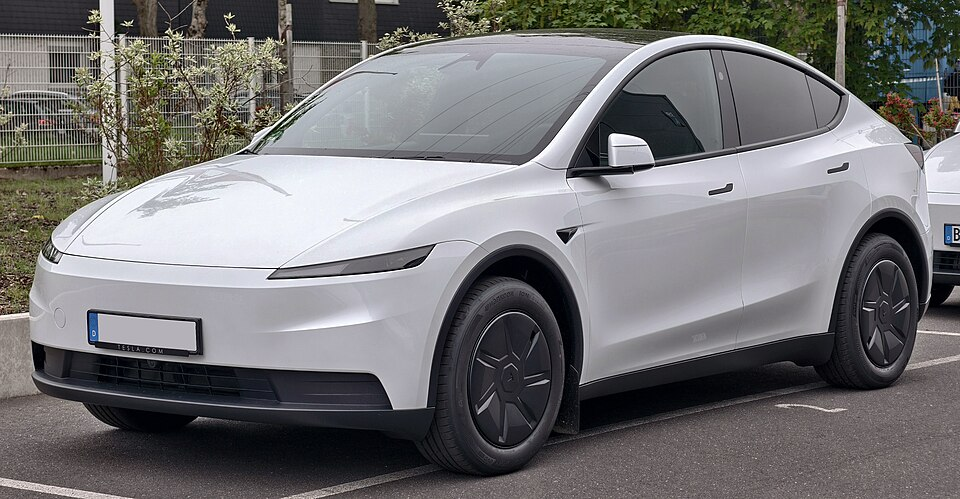

# Tesla Model Y

*Bild: [Tesla Model Y (Facelift) – f 05052026.jpg](https://commons.wikimedia.org/wiki/File:Tesla_Model_Y_(Facelift)_%E2%80%93_f_05052026.jpg) · Urheber: © M 93 · Lizenz: CC BY-SA 3.0 de · via Wikimedia Commons.*

> Mittelklasse-SUV von Tesla auf Basis des Model 3, in Europa unter anderem im Werk Grünheide bei Berlin gebaut.

## Steckbrief

| Feld | Wert | Beleg |
|---|---|---|
| Hersteller | [[tesla\|Tesla]] | [[tn-batterycheck-alle-daten]] |
| Segment | Mittelklasse-SUV | Fachwissen¹ |
| Karosserie | SUV (Crossover) | Fachwissen¹ |
| Bauzeit | seit 2020 | Fachwissen¹ |
| Plattform | Tesla-eigene Plattform (gemeinsam mit Model 3) | Fachwissen¹ |
| Varianten im Bestand | 6 | [[tn-batterycheck-alle-daten]] |
| [[bruttokapazitaet\|Bruttokapazität]] | 60–78,1 kWh | [[tn-batterycheck-alle-daten]] |
| [[nettokapazitaet\|Nettokapazität]] | 57,5–75 kWh | [[tn-batterycheck-alle-daten]] |
| [[batteriepuffer\|Puffer]] | 4,0–5,5 % | berechnet |

## Beschreibung

Das Tesla Model Y ist ein Crossover-SUV, das einen Großteil seiner Technik vom [[tesla-model-3|Model 3]] übernimmt, aber höher und geräumiger ausfällt. Es wird in den USA, in China und seit 2022 in Grünheide (Brandenburg) gebaut.

Wie beim Model 3 gibt es eine Einstiegsversion mit [[hinterradantrieb|Hinterradantrieb]] sowie Long-Range- und Performance-Versionen, meist mit [[allradantrieb|Allradantrieb]]. Die Einstiegsversionen nutzen häufig [[lfp-zellchemie|LFP-Zellen]], die Long-Range-Versionen nickelreiche Zellen ([[nmc-zellchemie|NMC]] bzw. NCA). Je nach Werk kamen unterschiedliche [[zellformat|Zellformate]] und Batterielieferanten zum Einsatz.

## Varianten und Batterien

„RWD“ = Einstiegsversion mit Heckantrieb (60 bzw. 64 kWh brutto), „Long Range AWD/RWD“ = große Batterie mit Allrad- oder Heckantrieb (75 bzw. 78,1 kWh brutto), „Performance“ = Topversion. Die zwei Werte je Bezeichnung spiegeln Zelllieferanten bzw. Produktionsstandorte wider; die Batterien entsprechen weitgehend denen des Model 3.

| Variante | Brutto | Netto | Puffer | Zeile |
|---|---|---|---|---|
| Model Y Long Range AWD | 75 kWh | 72 kWh | 3 kWh (4,0 %) | 402 |
| Model Y Long Range AWD | 78,1 kWh | 75 kWh | 3,1 kWh (4,0 %) | 403 |
| Model Y Long Range RWD | 78,1 kWh | 75 kWh | 3,1 kWh (4,0 %) | 404 |
| Model Y Performance | 78,1 kWh | 75 kWh | 3,1 kWh (4,0 %) | 405 |
| Model Y RWD | 60 kWh | 57,5 kWh | 2,5 kWh (4,2 %) | 406 |
| Model Y RWD | 64 kWh | 60,5 kWh | 3,5 kWh (5,5 %) | 407 |

Quelle: [[tn-batterycheck-alle-daten]], Blatt „Fahrzeuge“, Zeilen 402–407 – bereinigte Fassung (Stand 2026-09-24, Änderungen in [[datenqualitaet]]). Puffer = Brutto − Netto (berechnet).

## Fachbegriffe

- [[lfp-zellchemie|LFP-Zellchemie]] — Lithium-Eisenphosphat-Zellen – kobaltfrei, günstig, sehr langlebig, aber mit geringerer Energiedichte.
- [[nmc-zellchemie|NMC-Zellchemie]] — Lithium-Ionen-Zellen mit Kathode aus Nickel, Mangan und Kobalt – hohe Energiedichte, Standard in den meisten Fahrzeugen des Bestands.
- [[zellformat|Zellformat]] — Bauform der einzelnen Batteriezellen: zylindrische Rundzelle, prismatische Zelle oder Pouch-Zelle.
- [[hinterradantrieb|Hinterradantrieb (RWD)]] — Der Elektromotor treibt die Hinterräder an – Standard auf vielen reinen Elektroplattformen.
- [[allradantrieb|Allradantrieb (AWD)]] — Beide Achsen werden angetrieben, bei Elektroautos meist durch je einen eigenen Motor pro Achse.
- [[plattform-geschwister|Plattform-Geschwister (Badge-Engineering)]] — Fahrzeuge verschiedener Marken, die technisch weitgehend baugleich sind und dieselbe Batterie nutzen.

## Verwandte Fahrzeuge

- [[tesla-model-3|Tesla Model 3]] — technisch verwandt / gleiche Plattform oder Batterie
- Weitere Modelle von Tesla: [[tesla-model-s|Tesla Model S]], [[tesla-model-x|Tesla Model X]]

## Offene Punkte

- „Model Y RWD“ und „Long Range AWD“ jeweils mit zwei Batteriewerten; Zuordnung zu Werk oder Baujahr fehlt.
- Bruttowerte bei Tesla sind überwiegend Messwerte Dritter, keine Herstellerangaben.

Siehe auch [[datenqualitaet]].

## Quellen

- [[tn-batterycheck-alle-daten]] — Brutto-/Nettokapazität aller Varianten (Zeilen 402–407)
- Weiterlesen: [Wikipedia – Tesla Model Y](https://en.wikipedia.org/wiki/Tesla_Model_Y)

¹ *Beschreibung und Steckbrief-Felder ohne Quellseite beruhen auf allgemeinem Fachwissen des LLM (Stand 2026-09-24) und sind nicht durch eine Rohquelle im Bestand belegt. Zahlenwerte zur Batterie stammen aus der Rohquelle, bereinigt nach dem Protokoll in [[datenqualitaet]].*
