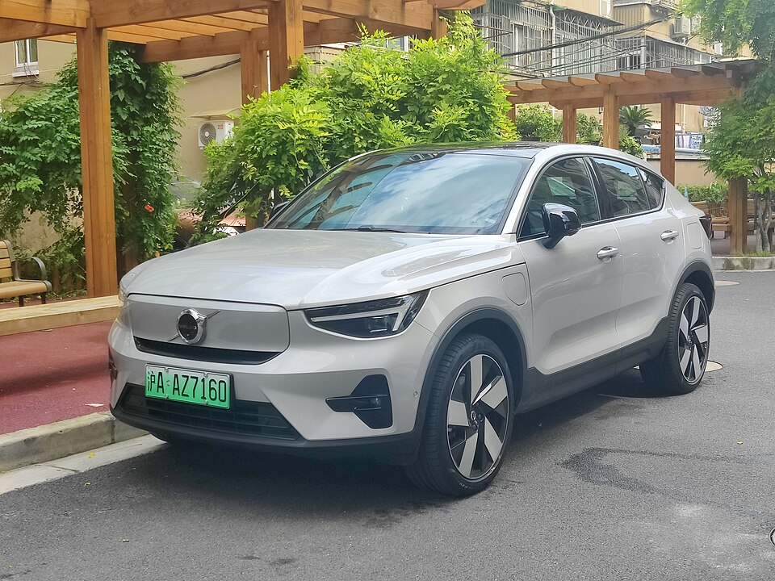

# Volvo EC40 (C40 Recharge)

*Bild: [Volvo C40 Recharge 2022092201.jpg](https://commons.wikimedia.org/wiki/File:Volvo_C40_Recharge_2022092201.jpg) · Urheber: Evnerd · Lizenz: CC BY-SA 4.0 · via Wikimedia Commons.*

> Rein elektrisches SUV-Coupé von Volvo, bis 2024 als C40 Recharge verkauft; technisch eng mit dem EX40 (XC40 Recharge) verwandt.

## Steckbrief

| Feld | Wert | Beleg |
|---|---|---|
| Hersteller | [[volvo\|Volvo]] | [[tn-batterycheck-alle-daten]] |
| Segment | Kompakt-SUV | Fachwissen¹ |
| Karosserie | SUV-Coupé | Fachwissen¹ |
| Bauzeit | seit 2021 | Fachwissen¹ |
| Plattform | CMA (Compact Modular Architecture) | Fachwissen¹ |
| Varianten im Bestand | 9 | [[tn-batterycheck-alle-daten]] |
| [[bruttokapazitaet\|Bruttokapazität]] | 69–82 kWh | [[tn-batterycheck-alle-daten]] |
| [[nettokapazitaet\|Nettokapazität]] | 66–79 kWh | [[tn-batterycheck-alle-daten]] |
| [[batteriepuffer\|Puffer]] | 2,9–4,3 % | berechnet |

## Beschreibung

Der Volvo EC40 ist die Coupé-Variante des [[volvo-ex40|Volvo EX40]] und basiert wie dieser auf der Kompaktwagen-Plattform CMA, die Volvo mit Geely teilt. Anders als der EX40 wurde er von Beginn an nur als [[bev|Elektroauto]] angeboten. 2024 wurde er von C40 Recharge in EC40 umbenannt.

Die frühen Single-Motor-Versionen hatten [[frontantrieb|Frontantrieb]]. Mit einer [[modellpflege|Modellpflege]] wechselte Volvo bei den Einmotorversionen auf [[hinterradantrieb|Hinterradantrieb]] mit neuem [[elektromotor|Elektromotor]]; die Twin-Motor-Versionen haben [[allradantrieb|Allradantrieb]]. Gleichzeitig wurden die Batterien überarbeitet.

## Varianten und Batterien

Batterien: 78/75 kWh (frühe Twin-Versionen, Bezeichnung "Twin Pure Electric"), 69/67 bzw. 69/66 kWh (Single Motor, Standardbatterie) und 82/79 kWh (Single Motor ER = Extended Range sowie Twin Motor nach Modellpflege). Die Zeilen mit "C40 Recharge" und "EC40" beschreiben teils identische Technik unter altem und neuem Namen.

| Variante | Brutto | Netto | Puffer | Zeile |
|---|---|---|---|---|
| C40 Recharge Pure Electric | 69 kWh | 67 kWh | 2 kWh (2,9 %) | 449 |
| C40 Recharge Single Motor | 69 kWh | 66 kWh | 3 kWh (4,3 %) | 450 |
| C40 Recharge Single Motor ER | 82 kWh | 79 kWh | 3 kWh (3,7 %) | 451 |
| C40 Recharge Twin Motor | 82 kWh | 79 kWh | 3 kWh (3,7 %) | 452 |
| C40 Recharge Twin Pure Electric | 78 kWh | 75 kWh | 3 kWh (3,8 %) | 453 |
| EC40 Single Motor | 69 kWh | 67 kWh | 2 kWh (2,9 %) | 454 |
| EC40 Single Motor ER | 82 kWh | 79 kWh | 3 kWh (3,7 %) | 455 |
| EC40 Twin Motor | 82 kWh | 79 kWh | 3 kWh (3,7 %) | 456 |
| EC40 Twin Motor Performance | 82 kWh | 79 kWh | 3 kWh (3,7 %) | 457 |

Quelle: [[tn-batterycheck-alle-daten]], Blatt „Fahrzeuge“, Zeilen 449–457 – bereinigte Fassung (Stand 2026-09-24, Änderungen in [[datenqualitaet]]). Puffer = Brutto − Netto (berechnet).

## Fachbegriffe

- [[modellpflege|Modellpflege (Facelift)]] — Überarbeitung eines Modells während der Bauzeit – bei Elektroautos oft mit neuer Batterie.
- [[frontantrieb|Frontantrieb (FWD)]] — Der Elektromotor treibt die Vorderräder an – typisch für Kleinwagen und Konversionsfahrzeuge.
- [[hinterradantrieb|Hinterradantrieb (RWD)]] — Der Elektromotor treibt die Hinterräder an – Standard auf vielen reinen Elektroplattformen.
- [[allradantrieb|Allradantrieb (AWD)]] — Beide Achsen werden angetrieben, bei Elektroautos meist durch je einen eigenen Motor pro Achse.
- [[typbezeichnungen|Typbezeichnungen]] — Wie Hersteller Leistungsstufe, Batterie und Antrieb in Modellnamen codieren – ein Lesehilfe-Artikel.
- [[plattform-geschwister|Plattform-Geschwister (Badge-Engineering)]] — Fahrzeuge verschiedener Marken, die technisch weitgehend baugleich sind und dieselbe Batterie nutzen.

## Verwandte Fahrzeuge

- [[volvo-ex40|Volvo EX40 (XC40 Recharge)]] — technisch verwandt / gleiche Plattform oder Batterie
- Weitere Modelle von Volvo: [[volvo-ex90|Volvo EX90]]

## Offene Punkte

- Uneinheitlicher Nettowert für die 69-kWh-Batterie: 67 kWh (Pure Electric, EC40 Single Motor) gegenüber 66 kWh (C40 Recharge Single Motor).
- "Recharge Pure Electric" und "Recharge Twin Pure Electric" sind ältere Verkaufsbezeichnungen und überschneiden sich mit den späteren Single-/Twin-Motor-Namen.

Siehe auch [[datenqualitaet]].

## Quellen

- [[tn-batterycheck-alle-daten]] — Brutto-/Nettokapazität aller Varianten (Zeilen 449–457)

¹ *Beschreibung und Steckbrief-Felder ohne Quellseite beruhen auf allgemeinem Fachwissen des LLM (Stand 2026-09-24) und sind nicht durch eine Rohquelle im Bestand belegt. Zahlenwerte zur Batterie stammen aus der Rohquelle, bereinigt nach dem Protokoll in [[datenqualitaet]].*
