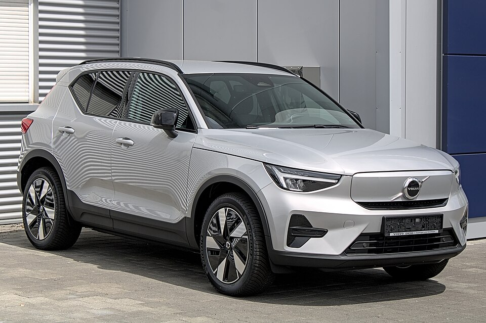

# Volvo EX40 (XC40 Recharge)

*Bild: [Volvo XC40 Recharge Facelift IMG 8127.jpg](https://commons.wikimedia.org/wiki/File:Volvo_XC40_Recharge_Facelift_IMG_8127.jpg) · Urheber: Alexander-93 · Lizenz: CC BY-SA 4.0 · via Wikimedia Commons.*

> Kompakt-SUV von Volvo in der rein elektrischen Ausführung, bis 2024 als XC40 Recharge verkauft; basiert auf dem auch mit Verbrenner angebotenen XC40.

## Steckbrief

| Feld | Wert | Beleg |
|---|---|---|
| Hersteller | [[volvo\|Volvo]] | [[tn-batterycheck-alle-daten]] |
| Segment | Kompakt-SUV | Fachwissen¹ |
| Karosserie | SUV | Fachwissen¹ |
| Bauzeit | seit 2020 | Fachwissen¹ |
| Plattform | CMA (Compact Modular Architecture) | Fachwissen¹ |
| Varianten im Bestand | 10 | [[tn-batterycheck-alle-daten]] |
| [[bruttokapazitaet\|Bruttokapazität]] | 69–82 kWh | [[tn-batterycheck-alle-daten]] |
| [[nettokapazitaet\|Nettokapazität]] | 66–79 kWh | [[tn-batterycheck-alle-daten]] |
| [[batteriepuffer\|Puffer]] | 2,9–4,3 % | berechnet |

## Beschreibung

Der Volvo EX40 ist die batterieelektrische Ausführung des XC40 und damit ein [[konversionsfahrzeug|Konversionsfahrzeug]] auf der CMA-Plattform, die auch Verbrenner und Plug-in-Hybride trägt. Er war das erste Elektroauto der Marke; seine Coupé-Schwester ist der [[volvo-ec40|Volvo EC40]].

Anfangs gab es nur eine Version mit zwei [[elektromotor|Elektromotoren]] und [[allradantrieb|Allradantrieb]]. Später folgten Einmotorversionen, zunächst mit [[frontantrieb|Frontantrieb]], nach der [[modellpflege|Modellpflege]] mit [[hinterradantrieb|Hinterradantrieb]]. Parallel wurden die [[traktionsbatterie|Traktionsbatterien]] mehrfach geändert.

## Varianten und Batterien

Batterien: 78/75 kWh (erste Version "P8 AWD" bzw. "Twin Pure Electric"), 69/67 bzw. 69/66 kWh (Single Motor) und 82/79 kWh (Single Motor ER = Extended Range, Twin Motor nach Modellpflege). Die Namen "XC40 Recharge" und "EX40" bezeichnen dasselbe Modell vor und nach der Umbenennung 2024.

| Variante | Brutto | Netto | Puffer | Zeile |
|---|---|---|---|---|
| EX40 Single Motor | 69,0 kWh | 67,0 kWh | 2 kWh (2,9 %) | 458 |
| EX40 Single Motor ER | 82,0 kWh | 79,0 kWh | 3 kWh (3,7 %) | 459 |
| EX40 Twin Motor | 82,0 kWh | 79,0 kWh | 3 kWh (3,7 %) | 460 |
| EX40 Twin Motor Performance | 82,0 kWh | 79,0 kWh | 3 kWh (3,7 %) | 461 |
| XC40 P8 AWD Recharge | 78,0 kWh | 75,0 kWh | 3 kWh (3,8 %) | 465 |
| XC40 Recharge Pure Electric | 69,0 kWh | 67,0 kWh | 2 kWh (2,9 %) | 466 |
| XC40 Recharge Single Motor | 69,0 kWh | 66,0 kWh | 3 kWh (4,3 %) | 467 |
| XC40 Recharge Single Motor ER | 82,0 kWh | 79,0 kWh | 3 kWh (3,7 %) | 468 |
| XC40 Recharge Twin Motor | 82,0 kWh | 79,0 kWh | 3 kWh (3,7 %) | 469 |
| XC40 Recharge Twin Pure Electric | 78,0 kWh | 75,0 kWh | 3 kWh (3,8 %) | 470 |

Quelle: [[tn-batterycheck-alle-daten]], Blatt „Fahrzeuge“, Zeilen 458–470. Puffer = Brutto − Netto (berechnet).

## Fachbegriffe

- [[konversionsfahrzeug|Konversionsfahrzeug]] — Elektroauto, das von einem Modell mit Verbrennungsmotor abgeleitet ist, statt auf einer reinen Elektroplattform zu basieren.
- [[modellpflege|Modellpflege (Facelift)]] — Überarbeitung eines Modells während der Bauzeit – bei Elektroautos oft mit neuer Batterie.
- [[frontantrieb|Frontantrieb (FWD)]] — Der Elektromotor treibt die Vorderräder an – typisch für Kleinwagen und Konversionsfahrzeuge.
- [[hinterradantrieb|Hinterradantrieb (RWD)]] — Der Elektromotor treibt die Hinterräder an – Standard auf vielen reinen Elektroplattformen.
- [[allradantrieb|Allradantrieb (AWD)]] — Beide Achsen werden angetrieben, bei Elektroautos meist durch je einen eigenen Motor pro Achse.
- [[typbezeichnungen|Typbezeichnungen]] — Wie Hersteller Leistungsstufe, Batterie und Antrieb in Modellnamen codieren – ein Lesehilfe-Artikel.

## Verwandte Fahrzeuge

- [[volvo-ec40|Volvo EC40 (C40 Recharge)]] — technisch verwandt / gleiche Plattform oder Batterie
- Weitere Modelle von Volvo: [[volvo-ex90|Volvo EX90]]

## Offene Punkte

- Uneinheitlicher Nettowert für die 69-kWh-Batterie: 67 kWh (Pure Electric, EX40 Single Motor) gegenüber 66 kWh (XC40 Recharge Single Motor).
- Viele Namensvarianten für gleiche Technik (P8 AWD, Twin Pure Electric, Twin Motor) – die Einträge überschneiden sich.

Siehe auch [[datenqualitaet]].

## Quellen

- [[tn-batterycheck-alle-daten]] — Brutto-/Nettokapazität aller Varianten (Zeilen 458–470)

¹ *Beschreibung und Steckbrief-Felder ohne Quellseite beruhen auf allgemeinem Fachwissen des LLM (Stand 2026-09-23) und sind nicht durch eine Rohquelle im Bestand belegt. Zahlenwerte zur Batterie stammen ausschließlich aus der Rohquelle.*
