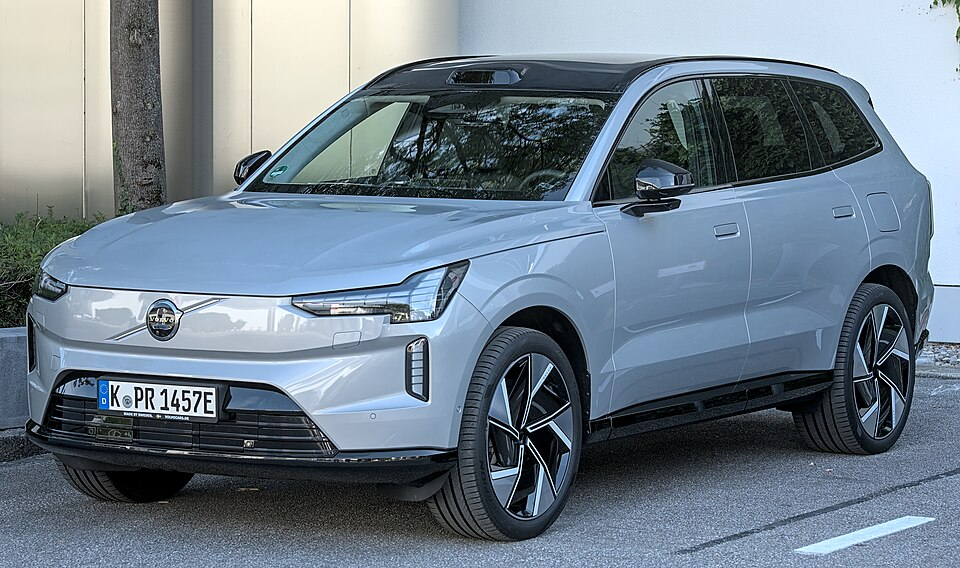

# Volvo EX90

*Bild: [Volvo EX90 IAA 2025 DSC 1520 (cropped).jpg](https://commons.wikimedia.org/wiki/File:Volvo_EX90_IAA_2025_DSC_1520_(cropped).jpg) · Urheber: Alexander Migl · Lizenz: CC BY-SA 4.0 · via Wikimedia Commons.*

> Großes rein elektrisches SUV von Volvo mit bis zu sieben Sitzen, Flaggschiff der Marke und erstes Modell auf der Plattform SPA2.

## Steckbrief

| Feld | Wert | Beleg |
|---|---|---|
| Hersteller | [[volvo\|Volvo]] | [[tn-batterycheck-alle-daten]] |
| Segment | Oberklasse-SUV | Fachwissen¹ |
| Karosserie | SUV (Siebensitzer) | Fachwissen¹ |
| Bauzeit | seit 2024 | Fachwissen¹ |
| Plattform | SPA2 (Scalable Product Architecture, 2. Generation) | Fachwissen¹ |
| Varianten im Bestand | 3 | [[tn-batterycheck-alle-daten]] |
| [[bruttokapazitaet\|Bruttokapazität]] | 104–111 kWh | [[tn-batterycheck-alle-daten]] |
| [[nettokapazitaet\|Nettokapazität]] | 100–107 kWh | [[tn-batterycheck-alle-daten]] |
| [[batteriepuffer\|Puffer]] | 3,6–3,8 % | berechnet |

## Beschreibung

Der Volvo EX90 ist das elektrische Flaggschiff von Volvo und wurde als reines [[bev|Elektroauto]] entwickelt. Er basiert auf der Plattform SPA2, die im Gegensatz zur CMA der [[volvo-ex40|EX40]]-Reihe auf Elektroantrieb ausgelegt ist.

Die Twin-Motor-Versionen haben zwei [[elektromotor|Elektromotoren]] und [[allradantrieb|Allradantrieb]]. Die [[traktionsbatterie|Traktionsbatterie]] gehört zu den größten im Volvo-Programm; die Einmotorversion nutzt eine etwas kleinere Batterie.

## Varianten und Batterien

Single Motor mit 104/100 kWh, Twin Motor und Twin Motor Performance mit 111/107 kWh. "Performance" bezeichnet eine höhere Leistungsstufe bei gleicher Batterie.

| Variante | Brutto | Netto | Puffer | Zeile |
|---|---|---|---|---|
| EX90 Single Motor | 104,0 kWh | 100,0 kWh | 4 kWh (3,8 %) | 462 |
| EX90 Twin Motor | 111,0 kWh | 107,0 kWh | 4 kWh (3,6 %) | 463 |
| EX90 Twin Motor Performance | 111,0 kWh | 107,0 kWh | 4 kWh (3,6 %) | 464 |

Quelle: [[tn-batterycheck-alle-daten]], Blatt „Fahrzeuge“, Zeilen 462–464. Puffer = Brutto − Netto (berechnet).

## Fachbegriffe

- [[allradantrieb|Allradantrieb (AWD)]] — Beide Achsen werden angetrieben, bei Elektroautos meist durch je einen eigenen Motor pro Achse.
- [[typbezeichnungen|Typbezeichnungen]] — Wie Hersteller Leistungsstufe, Batterie und Antrieb in Modellnamen codieren – ein Lesehilfe-Artikel.
- [[bruttokapazitaet|Bruttokapazität]] — Die gesamte, physikalisch in der Batterie verbaute Energiemenge – inklusive der Reserven, die der Fahrer nie nutzen kann.
- [[nettokapazitaet|Nettokapazität]] — Der Teil der Batteriekapazität, den der Fahrer tatsächlich nutzen kann – Grundlage für Reichweite und Batterietests.
- [[batteriepuffer|Batteriepuffer]] — Differenz zwischen Brutto- und Nettokapazität – eine Reserve, die die Batterie schont und Alterung ausgleicht.

## Verwandte Fahrzeuge

- Weitere Modelle von Volvo: [[volvo-ec40|Volvo EC40 (C40 Recharge)]], [[volvo-ex40|Volvo EX40 (XC40 Recharge)]]

## Offene Punkte

- Die Single-Motor-Version war nicht in allen Märkten erhältlich (hier nicht verifiziert).
- Eine spätere Umstellung auf 800-Volt-Technik wird berichtet, ist hier aber nicht geprüft.

Siehe auch [[datenqualitaet]].

## Quellen

- [[tn-batterycheck-alle-daten]] — Brutto-/Nettokapazität aller Varianten (Zeilen 462–464)
- Weiterlesen: [Wikipedia – Volvo EX90](https://en.wikipedia.org/wiki/Volvo_EX90)

¹ *Beschreibung und Steckbrief-Felder ohne Quellseite beruhen auf allgemeinem Fachwissen des LLM (Stand 2026-09-23) und sind nicht durch eine Rohquelle im Bestand belegt. Zahlenwerte zur Batterie stammen ausschließlich aus der Rohquelle.*
