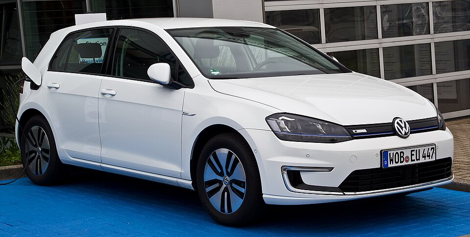

# VW e-Golf

*Bild: [VW e-Golf (VII) – Frontansicht, 19. Juni 2014, Düsseldorf.jpg](https://commons.wikimedia.org/wiki/File:VW_e-Golf_(VII)_%E2%80%93_Frontansicht,_19._Juni_2014,_D%C3%BCsseldorf.jpg) · Urheber: M 93 · Lizenz: CC BY-SA 3.0 de · via Wikimedia Commons.*

> Elektrische Version des VW Golf VII – ein Konversionsfahrzeug auf der Verbrenner-Plattform MQB, Vorgänger des ID.3.

## Steckbrief

| Feld | Wert | Beleg |
|---|---|---|
| Hersteller | [[volkswagen\|Volkswagen]] | [[tn-batterycheck-alle-daten]] |
| Segment | Kompaktklasse | Fachwissen¹ |
| Karosserie | Schrägheck-Limousine (fünftürig) | Fachwissen¹ |
| Bauzeit | 2014–2020 | Fachwissen¹ |
| Plattform | MQB (Modularer Querbaukasten), Verbrenner-Plattform | Fachwissen¹ |
| Varianten im Bestand | 2 | [[tn-batterycheck-alle-daten]] |
| [[bruttokapazitaet\|Bruttokapazität]] | 24,2–35,8 kWh | [[tn-batterycheck-alle-daten]] |
| [[nettokapazitaet\|Nettokapazität]] | 21,1–31,5 kWh | [[tn-batterycheck-alle-daten]] |
| [[batteriepuffer\|Puffer]] | 12,0–12,8 % | berechnet |

## Beschreibung

Der VW e-Golf war die batterieelektrische Ausführung des Golf der siebten Generation. Anders als die späteren ID.-Modelle wurde er nicht auf einer eigenen Elektroplattform entwickelt, sondern als [[konversionsfahrzeug|Konversionsfahrzeug]] aus dem Verbrennermodell abgeleitet: Die [[traktionsbatterie|Traktionsbatterie]] sitzt im Unterboden, der [[elektromotor|Elektromotor]] treibt die Vorderräder an ([[frontantrieb|Frontantrieb]]).

Mit der [[modellpflege|Modellpflege]] des Golf VII erhielt der e-Golf eine neue Batterie mit deutlich höherer Kapazität bei unveränderten Außenmaßen – möglich durch Zellen mit höherer Energiedichte. Als Nachfolger im Konzernprogramm gilt der [[vw-id-3|VW ID.3]] auf dem MEB.

## Varianten und Batterien

Beide Zeilen heißen „e-Golf“. Zeile 408 (24,2 kWh brutto / 21,1 kWh netto) gehört zur ersten Version, Zeile 409 (35,8 kWh brutto / 31,5 kWh netto) zur überarbeiteten Version nach der Modellpflege von 2017.

| Variante | Brutto | Netto | Puffer | Zeile |
|---|---|---|---|---|
| e-Golf | 24,2 kWh | 21,1 kWh | 3,1 kWh (12,8 %) | 408 |
| e-Golf | 35,8 kWh | 31,5 kWh | 4,3 kWh (12,0 %) | 409 |

Quelle: [[tn-batterycheck-alle-daten]], Blatt „Fahrzeuge“, Zeilen 408–409 – bereinigte Fassung (Stand 2026-09-24, Änderungen in [[datenqualitaet]]). Puffer = Brutto − Netto (berechnet).

## Fachbegriffe

- [[konversionsfahrzeug|Konversionsfahrzeug]] — Elektroauto, das von einem Modell mit Verbrennungsmotor abgeleitet ist, statt auf einer reinen Elektroplattform zu basieren.
- [[modellpflege|Modellpflege (Facelift)]] — Überarbeitung eines Modells während der Bauzeit – bei Elektroautos oft mit neuer Batterie.
- [[frontantrieb|Frontantrieb (FWD)]] — Der Elektromotor treibt die Vorderräder an – typisch für Kleinwagen und Konversionsfahrzeuge.
- [[bruttokapazitaet|Bruttokapazität]] — Die gesamte, physikalisch in der Batterie verbaute Energiemenge – inklusive der Reserven, die der Fahrer nie nutzen kann.
- [[nettokapazitaet|Nettokapazität]] — Der Teil der Batteriekapazität, den der Fahrer tatsächlich nutzen kann – Grundlage für Reichweite und Batterietests.
- [[traktionsbatterie|Traktionsbatterie]] — Der Hochvolt-Energiespeicher, der den Elektromotor eines Elektroautos versorgt.

## Verwandte Fahrzeuge

- Weitere Modelle von Volkswagen: [[vw-e-up|VW e-up!]], [[vw-id-3|VW ID.3]], [[vw-id-4|VW ID.4]], [[vw-id-5|VW ID.5]], [[vw-id-7|VW ID.7]], [[vw-id-buzz|VW ID. Buzz]]

## Quellen

- [[tn-batterycheck-alle-daten]] — Brutto-/Nettokapazität aller Varianten (Zeilen 408–409)
- Weiterlesen: [Wikipedia – Volkswagen e-Golf](https://en.wikipedia.org/wiki/Volkswagen_e-Golf)

¹ *Beschreibung und Steckbrief-Felder ohne Quellseite beruhen auf allgemeinem Fachwissen des LLM (Stand 2026-09-24) und sind nicht durch eine Rohquelle im Bestand belegt. Zahlenwerte zur Batterie stammen aus der Rohquelle, bereinigt nach dem Protokoll in [[datenqualitaet]].*
