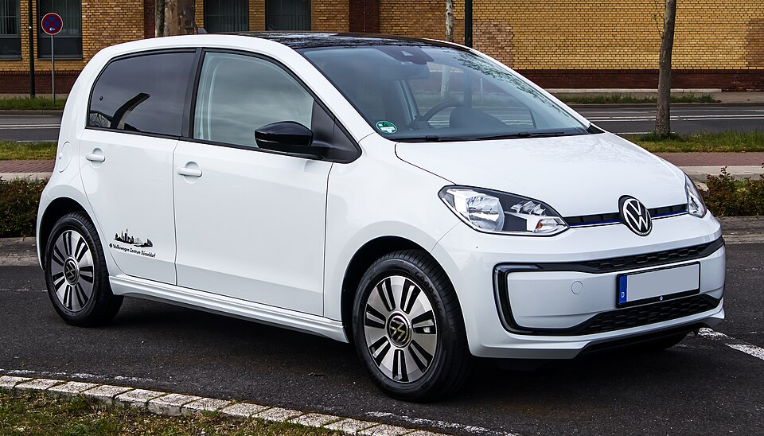

# VW e-up!

*Bild: [VW e-up! Style – f 08052021.jpg](https://commons.wikimedia.org/wiki/File:VW_e-up!_Style_%E2%80%93_f_08052021.jpg) · Urheber: © M 93 · Lizenz: CC BY-SA 3.0 de · via Wikimedia Commons.*

> Elektrischer Kleinstwagen von Volkswagen auf Basis des up!, baugleich mit SEAT Mii electric und Škoda Citigo e iV.

## Steckbrief

| Feld | Wert | Beleg |
|---|---|---|
| Hersteller | [[volkswagen\|Volkswagen]] | [[tn-batterycheck-alle-daten]] |
| Segment | Kleinstwagen | Fachwissen¹ |
| Karosserie | Schrägheck (drei- und fünftürig) | Fachwissen¹ |
| Plattform | NSF (New Small Family) des Volkswagen-Konzerns, Verbrenner-Plattform | Fachwissen¹ |
| Varianten im Bestand | 2 | [[tn-batterycheck-alle-daten]] |
| [[bruttokapazitaet\|Bruttokapazität]] | 18,7–36,8 kWh | [[tn-batterycheck-alle-daten]] |
| [[nettokapazitaet\|Nettokapazität]] | 16,4–32,3 kWh | [[tn-batterycheck-alle-daten]] |
| [[batteriepuffer\|Puffer]] | 12,2–12,3 % | berechnet |

## Beschreibung

Der VW e-up! ist die elektrische Variante des Kleinstwagens up! und war eines der ersten Serien-Elektroautos von Volkswagen. Als [[konversionsfahrzeug|Konversionsfahrzeug]] nutzt er die Karosserie des Verbrenners; [[traktionsbatterie|Traktionsbatterie]] und [[elektromotor|Elektromotor]] wurden in die vorhandene Struktur integriert. Angetrieben werden die Vorderräder ([[frontantrieb|Frontantrieb]]).

Mit einer [[modellpflege|Modellpflege]] erhielt der e-up! eine neue, deutlich größere Batterie bei gleichem Bauraum. In dieser Form ist er technisch identisch mit dem [[seat-mii-electric|SEAT Mii electric]] und dem [[skoda-citigo-e-iv|Škoda Citigo e iV]].

## Varianten und Batterien

Beide Zeilen heißen „e-Up“. Zeile 410 (18,7 kWh brutto / 16,4 kWh netto) ist die erste Version, Zeile 411 (36,8 kWh brutto / 32,3 kWh netto) die überarbeitete Version mit neuer Batterie, die auch in Mii electric und Citigo e iV verbaut ist.

| Variante | Brutto | Netto | Puffer | Zeile |
|---|---|---|---|---|
| e-up! | 18,7 kWh | 16,4 kWh | 2,3 kWh (12,3 %) | 410 |
| e-up! | 36,8 kWh | 32,3 kWh | 4,5 kWh (12,2 %) | 411 |

Quelle: [[tn-batterycheck-alle-daten]], Blatt „Fahrzeuge“, Zeilen 410–411 – bereinigte Fassung (Stand 2026-09-24, Änderungen in [[datenqualitaet]]). Puffer = Brutto − Netto (berechnet).

## Fachbegriffe

- [[konversionsfahrzeug|Konversionsfahrzeug]] — Elektroauto, das von einem Modell mit Verbrennungsmotor abgeleitet ist, statt auf einer reinen Elektroplattform zu basieren.
- [[modellpflege|Modellpflege (Facelift)]] — Überarbeitung eines Modells während der Bauzeit – bei Elektroautos oft mit neuer Batterie.
- [[frontantrieb|Frontantrieb (FWD)]] — Der Elektromotor treibt die Vorderräder an – typisch für Kleinwagen und Konversionsfahrzeuge.
- [[plattform-geschwister|Plattform-Geschwister (Badge-Engineering)]] — Fahrzeuge verschiedener Marken, die technisch weitgehend baugleich sind und dieselbe Batterie nutzen.
- [[bruttokapazitaet|Bruttokapazität]] — Die gesamte, physikalisch in der Batterie verbaute Energiemenge – inklusive der Reserven, die der Fahrer nie nutzen kann.
- [[nettokapazitaet|Nettokapazität]] — Der Teil der Batteriekapazität, den der Fahrer tatsächlich nutzen kann – Grundlage für Reichweite und Batterietests.

## Verwandte Fahrzeuge

- [[seat-mii-electric|Seat Mii electric]] — technisch verwandt / gleiche Plattform oder Batterie
- [[skoda-citigo-e-iv|Škoda Citigo e iV]] — technisch verwandt / gleiche Plattform oder Batterie
- Weitere Modelle von Volkswagen: [[vw-e-golf|VW e-Golf]], [[vw-id-3|VW ID.3]], [[vw-id-4|VW ID.4]], [[vw-id-5|VW ID.5]], [[vw-id-7|VW ID.7]], [[vw-id-buzz|VW ID. Buzz]]

## Offene Punkte

- Schreibweise in den Rohdaten „e-Up“; offizielle Schreibweise ist „e-up!“.
- Bauzeit offen gelassen: Markteinführung 2013, das Produktionsende ist nicht sicher belegt.

Siehe auch [[datenqualitaet]].

## Quellen

- [[tn-batterycheck-alle-daten]] — Brutto-/Nettokapazität aller Varianten (Zeilen 410–411)

¹ *Beschreibung und Steckbrief-Felder ohne Quellseite beruhen auf allgemeinem Fachwissen des LLM (Stand 2026-09-24) und sind nicht durch eine Rohquelle im Bestand belegt. Zahlenwerte zur Batterie stammen aus der Rohquelle, bereinigt nach dem Protokoll in [[datenqualitaet]].*
