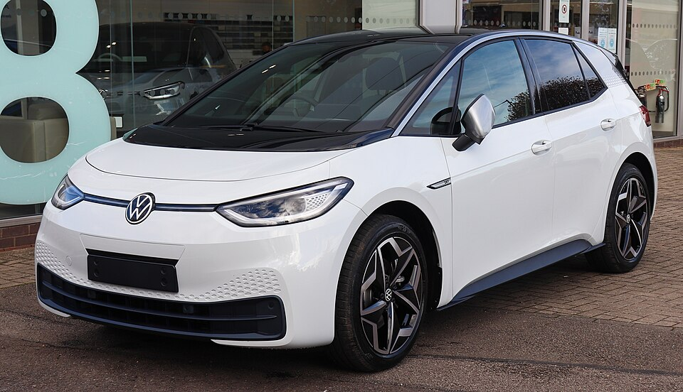

# VW ID.3

*Bild: [2020 Volkswagen ID.3 1st Front.jpg](https://commons.wikimedia.org/wiki/File:2020_Volkswagen_ID.3_1st_Front.jpg) · Urheber: Vauxford · Lizenz: CC BY-SA 4.0 · via Wikimedia Commons.*

> Kompaktes Elektroauto von Volkswagen und erstes Serienmodell auf dem Modularen E-Antriebs-Baukasten (MEB).

## Steckbrief

| Feld | Wert | Beleg |
|---|---|---|
| Hersteller | [[volkswagen\|Volkswagen]] | [[tn-batterycheck-alle-daten]] |
| Segment | Kompaktklasse | Fachwissen¹ |
| Karosserie | Schrägheck-Limousine (fünftürig) | Fachwissen¹ |
| Bauzeit | seit 2019 | Fachwissen¹ |
| Plattform | MEB (Modularer E-Antriebs-Baukasten) | Fachwissen¹ |
| Varianten im Bestand | 6 | [[tn-batterycheck-alle-daten]] |
| [[bruttokapazitaet\|Bruttokapazität]] | 55–82 kWh | [[tn-batterycheck-alle-daten]] |
| [[nettokapazitaet\|Nettokapazität]] | 45–77 kWh | [[tn-batterycheck-alle-daten]] |
| [[batteriepuffer\|Puffer]] | 6,1–18,2 % | berechnet |

## Beschreibung

Der VW ID.3 ist das erste Modell der ID.-Familie und zugleich das erste Serienfahrzeug auf dem [[plattform-meb|MEB]]. Er gilt als elektrischer Nachfolger des [[vw-e-golf|e-Golf]] und wird unter anderem im Werk Zwickau gebaut. Technisch eng verwandt ist er mit dem [[cupra-born|Cupra Born]].

Die [[traktionsbatterie|Traktionsbatterie]] liegt flach zwischen den Achsen, der [[elektromotor|Elektromotor]] sitzt an der Hinterachse ([[hinterradantrieb|Hinterradantrieb]]). Dank modularer Bauweise gibt es mehrere Batteriegrößen, die sich in der Zahl der Module unterscheiden. Zwischen [[bruttokapazitaet|Brutto-]] und [[nettokapazitaet|Nettokapazität]] hält Volkswagen einen [[batteriepuffer|Puffer]] frei.

Im Zuge der [[modellpflege|Modellpflege]] wurde neben Innenraum und Software auch die mittlere Batterie überarbeitet; die neuere Version hat etwas höhere Brutto- und Nettowerte.

## Varianten und Batterien

„Pure“ = kleine Batterie (55 kWh brutto laut Rohdaten), „Pro“ = mittlere Batterie (62 bzw. 63 kWh brutto), „Pro S“ = große Batterie (82 kWh brutto). Der Zusatz „Performance“ bezeichnet eine stärkere Motorvariante bei gleicher Batterie. Die zwei Werte beim „Pro“ (Zeilen 412/413) entsprechen der ursprünglichen und der überarbeiteten Batterie.

| Variante | Brutto | Netto | Puffer | Zeile | Status |
|---|---|---|---|---|---|
| ID.3 Pro | 62 kWh | 58 kWh | 4 kWh (6,5 %) | 412 |  |
| ID.3 Pro | 63 kWh | 59 kWh | 4 kWh (6,3 %) | 413 |  |
| ID.3 Pro Performance | 62 kWh | 58 kWh | 4 kWh (6,5 %) | 414 |  |
| ID.3 Pro S | 82 kWh | 77 kWh | 5 kWh (6,1 %) | 415 |  |
| ID.3 Pure | 55 kWh | 45 kWh | 10 kWh (18,2 %) | 416 | bestätigt |
| ID.3 Pure Performance | 55 kWh | 45 kWh | 10 kWh (18,2 %) | 417 | bestätigt |

Quelle: [[tn-batterycheck-alle-daten]], Blatt „Fahrzeuge“, Zeilen 412–417 – bereinigte Fassung (Stand 2026-09-24, Änderungen in [[datenqualitaet]]). Puffer = Brutto − Netto (berechnet).

## Fachbegriffe

- [[plattform-meb|MEB (Modularer E-Antriebs-Baukasten)]] — Volkswagens erste reine Elektroauto-Plattform, Basis für ID.-Modelle, Enyaq, Elroq, Born, Tavascan und Q4 e-tron.
- [[bruttokapazitaet|Bruttokapazität]] — Die gesamte, physikalisch in der Batterie verbaute Energiemenge – inklusive der Reserven, die der Fahrer nie nutzen kann.
- [[nettokapazitaet|Nettokapazität]] — Der Teil der Batteriekapazität, den der Fahrer tatsächlich nutzen kann – Grundlage für Reichweite und Batterietests.
- [[batteriepuffer|Batteriepuffer]] — Differenz zwischen Brutto- und Nettokapazität – eine Reserve, die die Batterie schont und Alterung ausgleicht.
- [[hinterradantrieb|Hinterradantrieb (RWD)]] — Der Elektromotor treibt die Hinterräder an – Standard auf vielen reinen Elektroplattformen.
- [[modellpflege|Modellpflege (Facelift)]] — Überarbeitung eines Modells während der Bauzeit – bei Elektroautos oft mit neuer Batterie.
- [[plattform-geschwister|Plattform-Geschwister (Badge-Engineering)]] — Fahrzeuge verschiedener Marken, die technisch weitgehend baugleich sind und dieselbe Batterie nutzen.

## Verwandte Fahrzeuge

- [[vw-id-4|VW ID.4]] — technisch verwandt / gleiche Plattform oder Batterie
- [[vw-id-5|VW ID.5]] — technisch verwandt / gleiche Plattform oder Batterie
- [[vw-id-7|VW ID.7]] — technisch verwandt / gleiche Plattform oder Batterie
- [[vw-id-buzz|VW ID. Buzz]] — technisch verwandt / gleiche Plattform oder Batterie
- [[skoda-enyaq|Škoda Enyaq]] — technisch verwandt / gleiche Plattform oder Batterie
- [[skoda-elroq|Škoda Elroq]] — technisch verwandt / gleiche Plattform oder Batterie
- [[cupra-born|Cupra Born]] — technisch verwandt / gleiche Plattform oder Batterie
- [[cupra-tavascan|Cupra Tavascan]] — technisch verwandt / gleiche Plattform oder Batterie
- [[audi-q4-e-tron|Audi Q4 e-tron]] — technisch verwandt / gleiche Plattform oder Batterie
- Weitere Modelle von Volkswagen: [[vw-e-golf|VW e-Golf]], [[vw-e-up|VW e-up!]]

## Offene Punkte

- Die Varianten GTX und Pro S nach der Modellpflege sind in den Rohdaten nicht gesondert aufgeführt.

Siehe auch [[datenqualitaet]].

## Quellen

- [[tn-batterycheck-alle-daten]] — Brutto-/Nettokapazität aller Varianten (Zeilen 412–417)
- Weiterlesen: [Wikipedia – Volkswagen ID.3](https://en.wikipedia.org/wiki/Volkswagen_ID.3)

¹ *Beschreibung und Steckbrief-Felder ohne Quellseite beruhen auf allgemeinem Fachwissen des LLM (Stand 2026-09-24) und sind nicht durch eine Rohquelle im Bestand belegt. Zahlenwerte zur Batterie stammen aus der Rohquelle, bereinigt nach dem Protokoll in [[datenqualitaet]].*
