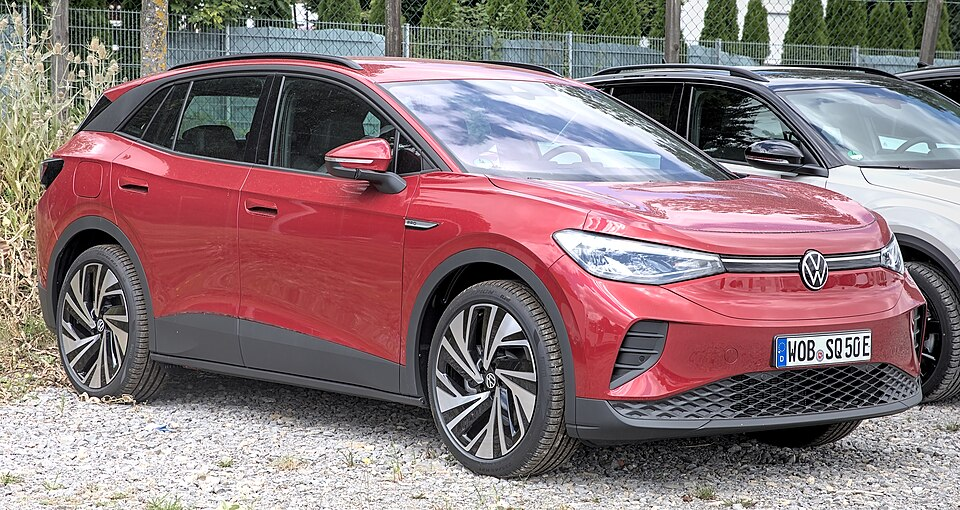

# VW ID.4

*Bild: [Volkswagen ID.4 1X7A0360.jpg](https://commons.wikimedia.org/wiki/File:Volkswagen_ID.4_1X7A0360.jpg) · Urheber: Alexander Migl · Lizenz: CC BY-SA 4.0 · via Wikimedia Commons.*

> Elektro-SUV von Volkswagen auf dem MEB, weltweit gebaut und eines der wichtigsten Elektromodelle des Konzerns.

## Steckbrief

| Feld | Wert | Beleg |
|---|---|---|
| Hersteller | [[volkswagen\|Volkswagen]] | [[tn-batterycheck-alle-daten]] |
| Segment | Kompakt-SUV | Fachwissen¹ |
| Karosserie | SUV | Fachwissen¹ |
| Bauzeit | seit 2020 | Fachwissen¹ |
| Plattform | MEB (Modularer E-Antriebs-Baukasten) | Fachwissen¹ |
| Varianten im Bestand | 9 | [[tn-batterycheck-alle-daten]] |
| [[bruttokapazitaet\|Bruttokapazität]] | 55–82 kWh | [[tn-batterycheck-alle-daten]] |
| [[nettokapazitaet\|Nettokapazität]] | 52–77 kWh | [[tn-batterycheck-alle-daten]] |
| [[batteriepuffer\|Puffer]] | 5,5–6,1 % | berechnet |

## Beschreibung

Der VW ID.4 ist das SUV-Modell der ID.-Familie und basiert wie der [[vw-id-3|ID.3]] auf dem [[plattform-meb|MEB]]. Er wird in mehreren Werken in Europa, China und den USA gebaut. Eng verwandt sind der [[skoda-enyaq|Škoda Enyaq]], der [[audi-q4-e-tron|Audi Q4 e-tron]] sowie der coupéartige [[vw-id-5|ID.5]].

Standardmäßig hat der ID.4 [[hinterradantrieb|Hinterradantrieb]]; Versionen mit „4MOTION“ bzw. „4M“ sowie der sportliche GTX haben einen zusätzlichen Motor an der Vorderachse und damit [[allradantrieb|Allradantrieb]]. In den Rohdaten finden sich nur zwei Batteriegrößen: die kleine (55 kWh brutto) und die große (82 kWh brutto).

## Varianten und Batterien

„Pure“ und „Pure Performance“ = kleine Batterie (55/52 kWh), alle übrigen Zeilen = große Batterie (82/77 kWh). „Pro“, „Pro Performance“ und „Pro S“ sind Leistungs- bzw. Ausstattungsstufen, „4M“ und „AWD“ bedeuten Allrad, „RWD“ Heckantrieb, „GTX“ ist die sportliche Allradversion. Die Bezeichnungen „AWD“ und „RWD“ sind keine offiziellen VW-Namen in Europa und stammen vermutlich aus Nordamerika.

| Variante | Brutto | Netto | Puffer | Zeile |
|---|---|---|---|---|
| ID.4 AWD | 82 kWh | 77 kWh | 5 kWh (6,1 %) | 418 |
| ID.4 GTX | 82 kWh | 77 kWh | 5 kWh (6,1 %) | 419 |
| ID.4 Pro | 82 kWh | 77 kWh | 5 kWh (6,1 %) | 420 |
| ID.4 Pro 4M | 82 kWh | 77 kWh | 5 kWh (6,1 %) | 421 |
| ID.4 Pro Performance | 82 kWh | 77 kWh | 5 kWh (6,1 %) | 422 |
| ID.4 Pro S | 82 kWh | 77 kWh | 5 kWh (6,1 %) | 423 |
| ID.4 Pure | 55 kWh | 52 kWh | 3 kWh (5,5 %) | 424 |
| ID.4 Pure Performance | 55 kWh | 52 kWh | 3 kWh (5,5 %) | 425 |
| ID.4 RWD | 82 kWh | 77 kWh | 5 kWh (6,1 %) | 426 |

Quelle: [[tn-batterycheck-alle-daten]], Blatt „Fahrzeuge“, Zeilen 418–426 – bereinigte Fassung (Stand 2026-09-24, Änderungen in [[datenqualitaet]]). Puffer = Brutto − Netto (berechnet).

## Fachbegriffe

- [[plattform-meb|MEB (Modularer E-Antriebs-Baukasten)]] — Volkswagens erste reine Elektroauto-Plattform, Basis für ID.-Modelle, Enyaq, Elroq, Born, Tavascan und Q4 e-tron.
- [[allradantrieb|Allradantrieb (AWD)]] — Beide Achsen werden angetrieben, bei Elektroautos meist durch je einen eigenen Motor pro Achse.
- [[hinterradantrieb|Hinterradantrieb (RWD)]] — Der Elektromotor treibt die Hinterräder an – Standard auf vielen reinen Elektroplattformen.
- [[typbezeichnungen|Typbezeichnungen]] — Wie Hersteller Leistungsstufe, Batterie und Antrieb in Modellnamen codieren – ein Lesehilfe-Artikel.
- [[bruttokapazitaet|Bruttokapazität]] — Die gesamte, physikalisch in der Batterie verbaute Energiemenge – inklusive der Reserven, die der Fahrer nie nutzen kann.
- [[nettokapazitaet|Nettokapazität]] — Der Teil der Batteriekapazität, den der Fahrer tatsächlich nutzen kann – Grundlage für Reichweite und Batterietests.
- [[plattform-geschwister|Plattform-Geschwister (Badge-Engineering)]] — Fahrzeuge verschiedener Marken, die technisch weitgehend baugleich sind und dieselbe Batterie nutzen.

## Verwandte Fahrzeuge

- [[vw-id-3|VW ID.3]] — technisch verwandt / gleiche Plattform oder Batterie
- [[vw-id-5|VW ID.5]] — technisch verwandt / gleiche Plattform oder Batterie
- [[vw-id-7|VW ID.7]] — technisch verwandt / gleiche Plattform oder Batterie
- [[vw-id-buzz|VW ID. Buzz]] — technisch verwandt / gleiche Plattform oder Batterie
- [[skoda-enyaq|Škoda Enyaq]] — technisch verwandt / gleiche Plattform oder Batterie
- [[skoda-elroq|Škoda Elroq]] — technisch verwandt / gleiche Plattform oder Batterie
- [[cupra-born|Cupra Born]] — technisch verwandt / gleiche Plattform oder Batterie
- [[cupra-tavascan|Cupra Tavascan]] — technisch verwandt / gleiche Plattform oder Batterie
- [[audi-q4-e-tron|Audi Q4 e-tron]] — technisch verwandt / gleiche Plattform oder Batterie
- Weitere Modelle von Volkswagen: [[vw-e-golf|VW e-Golf]], [[vw-e-up|VW e-up!]]

## Offene Punkte

- Mehrere Bezeichnungen mit identischen Werten (82/77 kWh) für im Grunde dieselbe Batterie; „ID.4 AWD“/„ID.4 RWD“ überschneiden sich vermutlich mit „Pro 4M“/„Pro“.
- Eine mittlere Batterie (62/58 kWh), die es beim ID.4 zeitweise gab, ist in den Rohdaten nicht enthalten.

Siehe auch [[datenqualitaet]].

## Quellen

- [[tn-batterycheck-alle-daten]] — Brutto-/Nettokapazität aller Varianten (Zeilen 418–426)
- Weiterlesen: [Wikipedia – Volkswagen ID.4](https://en.wikipedia.org/wiki/Volkswagen_ID.4)

¹ *Beschreibung und Steckbrief-Felder ohne Quellseite beruhen auf allgemeinem Fachwissen des LLM (Stand 2026-09-24) und sind nicht durch eine Rohquelle im Bestand belegt. Zahlenwerte zur Batterie stammen aus der Rohquelle, bereinigt nach dem Protokoll in [[datenqualitaet]].*
