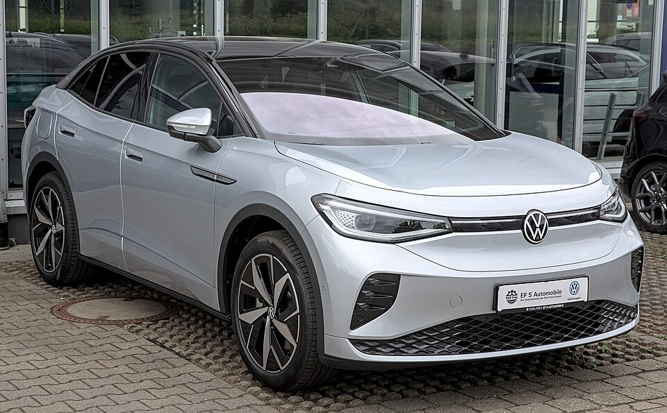

# VW ID.5

*Bild: [Volkswagen ID.5 GTX 1X7A0404.jpg](https://commons.wikimedia.org/wiki/File:Volkswagen_ID.5_GTX_1X7A0404.jpg) · Urheber: Alexander Migl · Lizenz: CC BY-SA 4.0 · via Wikimedia Commons.*

> SUV-Coupé von Volkswagen auf dem MEB, die Variante des ID.4 mit abfallender Dachlinie.

## Steckbrief

| Feld | Wert | Beleg |
|---|---|---|
| Hersteller | [[volkswagen\|Volkswagen]] | [[tn-batterycheck-alle-daten]] |
| Segment | Kompakt-SUV / SUV-Coupé | Fachwissen¹ |
| Karosserie | SUV-Coupé | Fachwissen¹ |
| Bauzeit | seit 2021 | Fachwissen¹ |
| Plattform | MEB (Modularer E-Antriebs-Baukasten) | Fachwissen¹ |
| Varianten im Bestand | 4 | [[tn-batterycheck-alle-daten]] |
| [[bruttokapazitaet\|Bruttokapazität]] | 82 kWh | [[tn-batterycheck-alle-daten]] |
| [[nettokapazitaet\|Nettokapazität]] | 77 kWh | [[tn-batterycheck-alle-daten]] |
| [[batteriepuffer\|Puffer]] | 6,1 % | berechnet |

## Beschreibung

Der VW ID.5 ist technisch ein [[vw-id-4|ID.4]] mit flacher auslaufendem Dach und etwas geänderter Heckpartie. Er basiert auf dem [[plattform-meb|MEB]] und entspricht in seiner Grundidee dem [[skoda-enyaq|Škoda Enyaq Coupé]] und dem [[cupra-tavascan|Cupra Tavascan]].

In den Rohdaten ist der ID.5 ausschließlich mit der großen MEB-[[traktionsbatterie|Batterie]] vertreten. Die Pro-Versionen haben [[hinterradantrieb|Hinterradantrieb]], der GTX ist die sportliche Version mit [[allradantrieb|Allradantrieb]].

## Varianten und Batterien

Alle vier Zeilen (427–430) haben 82 kWh brutto und 77 kWh netto. „Pro“ und „Pro Performance“ unterscheiden sich in der Motorleistung, „GTX“ bzw. „GTX 4M“ bezeichnen die Allradversion.

| Variante | Brutto | Netto | Puffer | Zeile |
|---|---|---|---|---|
| ID.5 GTX | 82 kWh | 77 kWh | 5 kWh (6,1 %) | 427 |
| ID.5 GTX 4M | 82 kWh | 77 kWh | 5 kWh (6,1 %) | 428 |
| ID.5 Pro | 82 kWh | 77 kWh | 5 kWh (6,1 %) | 429 |
| ID.5 Pro Performance | 82 kWh | 77 kWh | 5 kWh (6,1 %) | 430 |

Quelle: [[tn-batterycheck-alle-daten]], Blatt „Fahrzeuge“, Zeilen 427–430 – bereinigte Fassung (Stand 2026-09-24, Änderungen in [[datenqualitaet]]). Puffer = Brutto − Netto (berechnet).

## Fachbegriffe

- [[plattform-meb|MEB (Modularer E-Antriebs-Baukasten)]] — Volkswagens erste reine Elektroauto-Plattform, Basis für ID.-Modelle, Enyaq, Elroq, Born, Tavascan und Q4 e-tron.
- [[karosserieformen|Karosserieformen]] — Varianten der Aufbauform eines Modells – beeinflussen Aussehen und Luftwiderstand, meist nicht die Batterie.
- [[allradantrieb|Allradantrieb (AWD)]] — Beide Achsen werden angetrieben, bei Elektroautos meist durch je einen eigenen Motor pro Achse.
- [[hinterradantrieb|Hinterradantrieb (RWD)]] — Der Elektromotor treibt die Hinterräder an – Standard auf vielen reinen Elektroplattformen.
- [[plattform-geschwister|Plattform-Geschwister (Badge-Engineering)]] — Fahrzeuge verschiedener Marken, die technisch weitgehend baugleich sind und dieselbe Batterie nutzen.

## Verwandte Fahrzeuge

- [[vw-id-3|VW ID.3]] — technisch verwandt / gleiche Plattform oder Batterie
- [[vw-id-4|VW ID.4]] — technisch verwandt / gleiche Plattform oder Batterie
- [[vw-id-7|VW ID.7]] — technisch verwandt / gleiche Plattform oder Batterie
- [[vw-id-buzz|VW ID. Buzz]] — technisch verwandt / gleiche Plattform oder Batterie
- [[skoda-enyaq|Škoda Enyaq]] — technisch verwandt / gleiche Plattform oder Batterie
- [[skoda-elroq|Škoda Elroq]] — technisch verwandt / gleiche Plattform oder Batterie
- [[cupra-born|Cupra Born]] — technisch verwandt / gleiche Plattform oder Batterie
- [[cupra-tavascan|Cupra Tavascan]] — technisch verwandt / gleiche Plattform oder Batterie
- [[audi-q4-e-tron|Audi Q4 e-tron]] — technisch verwandt / gleiche Plattform oder Batterie
- Weitere Modelle von Volkswagen: [[vw-e-golf|VW e-Golf]], [[vw-e-up|VW e-up!]]

## Offene Punkte

- „ID.5 GTX“ und „ID.5 GTX 4M“ bezeichnen vermutlich dasselbe Fahrzeug (der GTX hat grundsätzlich Allradantrieb) – mögliche Dublette.

Siehe auch [[datenqualitaet]].

## Quellen

- [[tn-batterycheck-alle-daten]] — Brutto-/Nettokapazität aller Varianten (Zeilen 427–430)
- Weiterlesen: [Wikipedia – Volkswagen ID.5](https://en.wikipedia.org/wiki/Volkswagen_ID.5)

¹ *Beschreibung und Steckbrief-Felder ohne Quellseite beruhen auf allgemeinem Fachwissen des LLM (Stand 2026-09-24) und sind nicht durch eine Rohquelle im Bestand belegt. Zahlenwerte zur Batterie stammen aus der Rohquelle, bereinigt nach dem Protokoll in [[datenqualitaet]].*
