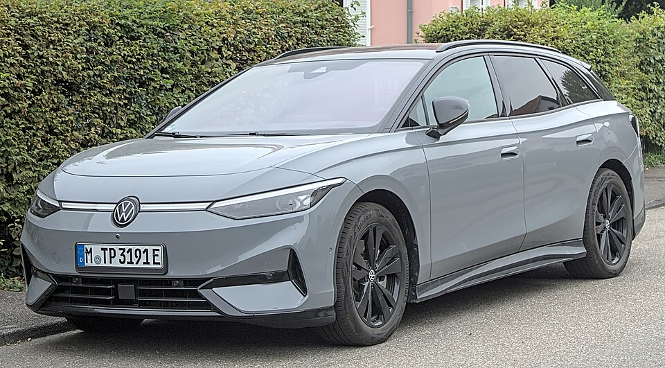

# VW ID.7

*Bild: [Volkswagen ID.7 Tourer IMG 4193.jpg](https://commons.wikimedia.org/wiki/File:Volkswagen_ID.7_Tourer_IMG_4193.jpg) · Urheber: Alexander Migl · Lizenz: CC BY-SA 4.0 · via Wikimedia Commons.*

> Elektrische Mittelklasse-Limousine und Kombi (Tourer) von Volkswagen auf dem MEB, mit der größten MEB-Batterie.

## Steckbrief

| Feld | Wert | Beleg |
|---|---|---|
| Hersteller | [[volkswagen\|Volkswagen]] | [[tn-batterycheck-alle-daten]] |
| Segment | Mittelklasse (Limousine und Kombi) | Fachwissen¹ |
| Karosserie | Fließheck-Limousine, Kombi (Tourer) | Fachwissen¹ |
| Bauzeit | seit 2023 | Fachwissen¹ |
| Plattform | MEB (Modularer E-Antriebs-Baukasten) | Fachwissen¹ |
| Varianten im Bestand | 6 | [[tn-batterycheck-alle-daten]] |
| [[bruttokapazitaet\|Bruttokapazität]] | 82–91 kWh | [[tn-batterycheck-alle-daten]] |
| [[nettokapazitaet\|Nettokapazität]] | 77–86 kWh | [[tn-batterycheck-alle-daten]] |
| [[batteriepuffer\|Puffer]] | 5,5–6,1 % | berechnet |

## Beschreibung

Der VW ID.7 ist das bislang größte Pkw-Modell der ID.-Familie und nimmt im Programm etwa die Position des Passat bzw. Arteon ein. Neben der Fließhecklimousine gibt es mit dem ID.7 Tourer einen Kombi. Beide basieren auf einer weiterentwickelten Version des [[plattform-meb|MEB]].

Neben der bekannten 82-kWh-Batterie (brutto) bietet der ID.7 eine neue, größere [[traktionsbatterie|Traktionsbatterie]] mit 91 kWh brutto, die auch im langen [[vw-id-buzz|ID. Buzz]] zum Einsatz kommt. Die Basisversionen haben [[hinterradantrieb|Hinterradantrieb]], der GTX „4Motion“ [[allradantrieb|Allradantrieb]].

## Varianten und Batterien

„Pro“ = große Standardbatterie (82/77 kWh), „Pro S“ = neue, größere Batterie (91/86 kWh), „GTX 4Motion“ = Allradversion mit der 91-kWh-Batterie. Der Zusatz „Tourer“ kennzeichnet den Kombi; er hat dieselben Batterien wie die Limousine.

| Variante | Brutto | Netto | Puffer | Zeile |
|---|---|---|---|---|
| ID.7 GTX 4Motion | 91 kWh | 86,0 kWh | 5 kWh (5,5 %) | 431 |
| ID.7 GTX 4Motion Tourer | 91 kWh | 86,0 kWh | 5 kWh (5,5 %) | 432 |
| ID.7 Pro | 82 kWh | 77,0 kWh | 5 kWh (6,1 %) | 433 |
| ID.7 Pro S | 91 kWh | 86,0 kWh | 5 kWh (5,5 %) | 434 |
| ID.7 Pro S Tourer | 91 kWh | 86,0 kWh | 5 kWh (5,5 %) | 435 |
| ID.7 Pro Tourer | 82 kWh | 77,0 kWh | 5 kWh (6,1 %) | 436 |

Quelle: [[tn-batterycheck-alle-daten]], Blatt „Fahrzeuge“, Zeilen 431–436. Puffer = Brutto − Netto (berechnet).

## Fachbegriffe

- [[plattform-meb|MEB (Modularer E-Antriebs-Baukasten)]] — Volkswagens erste reine Elektroauto-Plattform, Basis für ID.-Modelle, Enyaq, Elroq, Born, Tavascan und Q4 e-tron.
- [[karosserieformen|Karosserieformen]] — Varianten der Aufbauform eines Modells – beeinflussen Aussehen und Luftwiderstand, meist nicht die Batterie.
- [[allradantrieb|Allradantrieb (AWD)]] — Beide Achsen werden angetrieben, bei Elektroautos meist durch je einen eigenen Motor pro Achse.
- [[hinterradantrieb|Hinterradantrieb (RWD)]] — Der Elektromotor treibt die Hinterräder an – Standard auf vielen reinen Elektroplattformen.
- [[bruttokapazitaet|Bruttokapazität]] — Die gesamte, physikalisch in der Batterie verbaute Energiemenge – inklusive der Reserven, die der Fahrer nie nutzen kann.
- [[nettokapazitaet|Nettokapazität]] — Der Teil der Batteriekapazität, den der Fahrer tatsächlich nutzen kann – Grundlage für Reichweite und Batterietests.
- [[plattform-geschwister|Plattform-Geschwister (Badge-Engineering)]] — Fahrzeuge verschiedener Marken, die technisch weitgehend baugleich sind und dieselbe Batterie nutzen.

## Verwandte Fahrzeuge

- [[vw-id-3|VW ID.3]] — technisch verwandt / gleiche Plattform oder Batterie
- [[vw-id-4|VW ID.4]] — technisch verwandt / gleiche Plattform oder Batterie
- [[vw-id-5|VW ID.5]] — technisch verwandt / gleiche Plattform oder Batterie
- [[vw-id-buzz|VW ID. Buzz]] — technisch verwandt / gleiche Plattform oder Batterie
- [[skoda-enyaq|Škoda Enyaq]] — technisch verwandt / gleiche Plattform oder Batterie
- [[skoda-elroq|Škoda Elroq]] — technisch verwandt / gleiche Plattform oder Batterie
- [[cupra-born|Cupra Born]] — technisch verwandt / gleiche Plattform oder Batterie
- [[cupra-tavascan|Cupra Tavascan]] — technisch verwandt / gleiche Plattform oder Batterie
- [[audi-q4-e-tron|Audi Q4 e-tron]] — technisch verwandt / gleiche Plattform oder Batterie
- Weitere Modelle von Volkswagen: [[vw-e-golf|VW e-Golf]], [[vw-e-up|VW e-up!]]

## Quellen

- [[tn-batterycheck-alle-daten]] — Brutto-/Nettokapazität aller Varianten (Zeilen 431–436)
- Weiterlesen: [Wikipedia – Volkswagen ID.7](https://en.wikipedia.org/wiki/Volkswagen_ID.7)

¹ *Beschreibung und Steckbrief-Felder ohne Quellseite beruhen auf allgemeinem Fachwissen des LLM (Stand 2026-09-23) und sind nicht durch eine Rohquelle im Bestand belegt. Zahlenwerte zur Batterie stammen ausschließlich aus der Rohquelle.*
