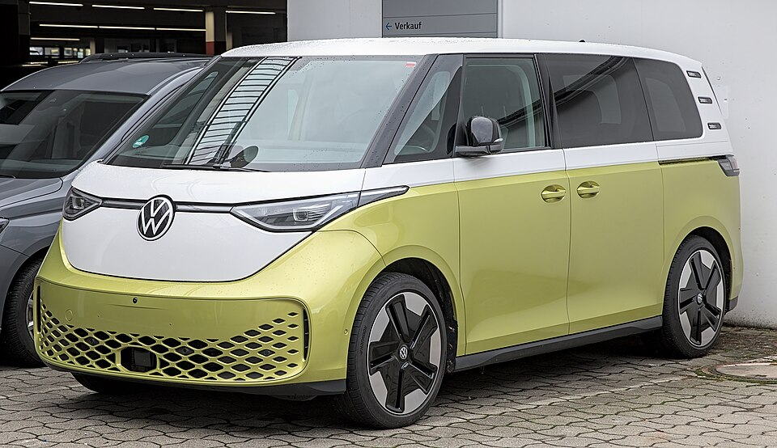

# VW ID. Buzz

*Bild: [Volkswagen ID. Buzz 1X7A1610.jpg](https://commons.wikimedia.org/wiki/File:Volkswagen_ID._Buzz_1X7A1610.jpg) · Urheber: Alexander-93 · Lizenz: CC BY-SA 4.0 · via Wikimedia Commons.*

> Elektrischer Kleinbus und Transporter von Volkswagen auf dem MEB, im Design an den klassischen VW-Bus angelehnt.

## Steckbrief

| Feld | Wert | Beleg |
|---|---|---|
| Hersteller | [[volkswagen\|Volkswagen]] | [[tn-batterycheck-alle-daten]] |
| Segment | Van / Kleinbus und Transporter | Fachwissen¹ |
| Karosserie | Van (Pkw), Kastenwagen (Cargo); kurzer und langer Radstand | Fachwissen¹ |
| Bauzeit | seit 2022 | Fachwissen¹ |
| Plattform | MEB (Modularer E-Antriebs-Baukasten) | Fachwissen¹ |
| Varianten im Bestand | 12 | [[tn-batterycheck-alle-daten]] |
| [[bruttokapazitaet\|Bruttokapazität]] | 63–91 kWh | [[tn-batterycheck-alle-daten]] |
| [[nettokapazitaet\|Nettokapazität]] | 59–86 kWh | [[tn-batterycheck-alle-daten]] |
| [[batteriepuffer\|Puffer]] | 5,5–6,3 % | berechnet |

## Beschreibung

Der VW ID. Buzz überträgt das Konzept des klassischen VW-Busses in die Elektro-Ära. Er basiert auf dem [[plattform-meb|MEB]] und wird in Hannover gebaut. Es gibt eine Pkw-Version für bis zu sieben Personen und als ID. Buzz Cargo einen [[elektro-transporter|Elektro-Transporter]] für den gewerblichen Einsatz. Später kam eine Version mit langem Radstand (LWB) hinzu.

Die ersten Fahrzeuge hatten die große MEB-Batterie mit 82 kWh brutto. Mit der langen Version und im Zuge der [[modellpflege|Modellpflege]] kamen weitere [[traktionsbatterie|Batterien]] hinzu: eine überarbeitete Batterie mit 84 kWh brutto für den kurzen Radstand und eine mit 91 kWh brutto, die auch der [[vw-id-7|ID.7]] nutzt. Die Einstiegsversion „Pure“ hat eine kleinere Batterie.

Serienmäßig hat der ID. Buzz [[hinterradantrieb|Hinterradantrieb]]; der GTX und die Versionen mit „4M“ bzw. „AWD“ haben [[allradantrieb|Allradantrieb]].

## Varianten und Batterien

„Pure“ = kleinste Batterie (63/59 kWh). Ohne Zusatz bzw. „Cargo“ = ursprüngliche Batterie (82/77 kWh). „Pro“, „Cargo Pro“ und „GTX“ erscheinen mit 84/79 kWh (kurzer Radstand, überarbeitete Batterie) und teils mit 91/86 kWh (langer Radstand). „LWB“ = langer Radstand, „AWD“/„4M“ = Allrad, „RWD“ = Heckantrieb.

| Variante | Brutto | Netto | Puffer | Zeile |
|---|---|---|---|---|
| ID. Buzz | 82 kWh | 77 kWh | 5 kWh (6,1 %) | 437 |
| ID. Buzz AWD | 91 kWh | 86 kWh | 5 kWh (5,5 %) | 438 |
| ID. Buzz Cargo | 82 kWh | 77 kWh | 5 kWh (6,1 %) | 439 |
| ID. Buzz Cargo Pro | 84 kWh | 79 kWh | 5 kWh (6,0 %) | 440 |
| ID. Buzz Cargo Pro 4M | 84 kWh | 79 kWh | 5 kWh (6,0 %) | 441 |
| ID. Buzz GTX | 84 kWh | 79 kWh | 5 kWh (6,0 %) | 442 |
| ID. Buzz GTX | 91 kWh | 86 kWh | 5 kWh (5,5 %) | 443 |
| ID. Buzz LWB | 91 kWh | 86 kWh | 5 kWh (5,5 %) | 444 |
| ID. Buzz Pro | 84 kWh | 79 kWh | 5 kWh (6,0 %) | 445 |
| ID. Buzz Pro | 91 kWh | 86 kWh | 5 kWh (5,5 %) | 446 |
| ID. Buzz Pure | 63 kWh | 59 kWh | 4 kWh (6,3 %) | 447 |
| ID. Buzz RWD | 91 kWh | 86 kWh | 5 kWh (5,5 %) | 448 |

Quelle: [[tn-batterycheck-alle-daten]], Blatt „Fahrzeuge“, Zeilen 437–448 – bereinigte Fassung (Stand 2026-09-24, Änderungen in [[datenqualitaet]]). Puffer = Brutto − Netto (berechnet).

## Fachbegriffe

- [[plattform-meb|MEB (Modularer E-Antriebs-Baukasten)]] — Volkswagens erste reine Elektroauto-Plattform, Basis für ID.-Modelle, Enyaq, Elroq, Born, Tavascan und Q4 e-tron.
- [[elektro-transporter|Elektro-Transporter und Vans]] — Leichte Nutzfahrzeuge und Großraum-Pkw mit Elektroantrieb – im Bestand vor allem von Stellantis, Mercedes, Renault und VW.
- [[modellpflege|Modellpflege (Facelift)]] — Überarbeitung eines Modells während der Bauzeit – bei Elektroautos oft mit neuer Batterie.
- [[allradantrieb|Allradantrieb (AWD)]] — Beide Achsen werden angetrieben, bei Elektroautos meist durch je einen eigenen Motor pro Achse.
- [[hinterradantrieb|Hinterradantrieb (RWD)]] — Der Elektromotor treibt die Hinterräder an – Standard auf vielen reinen Elektroplattformen.
- [[bruttokapazitaet|Bruttokapazität]] — Die gesamte, physikalisch in der Batterie verbaute Energiemenge – inklusive der Reserven, die der Fahrer nie nutzen kann.
- [[nettokapazitaet|Nettokapazität]] — Der Teil der Batteriekapazität, den der Fahrer tatsächlich nutzen kann – Grundlage für Reichweite und Batterietests.

## Verwandte Fahrzeuge

- [[vw-id-3|VW ID.3]] — technisch verwandt / gleiche Plattform oder Batterie
- [[vw-id-4|VW ID.4]] — technisch verwandt / gleiche Plattform oder Batterie
- [[vw-id-5|VW ID.5]] — technisch verwandt / gleiche Plattform oder Batterie
- [[vw-id-7|VW ID.7]] — technisch verwandt / gleiche Plattform oder Batterie
- [[skoda-enyaq|Škoda Enyaq]] — technisch verwandt / gleiche Plattform oder Batterie
- [[skoda-elroq|Škoda Elroq]] — technisch verwandt / gleiche Plattform oder Batterie
- [[cupra-born|Cupra Born]] — technisch verwandt / gleiche Plattform oder Batterie
- [[cupra-tavascan|Cupra Tavascan]] — technisch verwandt / gleiche Plattform oder Batterie
- [[audi-q4-e-tron|Audi Q4 e-tron]] — technisch verwandt / gleiche Plattform oder Batterie
- Weitere Modelle von Volkswagen: [[vw-e-golf|VW e-Golf]], [[vw-e-up|VW e-up!]]

## Offene Punkte

- „ID.BUZZ Pro“ und „ID.BUZZ GTX“ jeweils mit zwei Batteriewerten (84 und 91 kWh brutto); vermutlich kurzer vs. langer Radstand, in den Rohdaten nicht gekennzeichnet.
- Schreibweise „ID.BUZZ“ in den Rohdaten; offiziell „ID. Buzz“.
- Die Zuordnung der 84-kWh-Batterie zu einer bestimmten Modellpflege ist nicht gesichert.

Siehe auch [[datenqualitaet]].

## Quellen

- [[tn-batterycheck-alle-daten]] — Brutto-/Nettokapazität aller Varianten (Zeilen 437–448)
- Weiterlesen: [Wikipedia – Volkswagen ID. Buzz](https://en.wikipedia.org/wiki/Volkswagen_ID._Buzz)

¹ *Beschreibung und Steckbrief-Felder ohne Quellseite beruhen auf allgemeinem Fachwissen des LLM (Stand 2026-09-24) und sind nicht durch eine Rohquelle im Bestand belegt. Zahlenwerte zur Batterie stammen aus der Rohquelle, bereinigt nach dem Protokoll in [[datenqualitaet]].*
